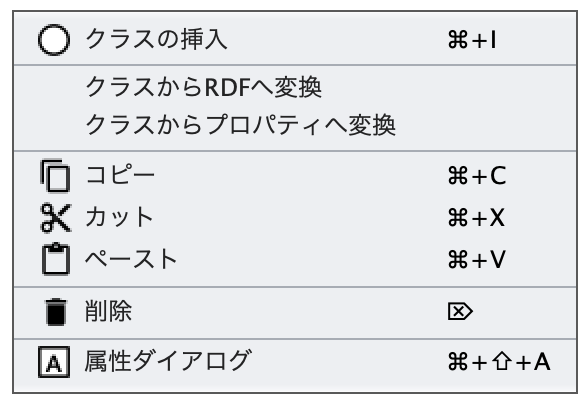
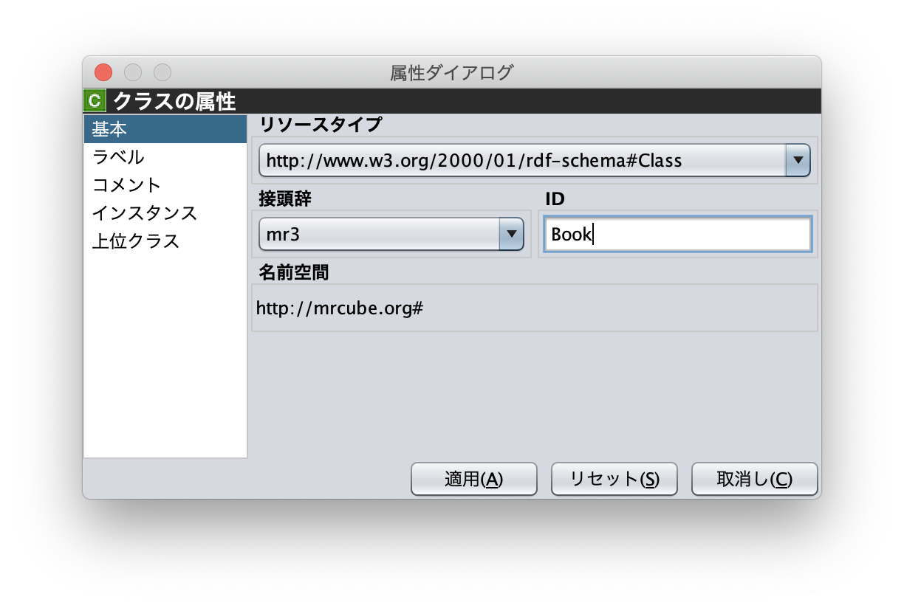
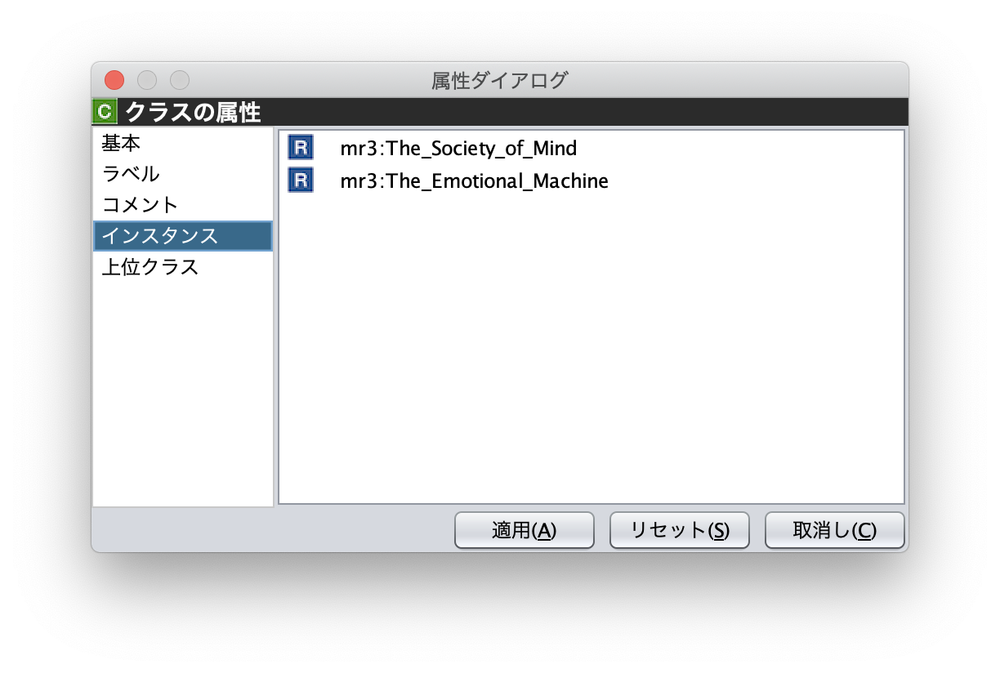
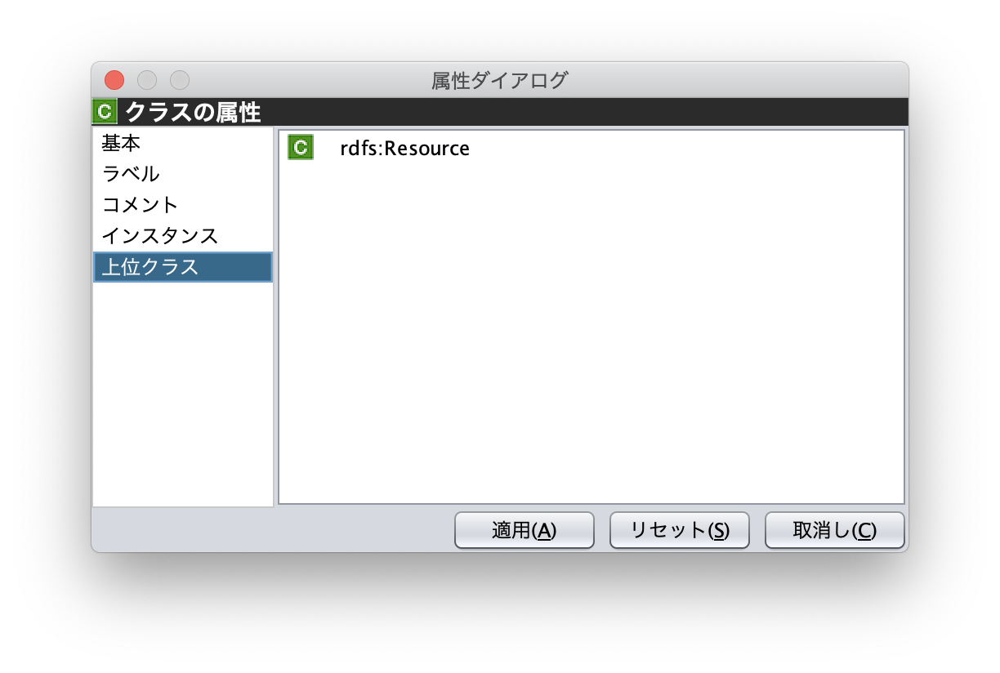

.. index:: クラスエディタ

=================
クラスエディタ
=================

.. contents:: コンテンツ 
   :depth: 2
   
クラスエディタでは，RDFSクラスの階層関係およびRDFSクラスの属性編集を行うことができる．図1にクラスエディタのスクリーンショットを示す

.. figure:: figures/class_editor.png
   :scale: 50 %
   :alt: 図1: クラスエディタ
   :align: center
   
   図1: クラスエディタ
   
------------------------------------------------
クラスエディタのポップアップメニュー
------------------------------------------------

クラスエディタ内で，右クリックするとポップアップメニューが表示される．ポップアップメニューは，ノードを選択している場合としていない場合で表示内容が異なる．ポップアップメニューは，以下のとおり．

.. figure:: figures/popup_menu_class_editor.png
   :scale: 40 %
   :alt: ノードが選択されていない状態
   :align: center
   
   ノードが選択されていない状態
   

   
   ノードが選択された状態

クラスの挿入
接続モード
クラスからRDFへ変換
RDFSクラスからRDFリソースへ変換する．
クラスからプロパティへ変換
RDFSクラスからRDFSプロパティへ変換する．
コピー
カット
ペースト
削除
アトリビュートダイアログを表示

------------------------------------------------
クラスエディタの属性編集
------------------------------------------------
クラスエディタ内のRDFSクラスを選択すると，RDFSクラスの属性がアトリビュートダイアログに表示される（図2から図4）．アトリビュートダイアログ左側のリストから「基本」，「ラベル」，「コメント」，「インスタンス」，「上位クラス」項目を選択し，RDFSクラスの属性の編集を行う．「基本」では，リソースタイプおよびURI を編集することができる（図2）．リソースタイプで選択できる項目は，「設定」ダイアログのクラスクラスリストから追加および削除を行うことができる．「ラベル」では，rdfs:label プロパティの編集を行うことができる．「コメント」では，rdfs:commentの編集を行うことができる．ラベルとコメントの編集方法は，RDFリソースと同様である．「インスタンス」には選択したRDFSクラスのインスタンスのリストが表示される（図3）．リスト中の項目をクリックすると対応するRDFエディタ内のRDFリソースにジャンプし，そのRDFリソースの属性がアトリビュートダイアログに表示される．「上位クラス」には，選択したRDFSクラスの上位クラスのリストが表示される（図4）．

   
   図2: アトリビュートダイアログ（RDFSクラスの基本）
   

   
   図3: アトリビュートダイアログ（RDFSクラスのインスタンス）
   

   
   図4: アトリビュートダイアログ（RDFSクラスの上位クラス）