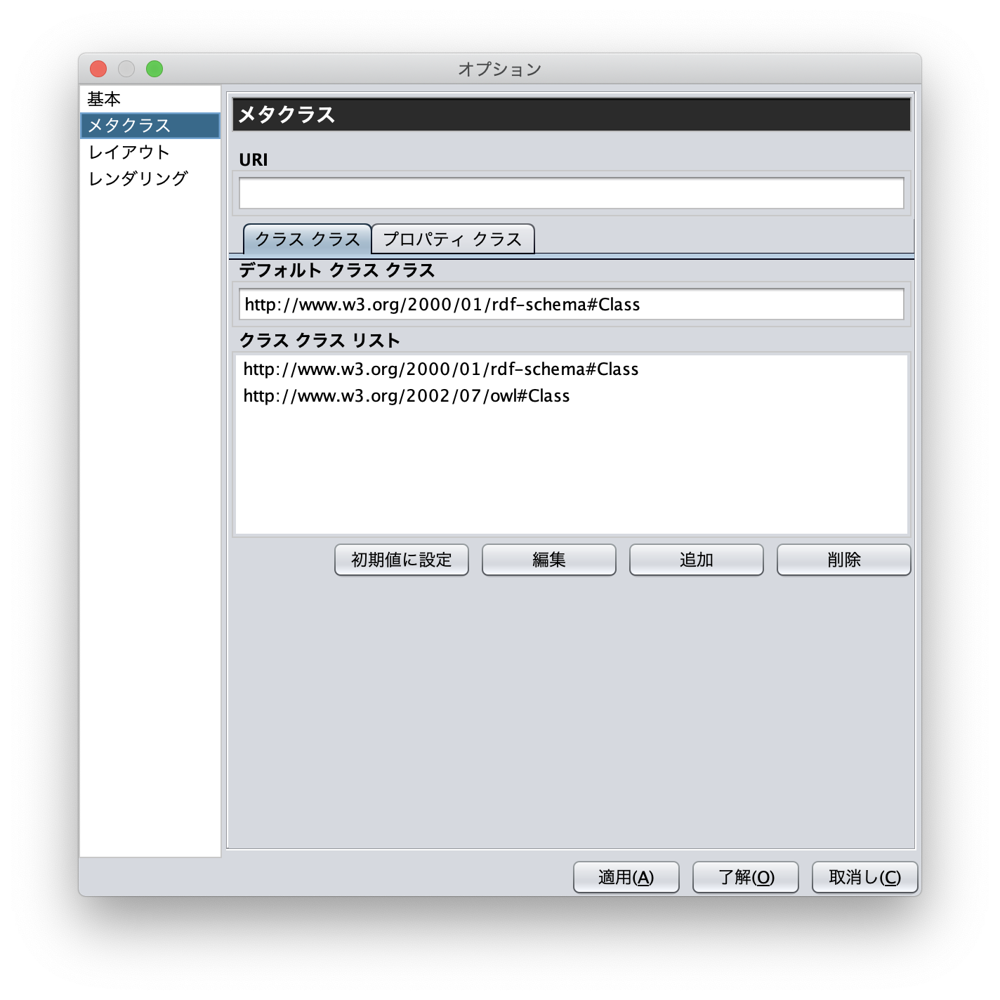

=====================
設定ダイアログ
===================== 

.. contents:: コンテンツ 
   :depth: 2

設定ダイアログでは，基本，ディレクトリ，プロキシ，メタクラス，レイアウト，レンダリングについて設定を行うことができる．

------------------------ 
基本
------------------------

設定ダイアログの「基本」タブ（図1）では，言語，UI 言語，出力エンコーディング，フォント，ベースURI，ログファイルの設定ができる．言語はラベル表示を行う際に優先して表示する言語を設定できる．UI 言語は，メニューなどに表示する言語を設定できる．言語は，ja（日本語），en（英語），zh（中国語）を選択できる．出力エンコーディングは，エクスポート時にRDF(S)文書を保存するファイルエンコーディングを設定する．フォントは，各エディタ内のノード内の文字列を表示する際のフォントを設定する．ベースURI には，エクスポート時の初期の名前空間URI を設定する．ログファイルには，MR\ :sup:`3` \使用中の各種ログを保存するファイルを設定する．

 .. figure:: figures/config_dialog_basic.png
   :scale: 80 %
   :alt: 図1:設定ダイアログ: 基本
   :align: center

   図1:設定ダイアログ: 基本

------------------------ 
ディレクトリ
------------------------

設定ダイアログの「ディレクトリ」タブ（図2）では，作業ディレクトリ，プラグインディレクトリ，リソースディレクトリを設定ができる．作業ディレクトリには，インポートダイアログにおいて，RDF(S)文書を含むフォルダを選択する際に最初に開くフォルダを設定する．プラグインディレクトリには， MR\ :sup:`3` \のプラグインが保存されているフォルダを設定する．リソースディレクトリは， MR\ :sup:`3` \のプロパティファイル（メニューなどに表示する言語ごとの設定ファイル）が保存されているフォルダを設定する．

.. figure:: figures/config_dialog_directory.png
   :scale: 80 %
   :alt: 図2: 設定ダイアログ: ディレクトリ
   :align: center

   図2: 設定ダイアログ: ディレクトリ
   
------------------------   
プロキシ
------------------------

設定ダイアログの「プロキシ」タブ（図3）では，プロキシサーバを利用している場合に，プロキシサーバのホスト名とポート番号の設定を行うことができる．インポートダイアログからURI を指定して，RDF(S)文書をインポートする場合に設定が必要となる場合がある．   

.. figure:: figures/config_dialog_proxy.png
   :scale: 80 %
   :alt: 図3: 設定ダイアログ: プロキシ
   :align: center

   図3: 設定ダイアログ: プロキシ

------------------------
メタクラス
------------------------

設定ダイアログの「メタクラス」タブ（図4）では，「クラスクラス」および「プロパティクラス」の設定をすることができる．「クラスクラス」に設定したクラスをrdf:typeプロパティの値とするリソースを， MR\ :sup:`3` \はクラスとして認識し，クラスエディタにインポートすることができる．同様に，「プロパティクラス」に設定したクラスをrdf:type プロパティの値とするリソースを， MR\ :sup:`3` \はプロパティとして認識し，プロパティエディタにインポートすることができる．

初期状態では，「クラスクラス」にはrdfs:Class が設定されている．また，「プロパティクラス」には，rdf:Property が設定されている．owl:Class やowl:ObjectProperty をタイプとするリソースを，クラスまたはプロパティとしてMR\ :sup:`3` \にインポートしたい場合には，図4の「Class Class」タブまたは「Property Class」タブで設定を行う

   図4: 設定ダイアログ: メタクラス

------------------------
レイアウト
------------------------

設定ダイアログの「レイアウト」タブ（図5）では，各エディタ内のデータグラフのレイアウト方法を設定する．

.. figure:: figures/config_dialog_layout.png
   :scale: 80 %
   :alt: 図5:設定ダイアログ: レイアウト
   :align: center

   図5:設定ダイアログ: レイアウト

------------------------    
レンダリング
------------------------
設定ダイアログの「レンダリング」タブ（図6）では，RDFリソース，RDFリテラル，RDFSクラス，RDFSプロパティの各ノードの色や，ノード選択時の色，エディタウィンドウの背景職をカスタマイズすることができる．「ノードに色をつける」チェックボックスのチェックをはずすと，すべてのノードが無色となる．「アンチエイリアス」チェックボックスにチェックをいれると各ノードの縁が滑らかに表示される．

.. figure:: figures/config_dialog_rendering.png
   :scale: 80 %
   :alt: 図6: 設定ダイアログ: レンダリング
   :align: center

   図6: 設定ダイアログ: レンダリング    

    