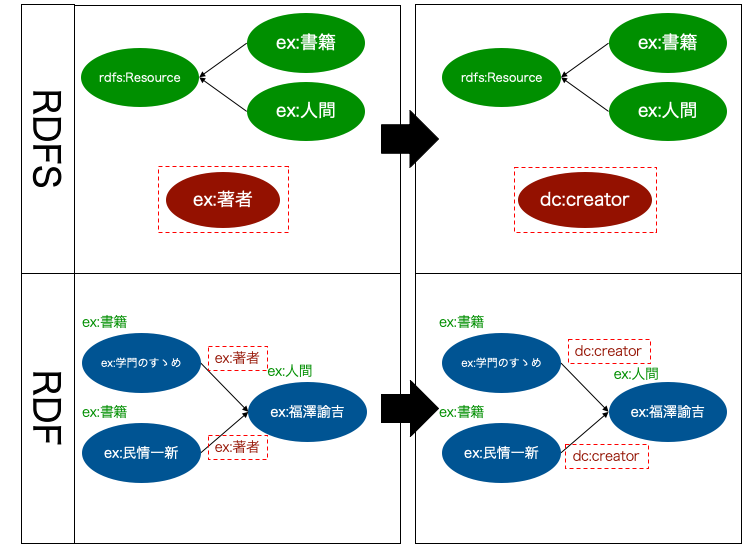
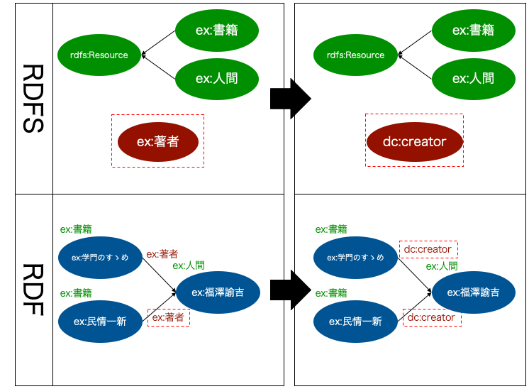

機能一覧
====================

.. contents:: コンテンツ 
   :depth: 4
   
MR\ :sup:`3` \の機能概要
------------------------

RDF(S)コンテンツ構築支援ツールの機能概要を :numref:`mrcube_function_overview` に示す．RDF(S)コンテンツ構築支援ツールは，(1) RDFコンテンツの視覚的編集機能，(2) RDFSコンテンツの視覚的編集機能，(3) RDF(S)コンテンツ管理機能の主に三つの機能を持つ．

RDFS文書は，クラスおよびプロパティの階層関係，プロパティの定義域および値域がRDF構文（RDF/XML, Notation 3, N-Triples など）により記述された文書を表す．RDF文書は，クラスのインスタンスに関するステートメントがRDF構文により記述された文書を表す．RDF(S)データグラフとは，RDF(S)データモデルを視覚的に表現したものである．RDF要素は，RDFリソース，RDFプロパティ，RDFリテラルを表す．RDFS要素は，RDFSクラスおよびRDFSプロパティを表す．

以下では，RDF(S)コンテンツ構築支援ツールの各機能について説明する．

.. _mrcube_function_overview:

   RDF(S)コンテンツ構築支援ツールの機能概要

RDFコンテンツの視覚的編集機能
-----------------------------

:numref:`mrcube_function_overview` の(1) は，RDFコンテンツの視覚的編集機能を表している．RDFコンテンツの視覚的編集機能は，RDF文書からRDFデータグラフへの変換機能，RDFデータグラフからRDF文書への変換機能，RDFデータモデルに基づいたRDF要素の視覚的編集機能の三つから構成される．RDF要素の視覚的編集機能では，ステートメント（RDFリソース，RDFプロパティ，RDFリテラルで表される三つ組み）の編集を行うことができる．

RDFSコンテンツの視覚的編集機能
------------------------------

:numref:`mrcube_function_overview` の(2)は，RDFSコンテンツの視覚的編集機能を表している．RDFSコンテンツの視覚的編集機能は，RDFS文書からRDFSデータグラフへの変換機能，RDFSデータグラフからRDFS文書への変換機能，RDFSデータモデルに基づいたRDFS要素の視覚的編集機能の三つから構成される．RDFS要素の視覚的編集機能では，クラスおよびプロパティの階層関係，プロパティの定義域および値域の編集を行うことができる．

.. _rdfs-contents-management-functions:

RDF(S)コンテンツ管理機能
------------------------

:numref:`mrcube_function_overview` の(3) は，RDF(S)コンテンツ管理機能を表している．RDF(S)コンテンツ管理機能により，オントロジー(RDFSコンテンツ)とモデル(RDFコンテンツ) 間の整合性を管理することができる．

RDF(S)コンテンツ管理機能は，O→MまたはM→Oで表すことができる．O→Mは，オントロジー(RDFSクラスおよびRDFSプロパティ) の変更をモデル(RDFリソースのタイプおよびRDFプロパティ) に反映させる機能を表す．M→Oは，モデルの変更をオントロジーに反映させる機能を表す．

O→M: RDFSクラスの編集
~~~~~~~~~~~~~~~~~~~~~

RDF(S)コンテンツ管理機能におけるRDFSクラスの編集には，RDFSクラスのURIの変更とRDFSクラスの削除がある．

RDFSクラスのURIの変更
""""""""""""""""""""""""""

RDFSクラスのURIを変更する場合，そのRDFSクラスを参照しているRDFリソースのタイプ(URI) も同時に変更される． :numref:`rename-class`  は，RDFSクラスのURIを変更する場合の具体例を表している． :numref:`rename-class`  の左側はRDFSクラスex:書籍を変更する前の状態を表しており，右側がRDFSクラスex:書籍をex:書物に変更した後の状態を表している．以下，RDF(S)コンテンツ管理機能の具体例を表す図中のRDFSにおける矩形はクラス，楕円はプロパティ，矢印はクラスの上位・下位関係を表す．矢印は，下位クラスから上位クラスに向かって伸びている．同様に，図中のRDFにおける楕円はRDFリソース，矢印はRDFプロパティ，楕円右上のラベルは，RDFリソースのタイプを表す．ex:学問のすゝめとex:民情一新は，ex:書籍をタイプとするRDFリソースである．RDFSクラスex:書籍をex:書物に変更すると，ex:書籍に対応するRDFリソースのタイプにも自動的に変更が反映される．つまり，RDFリソースex:学問のすゝめおよびex:民情一新のタイプは，ex:書物に自動的に変更される．
   
.. _rename-class:

   RDFSクラスのURIの変更

RDFSクラスの削除
""""""""""""""""

RDFSクラスを削除する場合，そのRDFSクラスをタイプとするRDFリソースの一覧を示し，ユーザはRDFリソースのタイプとして，他のRDFSクラス（または空）を選択することができる． :numref:`remove-class` は，RDFSクラスを削除する場合の具体例を表している．ユーザがRDFSクラスex:書籍を削除したとする．ex:学問のすゝめおよびex:民情一新は，ex:書籍をタイプとするRDFリソースであるため，ex:書籍が削除されるとRDFコンテンツとRDFSコンテンツ間の整合性を保つことができない． :numref:`remove-class` では整合性を保つために，RDFリソースex:学問のすゝめおよびex:民情一新のタイプを空にしている．

.. note::
    RDFリソースのタイプが空の場合，暗黙的にrdfs:Resource クラスをタイプとして持つことになる．

.. _remove-class:

   RDFSクラスの削除

O→M: RDFSプロパティの編集
~~~~~~~~~~~~~~~~~~~~~~~~~

RDF(S) コンテンツ管理機能におけるRDFSプロパティの編集には，RDFSプロパティのURIの変更とRDFSプロパティの削除がある．

RDFSプロパティのURIの変更
""""""""""""""""""""""""""""""

RDFSプロパティのURIを変更する場合，そのRDFSプロパティを参照しているRDFプロパティのURIも同時に自動的に変更される． :numref:`rename-rdfs-property` は，RDFSプロパティのURIを変更する場合の具体例を表している． :numref:`rename-rdfs-property` の左側はRDFSプロパティex:著者を変更する前の状態を表しており，右側はRDFSプロパティex:著者をex:作者に変更した後の状態を表している．ex:学問のすゝめおよびex:民情一新は，ex:著者プロパティをもつRDFリソースである．ユーザがRDFSプロパティex:著者をex:作者に変更すると，ex:著者と対応するRDFプロパティにも変更が反映される．つまり，RDFリソースex:学問のすゝめおよびex:民情一新がもつプロパティex:著者はex:作者に自動的に変更される．

.. _rename-rdfs-property:

   RDFSプロパティのURIの変更

RDFSプロパティの削除
""""""""""""""""""""

RDFSプロパティを削除する場合，そのRDFSプロパティを参照しているRDFプロパティの一覧を示し，ユーザはRDFプロパティとして，他のRDFSプロパティ（あるいは初期のプロパティ）を選択することができる． :numref:`remove-property` は，RDFSプロパティを削除する場合の具体例を表している．ユーザがRDFSプロパティex:著者を削除したとする．ex:学問のすゝめとex:民情一新は，ex:著者をプロパティとしてもつRDFリソースであるため，ex:著者が削除されるとRDFコンテンツとRDFSコンテンツ間の整合性を保つことができない． :numref:`remove-property` では，整合性を保つためにユーザは，RDFリソースex:学問のすゝめおよびex:民情一新がもつex:著者プロパティをデフォルトのプロパティ(mr3:nil) にしている．

.. note::
   MR\ :sup:`3` \ では，デフォルトのプロパティをmr3:nil としている．RDFSプロパティが定義されていない状態でRDFリソース間の関係を定義した場合，そのRDFリソース間の関係はデフォルトのプロパティとなる．

.. _remove-property:

   RDFSプロパティの削除

M→O: RDFリソースのタイプの変更
~~~~~~~~~~~~~~~~~~~~~~~~~~~~~~

ユーザが変更したRDFリソースのタイプがRDFSクラスで定義されている場合は，RDF(S) コンテンツ構築支援ツールは，RDFリソースのタイプとそれに対応するRDFSクラスを対応づける．ユーザが変更したRDFリソースのタイプに対応するRDFSクラスが定義されていない場合，ユーザは次の二つのどちらかを選択できる．一つは，ユーザはRDFリソースのタイプを変更する前に参照していたRDFSクラスのURIを変更することができる．もう一つは，ユーザは，定義されていないRDFSクラスを新規に作成することができる．ユーザが変更する前のRDFリソースのタイプが空の場合には，RDFSクラス名の変更は選択できない． :numref:`rename-resource-type` および :numref:`make-class` は，それぞれ，RDFリソースのタイプを変更した場合の具体例を表している．

参照しているRDFSクラスのURIの変更
""""""""""""""""""""""""""""""""""""""

:numref:`rename-resource-type` では，RDFSクラスex:書物が定義されていない状態で，ユーザがRDFリソースex:民情一新のタイプex:書籍をex:書物に変更している．ここでは，整合性を保つためにRDFSクラス名の変更をユーザが選択している．RDFSクラスex:書籍をex:書物に変更することにより，ex:学問のすゝめのタイプもex:書物に半自動的に変更される．

.. _rename-resource-type:

   参照しているRDFSクラスのURIの変更

RDFSクラスの新規作成
""""""""""""""""""""

:numref:`make-class` では，RDFSクラスex:啓蒙書が定義されていない状態で，ユーザがRDFリソースex:学問のすゝめのタイプex:書籍をex:啓蒙書に変更している．ここでは，整合性を保つためにRDFSクラスの新規作成をユーザが選択している．ex:啓蒙書クラスを新規に作成することによって，RDFコンテンツとRDFSコンテンツ間の整合性が保たれる．RDFSクラスex:啓蒙書は，rdfs:Resource のサブクラスとなる．

.. note::
    rdfs:subClassOfプロパティが定義されていないクラスは，暗黙的にrdfs:Resourceのサブクラスとなる．

.. _make-class:

   RDFSクラスの新規作成

M→O: RDFプロパティの変更
~~~~~~~~~~~~~~~~~~~~~~~~

ユーザが変更したRDFプロパティがRDFSプロパティで定義されている場合は，RDF(S)コンテンツ構築支援ツールは，RDFプロパティとそれに対応するRDFSプロパティを対応づける．ユーザが変更したRDFプロパティに対応するRDFSプロパティが定義されていない場合，ユーザは次の二つのどちらかを選択できる．一つは，ユーザはRDFプロパティを変更する前に参照していたRDFSプロパティのURIを変更することができる．もう一つは，ユーザは，定義されていないRDFSプロパティを新規に作成することができる． :numref:`rename-rdf-property` および :numref:`make-property` は，それぞれ，RDFプロパティを変更した場合の具体例を表している．

参照しているRDFSプロパティのURIの変更
""""""""""""""""""""""""""""""""""""""

:numref:`rename-rdf-property` では，RDFSプロパティex:作者が定義されていない状態で，ユーザがRDFリソースex:民情一新が持つプロパティex:著者をex:作者に変更している．ここでは，整合性を保つためにRDFSプロパティ名の変更をユーザが選択している．RDFSプロパティex:著者をex:作者に変更することにより，ex:学問のすゝめが持つプロパティex:著者もex:作者に半自動的に変更される．

.. _rename-rdf-property:

   参照しているRDFSプロパティのURIの変更

RDFSプロパティの新規作成
""""""""""""""""""""""""

:numref:`make-property` では，RDFSプロパティex:作者が定義されていない状態で，ユーザがRDFリソースex:民情一新が持つプロパティex:著者をex:作者に変更している．ここでは，整合性を保つためにRDFSプロパティの新規作成をユーザが選択している．RDFSプロパティex:作者を新規に作成することによって，整合性を保つことができる．

.. _make-property: 

   RDFSプロパティの新規作成

その他の機能
------------

RDF文書のインポート
~~~~~~~~~~~~~~~~~~~

RDF文書をRDF(S) コンテンツ構築支援ツールにインポートする場合，RDFリソースのタイプおよびRDFプロパティが，RDFSクラスおよびRDFSプロパティとして定義されていない場合がある．その場合，整合性を保つためにRDFSクラスとして定義されていないRDFリソースのタイプは，rdfs:Resource クラスのサブクラスとして新規作成する．同様に，RDFSプロパティとして定義されていないRDFプロパティについても新規作成する．

:numref:`import-rdf` の左側は，RDF文書をインポートする前の状態を表しており，右側はRDF文書をインポートした後の状態を表している．RDFリソースex:学問のすゝめとex:民情一新のタイプex:書籍は，RDFSクラスとして定義されていない．RDFプロパティex:著者も同様に，RDFSプロパティとして定義されてない．整合性を保つために，RDFSクラスex:書籍とRDFSプロパティex:著者は，インポート時に自動的に作成される．

.. _import-rdf:

   RDF文書のインポート

要素名の一意性確保
~~~~~~~~~~~~~~~~~~

要素名の一意性確保は，RDF要素およびRDFS要素の名前変更および新規作成を行う際に，他の要素名と重複しないようにするための機能である．RDFS要素名の重複を許すと，RDFリソースのタイプおよびRDFプロパティに対応するRDFS要素が複数存在することになるため，整合性を保つことができない．RDFコンテンツとRDFSコンテンツ間の整合性を保つために，RDF(S) コンテンツ構築支援ツールでは，要素名の一意性を確保する．

URI 識別補助機能
~~~~~~~~~~~~~~~~

URI 識別補助機能とは，RDF要素およびRDFS要素の識別を補助するための機能である．ユーザはRDF要素およびRDFS要素をURI によって識別する．URI は一般的に数十文字になるため，膨大な数のリソースを扱う場合，ユーザがURI を識別および編集することが困難である．そこで，RDF(S) コンテンツ構築支援ツールではユーザが指定した名前空間URI を指定した名前空間接頭辞に置換して表示する機能をもつ．また，RDF要素およびRDFS要素にrdfs:label プロパティの値（ラベル）が定義されている場合，URIの代わりにラベルを表示する機能をもつ．

メタクラスの設定機能
~~~~~~~~~~~~~~~~~~~~

RDF(S) コンテンツ構築支援ツールでは，ユーザはメタクラスを設定することができる．メタクラスには，クラスクラスとプロパティクラスの2 種類がある．あるリソースのタイプがクラスクラスの場合，そのリソースはクラスとなる．また，あるリソースのタイプがプロパティクラスの場合，そのリソースはプロパティとなる．この機能により，ユーザはどのリソースをクラスまたはプロパティとして扱うかを設定することができる．例えば，ユーザがowl:Class をクラスクラスとして，owl:ObjectProperty とowl:DatatypePropertyをプロパティクラスとして設定した場合，RDF(S) コンテンツ構築支援ツールはOWLのクラスおよびプロパティを扱うことができる．RDF(S) コンテンツ構築支援ツールでは，初期クラスクラスとしてrdfs:Class が，初期プロパティクラスとしてrdf:Propertyが設定されている．

整合性チェック機能
~~~~~~~~~~~~~~~~~~
整合性チェック機能により，RDF(S)コンテンツ構築中の任意の時点で，RDFSプロパティの定義域および値域に違反するRDFコンテンツのステートメントをユーザに提示することができる．RDF(S)コンテンツ構築支援ツールは，RDFプロパティの定義を容易に行うことができるように，RDFSプロパティの定義域および値域の整合性チェックをリアルタイムに行わない．整合性チェックには，`vOWLidator <http://projects.semwebcentral.org/projects/vowlidator/>`_ を用いている．

.. note ::
    オントロジーベースのツールでは，RDFS プロパティの定義域および値域を定義しなければ，RDF コンテンツ構築時にRDF プロパティが利用できない． MR\ :sup:`3` \ は，RDFS プロパティの定義域および値域の定義を行うことなく，RDF プロパティの定義を行うことができる．

