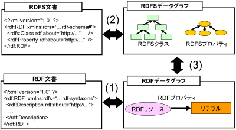

==========================================
MR\ :sup:`3` \の設計
==========================================

.. contents:: コンテンツ 
   :depth: 2
   
-------------------------------------------
MR\ :sup:`3` \の機能概要
-------------------------------------------

RDF(S)コンテンツ構築支援ツールの機能概要を図1に示す．RDF(S)コンテンツ構築支援ツールは，(1) RDFコンテンツの視覚的編集機能，(2) RDFSコンテンツの視覚的編集機能，(3) RDF(S)コンテンツ管理機能の主に三つの機能を持つ．

RDFS文書は，クラスおよびプロパティの階層関係，プロパティの定義域および値域がRDF構文（RDF/XML, Notation 3, N-Triples など）により記述された文書を表す．RDF文書は，クラスのインスタンスに関するステートメントがRDF構文により記述された文書を表す．RDF(S)データグラフとは，RDF(S)データモデルを視覚的に表現したものである．RDF要素は，RDFリソース，RDFプロパティ，RDFリテラルを表す．RDFS要素は，RDFSクラスおよびRDFSプロパティを表す．

以下では，RDF(S)コンテンツ構築支援ツールの各機能について説明する．

   図1: RDF(S)コンテンツ構築支援ツールの機能概要

--------------------------------
RDFコンテンツの視覚的編集機能
--------------------------------

図1の(1) は，RDFコンテンツの視覚的編集機能を表している．RDFコンテンツの視覚的編集機能は，RDF文書からRDFデータグラフへの変換機能，RDFデータグラフからRDF文書への変換機能，RDFデータモデルに基づいたRDF要素の視覚的編集機能の三つから構成される．RDF要素の視覚的編集機能では，ステートメント（RDFリソース，RDFプロパティ，RDFリテラルで表される三つ組み）の編集を行うことができる．

--------------------------------
RDFSコンテンツの視覚的編集機能
--------------------------------

図1の(2)は，RDFSコンテンツの視覚的編集機能を表している．RDFSコンテンツの視覚的編集機能は，RDFS文書からRDFSデータグラフへの変換機能，RDFSデータグラフからRDFS文書への変換機能，RDFSデータモデルに基づいたRDFS要素の視覚的編集機能の三つから構成される．RDFS要素の視覚的編集機能では，クラスおよびプロパティの階層関係，プロパティの定義域および値域の編集を行うことができる．

--------------------------------
RDF(S)コンテンツ管理機能
--------------------------------

図1の(3) は，RDF(S)コンテンツ管理機能を表している．RDF(S)コンテンツ管理機能により，オントロジー(RDFSコンテンツ)とモデル(RDFコンテンツ) 間の整合性を管理することができる．

RDF(S)コンテンツ管理機能は，O→MまたはM→Oで表すことができる．O→Mは，オントロジー(RDFSクラスおよびRDFSプロパティ) の変更をモデル(RDFリソースのタイプおよびRDFプロパティ) に反映させる機能を表す．M→Oは，モデルの変更をオントロジーに反映させる機能を表す．RDFSクラスの編集およびRDFSプロパティの編集は，O→Mで表される．RDFリソースタイプの変更およびRDFプロパティの変更は，M→Oで表される．

詳しくは，RDF(S) コンテンツ管理機能の詳細で述べる．

--------------------------
その他の機能
--------------------------

^^^^^^^^^^^^^^^^^^^^
URI 識別補助機能
^^^^^^^^^^^^^^^^^^^^

URI 識別補助機能とは，RDF要素およびRDFS要素の識別を補助するための機能である．ユーザはRDF要素およびRDFS要素をURI によって識別する．URI は一般的に数十文字になるため，膨大な数のリソースを扱う場合，ユーザがURI を識別および編集することが困難である．そこで，RDF(S) コンテンツ構築支援ツールではユーザが指定した名前空間URI を指定した名前空間接頭辞に置換して表示する機能をもつ．また，RDF要素およびRDFS要素にrdfs:label プロパティの値（見出し）が定義されている場合，URIの代わりに見出しを表示する機能をもつ．

^^^^^^^^^^^^^^^^^^^^^^
メタクラスの設定機能
^^^^^^^^^^^^^^^^^^^^^^

RDF(S) コンテンツ構築支援ツールでは，ユーザはメタクラスを設定することができる．メタクラスには，クラスクラスとプロパティクラスの2 種類がある．あるリソースのタイプがクラスクラスの場合，そのリソースはクラスとなる．また，あるリソースのタイプがプロパティクラスの場合，そのリソースはプロパティとなる．この機能により，ユーザはどのリソースをクラスまたはプロパティとして扱うかを設定することができる．例えば，ユーザがowl:Class をクラスクラスとして，owl:ObjectProperty とowl:DatatypePropertyをプロパティクラスとして設定した場合，RDF(S) コンテンツ構築支援ツールはOWLのクラスおよびプロパティ階層を扱うことができる．RDF(S) コンテンツ構築支援ツールでは，初期クラスクラスとしてrdfs:Class が，初期プロパティクラスとしてrdf:Propertyが設定されている．

^^^^^^^^^^^^^^^^^^^^^
整合性チェック機能
^^^^^^^^^^^^^^^^^^^^^
整合性チェック機能により，RDF(S)コンテンツ構築中の任意の時点で，RDFSプロパティの定義域および値域に違反するRDFコンテンツのステートメントをユーザに提示することができる．RDF(S)コンテンツ構築支援ツールは，RDFプロパティの定義を容易に行うことができるように*1，RDFSプロパティの定義域および値域の整合性チェックをリアルタイムに行わない．整合性チェックには，vOWLidatorを用いている．

注釈
オントロジーベースのツールでは，RDFS プロパティの定義域および値域を定義しなければ，RDF コンテンツ構築時にRDF プロパティが利用できない．RDF(S) コンテンツ構築支援ツールでは，RDFS プロパティの定義域および値域の定義を行うことなく，RDF プロパティの定義を行うことができる．