ユーザマニュアル
========================

.. contents:: コンテンツ 
   :depth: 4

MR\ :sup:`3` \のアーキテクチャ
------------------------------
 RDF(S)コンテンツ構築支援ツールの設計を基に，RDF(S)コンテンツ構築支援ツールMR\ :sup:`3` \ (Meta-Model Management based on RDFs Revision Reflection) の実装を行った． :numref:`mr3-architecture` にMR\ :sup:`3` \の実装アーキテクチャを示す．MR\ :sup:`3` \はGUIコンポーネントとしてJava Swingを用いて，Java言語で実装を行った． MR\ :sup:`3` \は，RDFおよびRDFSデータグラフを視覚化するためにJGraphライブラリを用いている．:numref:`mr3-architecture` のグラフィカルモデラの実装にはJGraphを用いている．また，MR\ :sup:`3` \は，セマンティックWeb コンテンツ（RDF，RDFS，OWLコンテンツ）のインポート，編集，エクスポートを行うために，Jena: A Semantic Web Frameworkを用いている． :numref:`mr3-architecture`  のパーサとジェネレータの実装にはJena APIを用いている．他のセマンティックWebアプリケーションと連携を行うことができるように， MR\ :sup:`3` \はプラグイン機構を備えている．MR\ :sup:`3` \はプラグイン開発のために主に2 種類のAPI を提供している．一つは，MR\ :sup:`3` \のデータグラフをJenaのモデルオブジェクトに変換するAPIであり，もう一つは，JenaのモデルオブジェクトをMR\ :sup:`3` \のデータグラフに変換するAPIである．これらのAPIを用いることで， MR\ :sup:`3` \で構築したRDFおよびRDFSコンテンツを別のセマンティックWeb アプリケーションに入力することや，逆に他のセマンティックWeb アプリケーションの出力をMR\ :sup:`3` \に入力することが可能となる．将来的には，RDFコンテンツとRDFSコンテンツ間の整合性管理に関するAPIも提供することを考えている．

.. _mr3-architecture:

.. figure:: figures/implementation_architecture_of_mr3.png
   :scale: 80 %
   :alt: MR\ :sup:`3` \の実装アーキテクチャ
   :align: center

   MR\ :sup:`3` \の実装アーキテクチャ

MR\ :sup:`3` \のシステム構成図
------------------------------

 :numref:`system-overview` にMR\ :sup:`3` \のシステム構成を示す． MR\ :sup:`3` \は，パーサモジュール，ジェネレータモジュール，RDF(S)コンテンツ管理モジュール，プラグイン，ユーザインタフェースから構成される．ユーザインタフェースには，プラグインインタフェースおよびグラフィカルモデラがあり，ユーザはグラフィカルモデラを介して，RDFおよびRDFSコンテンツを視覚的に編集することができる．また，ユーザは，プラグインインタフェースより，プラグインの機能にアクセスすることができる． MR\ :sup:`3` \の入力と出力はRDF(S)文書である．パーサはRDF(S)文書を解析して，Jena のモデルオブジェクトに変換し，その後，RDF(S)コンテンツ管理を行うことができるようにMR\ :sup:`3` \の内部データに変換する．ジェネレータは， MR\ :sup:`3` \の内部データをJena のモデルオブジェクトに変換し，その後，RDF(S)文書に変換する

.. _system-overview:

.. figure:: figures/system_overview_of_mr3.png
   :scale: 80 %
   :alt: MR\ :sup:`3` \のシステム構成
   :align: center

   MR\ :sup:`3` \のシステム構成

MR\ :sup:`3` \の画面構成
------------------------

 :numref:`mr3-screenshot` にMR\ :sup:`3` \のグラフィカルモデラのスクリーンショットを示す．グラフィカルモデラは，RDFエディタ，クラスエディタ，プロパティエディタ，アトリビュートダイアログ，名前空間テーブル，削除ダイアログ，リソース検索ダイアログ，インポートダイアログ，エクスポートダイアログ，設定ダイアログから構成される．

 .. _mr3-screenshot:
 .. figure:: figures/screenshot_of_mr3.png
   :scale: 50 %
   :alt: MR\ :sup:`3` \のグラフィカルモデラのスクリーンショットs
   :align: center

   MR\ :sup:`3` \のグラフィカルモデラのスクリーンショット
   
   
.. index:: RDFエディタ

RDFエディタ
-----------
   
RDFエディタでは，RDFリソース，RDFリソースのタイプ，RDFプロパティ，RDFリテラルの編集を行う．:numref:`rdf-editor` に示すように，RDFリソースは楕円，RDFプロパティは矢印，RDFリテラルは矩形でRDFエディタ内に表示される．RDFリソースのタイプはRDFリソースの右上に表示される．

.. _rdf-editor:
.. figure:: figures/rdf_editor.png
   :scale: 40 %
   :alt: RDFエディタ
   :align: center

   RDFエディタ

RDFエディタのツールバー
~~~~~~~~~~~~~~~~~~~~~~~

================================================== ===================================================================
        アイコン                                      説明                                                             
================================================== ===================================================================
 .. figure:: figures/toolbar/move.gif               ノードを移動する                                           
 .. figure:: figures/toolbar/connect.gif            ノードとノードを矢印で接続する                                     
 .. figure:: figures/toolbar/link.png               RDFノードを選択時に，対応するRDFSノードを選択する状態
 .. figure:: figures/toolbar/link_break.png         RDFノードを選択時に，対応するRDFSノードを選択しない状態
 .. figure:: figures/toolbar/insert_resource.png    RDFリソースを挿入する      
 .. figure:: figures/toolbar/insert_literal.png     RDFリテラルを挿入する                           
 .. figure:: figures/toolbar/arrow_undo.png         アンドゥ
 .. figure:: figures/toolbar/arrow_redo.png         リドゥ
 .. figure:: figures/toolbar/copy.png               ノードをコピーする                                         
 .. figure:: figures/toolbar/cut.png                ノードをカットする                                         
 .. figure:: figures/toolbar/paste.png              ノードをペーストする                                        
 .. figure:: figures/toolbar/delete.png             ノードを削除する                                          
 .. figure:: figures/toolbar/find.png               リソース検索ダイアログを表示する                                  
 .. figure:: figures/toolbar/zoom100.gif            標準の倍率にする                                          
 .. figure:: figures/toolbar/zoom_in.png            拡大する                                              
 .. figure:: figures/toolbar/zoom_out.png           縮小する                                              
 .. figure:: figures/toolbar/zoom.png               全体が表示できる倍率にする                                     
 .. figure:: figures/toolbar/shape_group.png        ノードのグループ化
 .. figure:: figures/toolbar/shape_ungroup.png      ノードのグループ化解除
 .. figure:: figures/toolbar/layout_rdf_graph.png   RDFグラフの自動整列を実行
================================================== ===================================================================

RDFエディタのポップアップメニュー
~~~~~~~~~~~~~~~~~~~~~~~~~~~~~~~~~

RDFエディタ内で，右クリックするとポップアップメニューが表示される．ポップアップメニューは，ノードを選択している場合としていない場合で表示内容が異なる．ポップアップメニューは，以下のとおり．

.. figure:: figures/popup_menu_rdf_editor.png
   :scale: 50 %
   :alt: ノードが選択されていない状態
   :align: center

   ノードが選択されていない状態

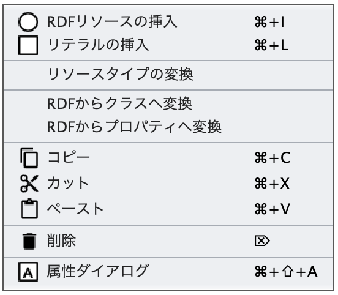

   ノードが選択された状態

RDFリソースの挿入
    マウスの右クリックで指定した位置にRDFリソースを挿入する．
リテラルの挿入
    マウスの右クリックで指定した位置にリテラルを挿入する．
接続モード
    接続モードにきりかえる．接続モードでRDFリソースから別のRDFリソースまたは，RDFリテラルにドラッグ＆ドロップを行うと，リソース間をプロパティで接続することができる．
RDFからクラスへ変換
    RDFリソースをRDFSクラスに変換する．
RDFからプロパティへ変換
    RDFリソースをRDFSプロパティに変換する．
コピー
    RDFリソース，プロパティ，リテラルをコピーする．
カット
    RDFリソース，プロパティ，リテラルをカットする．
ペースト
    RDFリソース，プロパティ，リテラルをペーストする．
削除
    RDFリソース，プロパティ，リテラルを削除する．
アトリビュートダイアログを表示
    アトリビュートダイアログを表示する 

RDFリソースの属性編集
~~~~~~~~~~~~~~~~~~~~~

RDFエディタ内のRDFリソースを選択すると，アトリビュートダイアログにRDFリソースの属性が表示される（ :numref:`attr-rdf-res-uri` から :numref:`attr-rdf-literal` ）．RDFリソースの属性編集では，RDFリソースのURI，RDFリソースのタイプ，RDFリソースが空白ノード(blank node) かどうかの選択，RDFリソースのラベルおよびコメントを編集することができる．ここで，空白ノードとは，URI により名前付けしないRDFリソースを表す．空白ノードは外部から参照することはできない．しかし，ステートメントにおける主語または目的語になることができ，URI により名前付けしにくいRDFリソースを記述したり，複数のRDFプロパティを構造化したRDFコンテンツを表現するために用いられる．

RDFリソースのURI を設定したい場合には， :numref:`attr-rdf-res-uri` に示すように，アトリビュートダイアログ左側の一覧から「URI」を選択する．「接頭辞」コンボボックスには，名前空間テーブルに登録されている名前空間接頭辞の一覧が表示される．「接頭辞」コンボボックスから名前空間接頭辞を選択すると，対応する名前空間が「RDFリソース」テキストフィールドに出力される．ユーザは，「RDFリソース」テキストフィールドに設定したいRDFリソースのURI を入力する．RDFリソースを空白ノードとしたい場合には，「ブランク」チェックボックスにチェックをいれる．

.. _attr-rdf-res-uri:
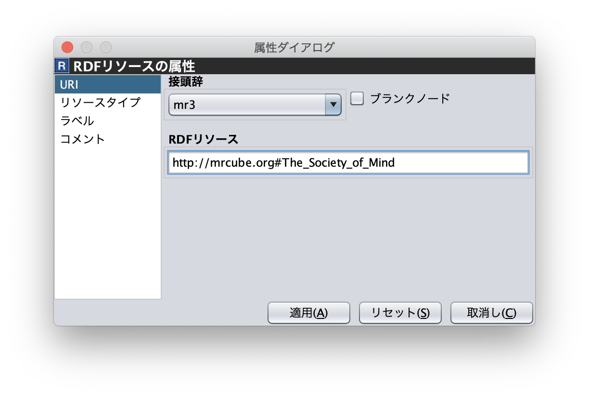

   アトリビュートダイアログ（RDFリソースのURI）

RDFリソースのタイプを設定したい場合には， :numref:`attr-rdf-res-type` に示すように，アトリビュートダイアログ左側の一覧から「タイプ」を選択する．RDFリソースタイプを入力するには，「タイプ」チェックボックスをチェックする．RDFリソースのタイプを空にするには，「タ
イプ」チェックボックスのチェックをはずす．「タイプ選択」ボタンをクリックすると， :numref:`rdf-res-type-selection-dialog` に示す「RDFリソースタイプ選択」ダイアログが表示される．「RDFリソースタイプ選択」ダイアログには，クラスエディタで構築したクラス階層が表示される．RDFリソースのタイプとしたいクラスを選択すると，「RDFリソースタイプ選択」ダイアログのURI ラベルに，選択したクラスのURI が表示される．「了解」ボタンをクリックすると，アトリビュートダイアログの「接頭辞」コンボボックスと「リソースタイプID」テキストフィールドに，「RDFリソースタイプ選択」ダイアログで選択したURI が設定される．クラスエディタで定義されていないクラスのURI をRDFリソースのタイプとして入力した場合，RDF(S)コンテンツ管理機能が働き， :numref:`rdf-and-rdfs-management-dialog` に示す「RDF(S)コンテンツ管理」ダイアログが表示される．RDF(S)コンテンツ管理ダイアログでは，RDFSクラス名の変更またはRDFSクラスの新規作成のどちらかをユーザは選択することができる．「ジャンプクラス」ボタンをクリックすると，そのRDFリソースのタイプと対応するクラスエディタ内のRDFSクラスへジャンプする．また，アトリビュートダイアログにそのRDFSクラスの属性が表示される．

.. _attr-rdf-res-type:
.. figure:: figures/attribute_dialog_rdf_resource_type.png
   :scale: 80 %
   :alt: アトリビュートダイアログ（RDFリソースのタイプ）
   :align: center

   アトリビュートダイアログ（RDFリソースのタイプ）

.. _rdf-res-type-selection-dialog:
.. figure:: figures/rdf_resource_type_selection_dialog.png
   :scale: 80 %
   :alt: RDFリソースタイプ選択ダイアログ
   :align: center

   RDFリソースタイプ選択ダイアログ

.. _rdf-and-rdfs-management-dialog:
.. figure:: figures/rdf_and_rdfs_management_dialog.png
   :scale: 80 %
   :alt: RDF(S)コンテンツ管理ダイアログ
   :align: center

   RDF(S)コンテンツ管理ダイアログ

RDFリソースに対して，rdfs:label プロパティを用いてRDFリソースのラベルを記述したい場合には， :numref:`attr-rdf-res-label` に示すように，アトリビュートダイアログ左側の一覧から「ラベル」を選択する．「言語」テキストフィールドに言語を，「ラベル」テキストフィールドにラベルを入力し，「追加」ボタンを押すと，アトリビュートダイアログ中央のテーブルに言語とラベルが追加される．テーブルの行を選択し，「削除」ボタンを押すと選択したラベルを削除することができる．

.. _attr-rdf-res-label:
.. figure:: figures/attribute_dialog_rdf_resource_label.png
   :scale: 80 %
   :alt: アトリビュートダイアログ（RDFリソースのラベル）
   :align: center

   アトリビュートダイアログ（RDFリソースのラベル）

RDFリソースに対して，rdfs:comment プロパティを用いてRDFリソースのコメントを記述したい場合には， :numref:`attr-rdf-res-comment` に示すように，アトリビュートダイアログ左側の一覧から「コメント」を選択する．「追加」ボタンを押すと，「コメント編集」ダイアログが表示される．「言語」テキストフィールドに言語を，「ラベル」テキストフィールドにラベルを入力し，「了解」ボタンを押すと，アトリビュートダイアログ中央のテーブルに言語とコメントが追加される．テーブルの行を選択し，「編集」ボタンを押すと「コメント編集」ダイアログが表示され，コメントを編集することができる．テーブルの行を選択し，「削除」ボタンを押すと選択したコメントを削除することができる．

.. _attr-rdf-res-comment:
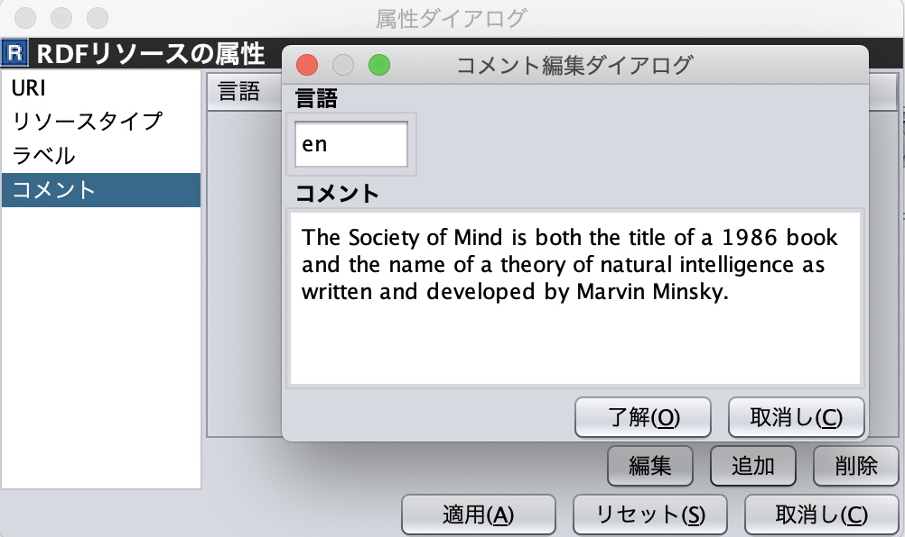

   アトリビュートダイアログ（RDFリソースのコメント）

RDFプロパティの属性編集
~~~~~~~~~~~~~~~~~~~~~~~

RDFエディタ内のRDFプロパティを選択すると，アトリビュートダイアログにRDFプロパティの属性が表示される（ :numref:`attr-rdf-property` ）．RDFプロパティの属性編集では，RDFプロパティのURI を編集することができる．「コンテナ」チェックボックスにチェックをして，数値を入力するとrdf: 1…rdf: n プロパティの入力を行うことができる．「プロパティの接頭辞のみ表示」チェックボックスにチェックをいれると，プロパティエディタで定義されているプロパティがもつ名前空間URI に対応する名前空間接頭辞のみを「接頭辞」コンボボックスから選択可能となる．チェックをはずすと，名前空間テーブルに登録されているすべての接頭辞を選択可能となる．

.. _attr-rdf-property:
.. figure:: figures/attribute_dialog_rdf_property.png
   :scale: 80 %
   :alt: アトリビュートダイアログ（RDFプロパティ）
   :align: center

   アトリビュートダイアログ（RDFプロパティ）

プロパティエディタで定義されていないプロパティのURI を入力した場合，RDF(S)コンテンツ管理機能が働き， :numref:`rdf-and-rdfs-management-dialog` に示す「RDF(S)コンテンツ管理」ダイアログが表示される．RDF(S)コンテンツ管理ダイアログでは，RDFSプロパティ名の変更またはRDFSプロパティの新規作成のどちらかをユーザは選択することができる．プロパティエディタ内で定義されているプロパティの中で，名前空間接頭辞に対応する名前空間URI をもつプロパティのID が「プロパティID」リストに表示される．「プロパティ」ボタンをクリックすると，選択したRDFプロパティに対応するプロパティエディタ内のRDFSプロパティにジャンプし，アトリビュートダイアログにそのRDFSプロパティの属性が表示される．

RDFリテラルの属性編集
~~~~~~~~~~~~~~~~~~~~~
RDFエディタ内のRDFリテラルを選択すると，アトリビュートダイアログにRDFリテラルの属性が表示される（ :numref:`attr-rdf-literal` ）．RDFリテラルの編集では，リテラルの内容，言語属性（xml:lang 属性），データタイプの編集を行うことができる．「リテラル」テキストエリアには，リテラルの内容を入力する．「言語」テキストフィールドには，リテラルの記述言語を入力する．リテラルのデータタイプを設定したい場合には，「タイプ」チェックボックスにチェックを入れて，「タイプ」コンボボックスからデータタイプを選択することができる．リテラルのデータタイプを必要としない場合には，「タイプ」チェックボックスのチェックをはずす．言語とリテラルのタイプは排他的であり，どちらか一方しか設定することはできない

.. _attr-rdf-literal:
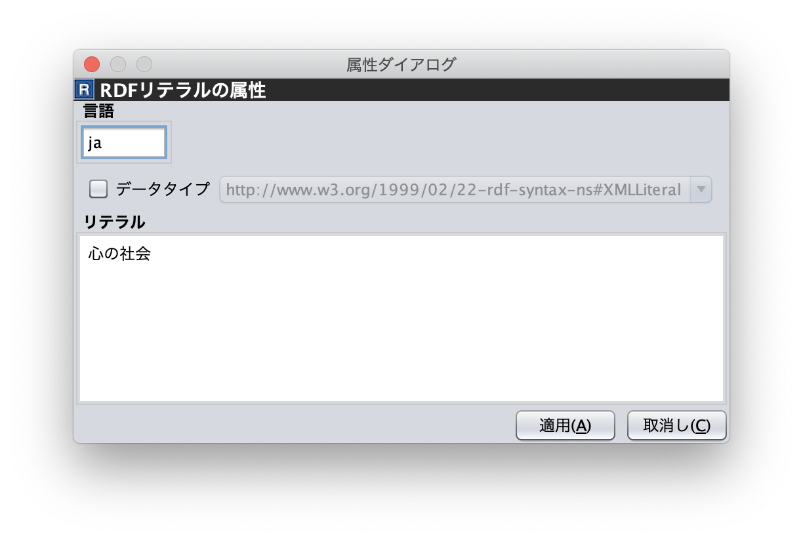

   アトリビュートダイアログ（RDFリテラル）

.. index:: クラスエディタ

クラスエディタ
--------------

クラスエディタでは，RDFSクラスの階層関係およびRDFSクラスの属性編集を行うことができる． :numref:`class-editor` にクラスエディタのスクリーンショットを示す

.. _class-editor:
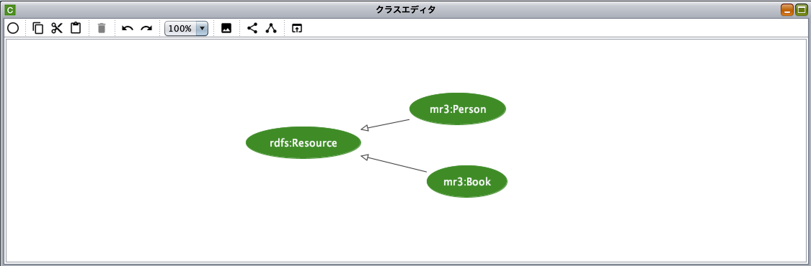
   
   クラスエディタ

クラスエディタのツールバー
~~~~~~~~~~~~~~~~~~~~~~~~~~

======================================================= ===================================================================
        アイコン                                          説明                                                             
======================================================= ===================================================================
 .. figure:: figures/toolbar/move.gif                    ノードを移動する                                           
 .. figure:: figures/toolbar/connect.gif                 ノードとノードを矢印で接続する                                     
 .. figure:: figures/toolbar/insert_class.png            RDFSクラスを挿入する    
 .. figure:: figures/toolbar/arrow_undo.png              アンドゥ
 .. figure:: figures/toolbar/arrow_redo.png              リドゥ
 .. figure:: figures/toolbar/copy.png                    ノードをコピーする                                         
 .. figure:: figures/toolbar/cut.png                     ノードをカットする                                         
 .. figure:: figures/toolbar/paste.png                   ノードをペーストする                                        
 .. figure:: figures/toolbar/delete.png                  ノードを削除する                                          
 .. figure:: figures/toolbar/find.png                    リソース検索ダイアログを表示する                                  
 .. figure:: figures/toolbar/zoom100.gif                 標準の倍率にする                                          
 .. figure:: figures/toolbar/zoom_in.png                 拡大する                                              
 .. figure:: figures/toolbar/zoom_out.png                縮小する                                              
 .. figure:: figures/toolbar/zoom.png                    全体が表示できる倍率にする                                     
 .. figure:: figures/toolbar/shape_group.png             ノードのグループ化
 .. figure:: figures/toolbar/shape_ungroup.png           ノードのグループ化解除
 .. figure:: figures/toolbar/layout_class_graph.png      RDFSクラスグラフの自動整列を実行
======================================================= ===================================================================

クラスエディタのポップアップメニュー
~~~~~~~~~~~~~~~~~~~~~~~~~~~~~~~~~~~~

クラスエディタ内で，右クリックするとポップアップメニューが表示される．ポップアップメニューは，ノードを選択している場合としていない場合で表示内容が異なる．ポップアップメニューは，以下のとおり．

.. figure:: figures/popup_menu_class_editor.png
   :scale: 50 %
   :alt: ノードが選択されていない状態
   :align: center
   
   ノードが選択されていない状態
   
.. figure:: figures/popup_menu_selected_class_editor.png
   :scale: 50 %
   :alt: ノードが選択された状態
   :align: center
   
   ノードが選択された状態

クラスの挿入
    マウスの右クリックで指定した場所にクラスを挿入する．他のクラスを選択した状態でクラスの挿入を行うと，選択したクラスのサブクラスとして，新規クラスが挿入される．
接続モード
    接続モードに切り替える．下位クラスから上位クラスにドラッグ＆ドロップをすることで，上位・下位関係を定義できる．
クラスからRDFへ変換
    RDFSクラスからRDFリソースへ変換する．
クラスからプロパティへ変換
    RDFSクラスからRDFSプロパティへ変換する．
コピー
    クラスとクラス間の関係をコピーする．
カット
    クラスとクラス間の関係をカットする．
ペースト
    クラスとクラス間の関係をカットする．
削除
    クラスとクラス間の関係を削除する．
アトリビュートダイアログを表示
    アトリビュートダイアログを表示する．

クラスエディタの属性編集
~~~~~~~~~~~~~~~~~~~~~~~~
クラスエディタ内のRDFSクラスを選択すると，RDFSクラスの属性がアトリビュートダイアログに表示される（ :numref:`attr-class-basic` から :numref:`attr-class-upper-class` ）．アトリビュートダイアログ左側のリストから「基本」，「ラベル」，「コメント」，「インスタンス」，「上位クラス」項目を選択し，RDFSクラスの属性の編集を行う．「基本」では，リソースタイプおよびURI を編集することができる（ :numref:`attr-class-basic` ）．リソースタイプで選択できる項目は，「設定」ダイアログのクラスクラスリストから追加および削除を行うことができる．「ラベル」では，rdfs:label プロパティの編集を行うことができる．「コメント」では，rdfs:commentの編集を行うことができる．ラベルとコメントの編集方法は，RDFリソースと同様である．「インスタンス」には選択したRDFSクラスのインスタンスのリストが表示される（ :numref:`attr-class-instance` ）．リスト中の項目をクリックすると対応するRDFエディタ内のRDFリソースにジャンプし，そのRDFリソースの属性がアトリビュートダイアログに表示される．「上位クラス」には，選択したRDFSクラスの上位クラスのリストが表示される（ :numref:`attr-class-upper-class` ）．

.. _attr-class-basic:
.. figure:: figures/attribute_dialog_rdfs_class_basic.png
   :scale: 80 %
   :alt: アトリビュートダイアログ（RDFSクラスの基本）
   :align: center
   
   アトリビュートダイアログ（RDFSクラスの基本）
 
.. _attr-class-instance:
.. figure:: figures/attribute_dialog_rdfs_class_instance.png
   :scale: 80 %
   :alt: アトリビュートダイアログ（RDFSクラスのインスタンス）
   :align: center
   
   アトリビュートダイアログ（RDFSクラスのインスタンス）
  
.. _attr-class-upper-class:
.. figure:: figures/attribute_dialog_rdfs_class_upper_class.png
   :scale: 80 %
   :alt: アトリビュートダイアログ（RDFSクラスの上位クラス）
   :align: center
   
   アトリビュートダイアログ（RDFSクラスの上位クラス）

.. index:: プロパティエディタ

プロパティエディタ
------------------

プロパティエディタでは，RDFS プロパティの階層関係およびRDFS プロパティの属性編集を行うことができる． :numref:`property-editor` にプロパティエディタのスクリーンショットを示す．

.. _property-editor:
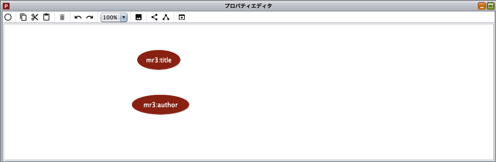
   
   プロパティエディタ

プロパティエディタのツールバー
~~~~~~~~~~~~~~~~~~~~~~~~~~~~~~

======================================================= ===================================================================
        アイコン                                          説明                                                             
======================================================= ===================================================================
 .. figure:: figures/toolbar/move.gif                    ノードを移動する                                           
 .. figure:: figures/toolbar/connect.gif                 ノードとノードを矢印で接続する                                     
 .. figure:: figures/toolbar/insert_property.png         RDFSプロパティを挿入する    
 .. figure:: figures/toolbar/arrow_undo.png              アンドゥ
 .. figure:: figures/toolbar/arrow_redo.png              リドゥ
 .. figure:: figures/toolbar/copy.png                    ノードをコピーする                                         
 .. figure:: figures/toolbar/cut.png                     ノードをカットする                                         
 .. figure:: figures/toolbar/paste.png                   ノードをペーストする                                        
 .. figure:: figures/toolbar/delete.png                  ノードを削除する                                          
 .. figure:: figures/toolbar/find.png                    リソース検索ダイアログを表示する                                  
 .. figure:: figures/toolbar/zoom100.gif                 標準の倍率にする                                          
 .. figure:: figures/toolbar/zoom_in.png                 拡大する                                              
 .. figure:: figures/toolbar/zoom_out.png                縮小する                                              
 .. figure:: figures/toolbar/zoom.png                    全体が表示できる倍率にする                                     
 .. figure:: figures/toolbar/shape_group.png             ノードのグループ化
 .. figure:: figures/toolbar/shape_ungroup.png           ノードのグループ化解除
 .. figure:: figures/toolbar/layout_property_graph.png   RDFSプロパティグラフの自動整列を実行
======================================================= ===================================================================

プロパティエディタのポップアップメニュー
~~~~~~~~~~~~~~~~~~~~~~~~~~~~~~~~~~~~~~~~

プロパティエディタ内で，右クリックするとポップアップメニューが表示される．ポップアップメニューは，ノードを選択している場合としていない場合で表示内容が異なる．ポップアップメニューは，以下のとおり．

.. figure:: figures/popup_menu_selected_property_editor.png
   :scale: 50 %
   :alt: ノードが選択されていない状態
   :align: center
   
   ノードが選択されていない状態
   
.. figure:: figures/popup_menu_selected_property_editor.png
   :scale: 50 %
   :alt: ノードが選択された状態
   :align: center
   
   ノードが選択された状態

プロパティの挿入
    マウスの右クリックで指定した場所にプロパティを挿入する．他のクラスを選択した状態でプロパティの挿入を行うと，選択したプロパティのサブプロパティとして，新規プロパティが挿入される．
接続モード
    接続モードに切り替える．下位プロパティから上位プロパティにドラッグ＆ドロップをすることで，上位・下位関係を定義できる．
プロパティからRDFへ変換
    RDFSプロパティからRDFリソースへ変換する．
プロパティからクラスへ変換
    RDFSプロパティからRDFSクラスへ変換する．
コピー
    プロパティとプロパティ間関係をコピーする．
カット
    プロパティとプロパティ間関係をカットする．
ペースト
    プロパティとプロパティ間関係をペーストする．
削除
    プロパティとプロパティ間関係を削除する．
アトリビュートダイアログを表示
    アトリビュートダイアログを表示する．

プロパティエディタの属性編集
~~~~~~~~~~~~~~~~~~~~~~~~~~~~
プロパティエディタ内のRDFS プロパティを選択すると，RDFS プロパティの属性がアトリビュートダイアログに表示される（ :numref:`attr-property-region` ， :numref:`attr-property-instance` ， :numref:`attr-property-upper-property` ）．アトリビュートダイアログ左側のリストには，「基本」，「ラベル」，「コメント」，「範囲」，「インスタンス」，「上位プロパティ」項目が表示される．「基本」，「ラベル」，「コメント」の編集項目はRDFSクラスと同様である．「基本」のリソースタイプは，「設定」ダイアログのプロパティクラスリストから追加および削除を行うことができる．「範囲」にはRDFS プロパティの定義域および値域をクラスエディタから選択できる（ :numref:`attr-property-region` ）．「インスタンス」には選択したRDFS プロパティを有するRDF リソースのリストが表示される（ :numref:`attr-property-instance` ）．リスト中の項目をクリックした際の動作は，RDFS クラスの場合と同様である．「上位プロパティ」には選択したRDFS プロパティの上位プロパティが表示される（ :numref:`attr-property-upper-property` ）．

.. _attr-property-region:
.. figure:: figures/attribute_dialog_rdfs_property_region.png
   :scale: 80 %
   :alt: アトリビュートダイアログ（RDFSプロパティの範囲）
   :align: center
   
   アトリビュートダイアログ（RDFSプロパティの範囲）
  
.. _attr-property-instance:
.. figure:: figures/attribute_dialog_rdfs_property_instance.png
   :scale: 80 %
   :alt: アトリビュートダイアログ（RDFSプロパティのインスタンス）
   :align: center
   
   アトリビュートダイアログ（RDFSプロパティのインスタンス）
  
.. _attr-property-upper-property:
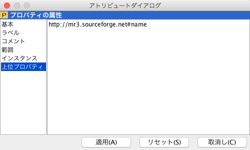
   
   アトリビュートダイアログ（RDFSプロパティの上位クラス）

.. index:: リソース検索ダイアログ

リソース検索ダイアログ
----------------------
 
 「リソース検索」ダイアログでは，RDF エディタ，クラスエディタ，プロパティエディタ内に定義されているRDF(S) 要素の検索を行うことができる． :numref:`resource-search-dialog` にリソース検索ダイアログを示す．「グラフタイプ」内の「RDF」，「クラス」，「プロパティ」チェックボックスのいずれか一つを選択し，検索範囲を設定する．「URI」テキストフィールドに検索したいURI を入力すると，「グラフタイプ」内で選択されたチェックボックスの検索範囲内でリソースを検索する．該当するリソース一覧が， :numref:`resource-search-dialog` 下部の「検索結果」リストに表示される．「検索結果」リストの項目を選択すると，選択したリソースを含むエディタ内のノードへジャンプし，アトリビュートダイアログにそのリソースの属性が表示される．「ラベル」と「コメント」テキストフィールドには，それぞれ，「rdfs:label」プロパティ値と「rdfs:comment」プロパティ値を対象に検索を行うことができる．表示方法は，「URI」テキストフィールドにおける検索と同様である．

 .. _resource-search-dialog:
 .. figure:: figures/resource_search_dialog.png
   :scale: 80 %
   :alt: リソース検索ダイアログ
   :align: center

   リソース検索ダイアログ
 
.. index:: 名前空間テーブル

名前空間テーブル
----------------
 
名前空間テーブルでは，名前空間URI を名前空間接頭辞に置換して表示するために，名前空間接頭辞と名前空間URI の管理を行う． :numref:`namespace-table` に名前空間テーブルのスクリーンショットを示す．「接頭辞」テキストフィールドに名前空間接頭辞を，「名前空間」テキストフィールドに名前空間URI を入力して，「追加」ボタンを押すと名前空間接頭辞と名前空間URI の対応がテーブルに追加される．対応を削除したい場合には，削除したいテーブルの行を選択し，「削除」ボタンを押す．「有効」チェックボックスをチェックすると，URI表示にしている場合に名前空間URI が名前空間接頭辞で置換される．

「有効」チェックボックスのチェックをはずすと名前空間接頭辞が名前空間URI に置換される．RDF(S) 要素のURI を入力する際に名前空間テーブルが参照される．RDF(S) 要素のURI を入力するためには，名前空間接頭辞とID（ローカル名）を入力する必要がある．名前空間テーブルに登録されている名前空間接頭辞をコンボボックスから選択することができる．入力したいURI の名前空間URI および，その名前空間接頭辞をあらかじめ名前空間テーブルに登録する必要がある．名前空間接頭辞を選択すると対応する名前空間URIが「名前空間」ラベルに表示される．

.. _namespace-table:
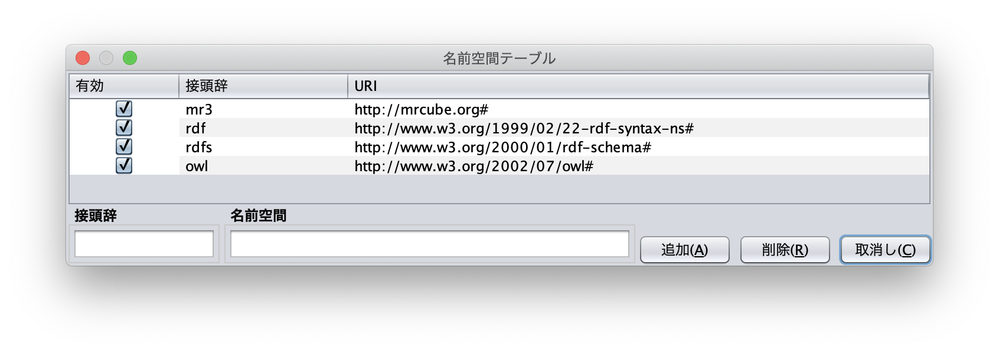

   名前空間テーブル
 

.. index:: 削除ダイアログ

削除ダイアログ
--------------

削除対象のRDFSクラスを，RDFリソースのタイプまたはRDFプロパティの定義域または値域が参照している場合，そのRDFSクラスを削除すると整合性を保つことができない．RDFプロパティが削除対象のRDFSプロパティを参照している場合も同様である．これらの場合，RDF(S)コンテンツ管理機能によって， :numref:`remove-dialog` に示す「削除」ダイアログが表示される． :numref:`remove-dialog` 上部の「削除」リストには，削除対象のRDFSクラスのうち，削除すると整合性を保つことができないRDFSクラスまたはRDFSプロパティのリストが表示される． :numref:`remove-dialog` 下部の参照リスト内の「RDF」タブには，削除対象のRDFSクラスをタイプとして参照しているRDFリソースのリストまたは，削除対象のRDFSプロパティを参照しているRDFプロパティのリストが表示される．「プロパティ」タブには，定義域または値域として，削除対象のRDFSクラスを参照しているRDFSプロパティの一覧が表示される．参照リストの「削除」チェックボックスは，RDFSクラスまたは，RDFSプロパティの参照をやめるかどうかの決定に用いる．「削除」チェックボックスをチェックした状態で「適用」ボタンをクリックすると，削除対象のRDFSクラスまたはRDFSプロパティへの参照がたたれる．「削除」チェックボックスのチェックをはずした項目については，「適用」ボタンを押したときに整合性のチェックを行う．「全選択」ボタンは，すべての「削除」チェックボックスにチェックをつける．「全解除」ボタンは，すべての「削除」チェックボックスのチェックをはずす．「反転」ボタンは，現在チェックされているものとされていないものを反転する．「ジャンプ」ボタンは，選択したリソースへジャンプする．RDFリソースのタイプ，定義域，値域を変更したい場合は，ジャンプボタンで該当するリソースへジャンプして変更を行うことができる．

.. _remove-dialog:
.. figure:: figures/remove_dialog.png
   :scale: 80 %
   :alt: 削除ダイアログ
   :align: center

   削除ダイアログ
 

.. index:: インポートダイアログ

インポートダイアログ
--------------------
 インポートダイアログでは，RDF/XML, N3, N-Triple, Turtle 形式で記述されたRDF(S)文書をMR\ :sup:`3` \にインポートすることができる． :numref:`import-dialog` にインポートダイアログのスクリーンショットを示す．また，以下ではインポートダイアログの各部分（ :numref:`import-dialog` 内の 1 から 13）について説明する．

 .. _import-dialog:
 .. figure:: figures/import_dialog.png
   :scale: 80 %
   :alt: インポートダイアログ
   :align: center

   インポートダイアログ
 
#. コンテナリスト
     RDF，N3, N-Triple，Turtle 形式で記述されたRDF(S) 文書が保存されたフォルダまたはURI のリストを表示する．
#. フォルダ追加
     「1. コンテナリスト」にフォルダを追加する．
#. URI 追加
     「1. コンテナリスト」にURI を追加する．    
#. 削除
     「1. コンテナリスト」内の選択したフォルダまたはURI を削除する．    
#. 構文
     インポートしたいRDF(S) 文書の構文(RDF/XML, N3, N-Triple, Turtle) を選択する．
#. データタイプ
     インポートしたい文書のタイプ(RDF, RDFS, OWL) を選択する．    
#. インポート方法
     編集中のRDF(S) コンテンツにインポートしたいRDF(S) 文書の内容をマージするか，または，編集中のRDF(S) コンテンツをインポートしたいRDF(S) 文書の内容に置換するかを選択する．    
#. 検索
     「検索」テキストフィールドに入力したキーワードによって，「9. インポートファイル」内に表示されているファイルを絞り込む．    
#. インポートファイル
     「1. コンテナリスト」内で選択されたフォルダ内のファイル一覧を表示する．    
#. 拡張子
    拡張子によって，「9. インポートファイル」内に表示されているファイルを絞り込む．
#. 再読み込み
    「1. コンテナリスト」で選択されているフォルダの内容を再読込し，最新のファイル一覧を「9. インポートファイル」に表示する．    
#. インポート
    設定した条件（構文，データタイプ，インポート方法，インポートファイル）でRDF(S) 文書をMR\ :sup:`3` \ にインポートする．    
#. 取消し
    インポートを中止し，インポートダイアログを閉じる．

.. index:: エクスポートダイアログ

エクスポートダイアログ
----------------------
エクスポートダイアログでは， MR\ :sup:`3` \ で構築したRDF(S) データグラフをRDF/XML, N3, N-Triple, Turtle 形式でRDF(S) 文書にエクスポートすることができる． :numref:`export-dialog` にエクスポートダイアログのスクリーンショットを示す．また，以下ではエクスポートダイアログの各部分（ :numref:`export-dialog` 内の1 から8）について説明する．

.. _export-dialog:

.. figure:: figures/export_dialog.png
   :scale: 80 %
   :alt:  エクスポートダイアログ
   :align: center

   エクスポートダイアログ

#. 構文
    RDF(S) 文書としてエクスポートしたい構文（RDF/XML，N-Triple，Turtle，N3 など）を選択する．
#. データタイプ
    各チェックボックスでチェックされたエディタ内のデータグラフをRDF(S) 文書にエクスポートする．（例：クラスとプロパティにチェックをつけた場合，クラスエディタとプロパティエディタ内のデータグラフをRDF(S) 文書にエクスポートする．）
#. オプション
    「Encode(UTF-8)」チェックボックスにチェックをいれた場合，エクスポート時にURI の規則を定めるRFC3986 に基づいて，各要素のURI 文字列に含まれる非予約文字データをURLエンコードする．「Selected」チェックボックスにチェックをいれた場合，範囲選択されているサブデータグラフをエクスポートする．「Abbrev」チェックボックスにチェックをいれた場合，省略表記方法でエクスポートする．「XMLbase」チェックボックスにチェックをいれると，XMLBase 宣言がRDF(S) 文書内に追加される．
#. ファイル
    設定した条件（構文，データタイプ，オプション）で，RDF(S) 文書にエクスポートする．
#. 画像
    「3. データタイプ」の「RDF」，「クラス」，「プロパティ」チェックボックスのうちどれか1 つを選択し，「画像」ボタンを押すと，選択されたエディタのデータグラフをpng 形式でファイルに保存することができる．
#. 再読み込み
    設定した条件で最新のデータグラフを「8. ソース表示」に表示する．
#. 取消し
    エクスポートを中止し，エクスポートダイアログを閉じる．
#. ソース表示
    エクスポートされるRDF(S) 文書の内容が表示される． 

    
.. index:: 設定ダイアログ

設定ダイアログ
--------------

設定ダイアログでは，基本，ディレクトリ，プロキシ，メタクラス，レイアウト，レンダリングについて設定を行うことができる．

基本
~~~~

設定ダイアログの「基本」項目（ :numref:`config-basic` ）では，言語，UI 言語，出力エンコーディング，フォント，ベースURI，ログファイルの設定ができる．言語はラベル表示を行う際に優先して表示する言語を設定できる．UI 言語は，メニューなどに表示する言語を設定できる．言語は，ja（日本語），en（英語），zh（中国語）を選択できる．出力エンコーディングは，エクスポート時にRDF(S)文書を保存するファイルエンコーディングを設定する．フォントは，各エディタ内のノード内の文字列を表示する際のフォントを設定する．ベースURI には，エクスポート時の初期の名前空間URI を設定する．ログファイルには，MR\ :sup:`3` \使用中の各種ログを保存するファイルを設定する．

.. _config-basic:

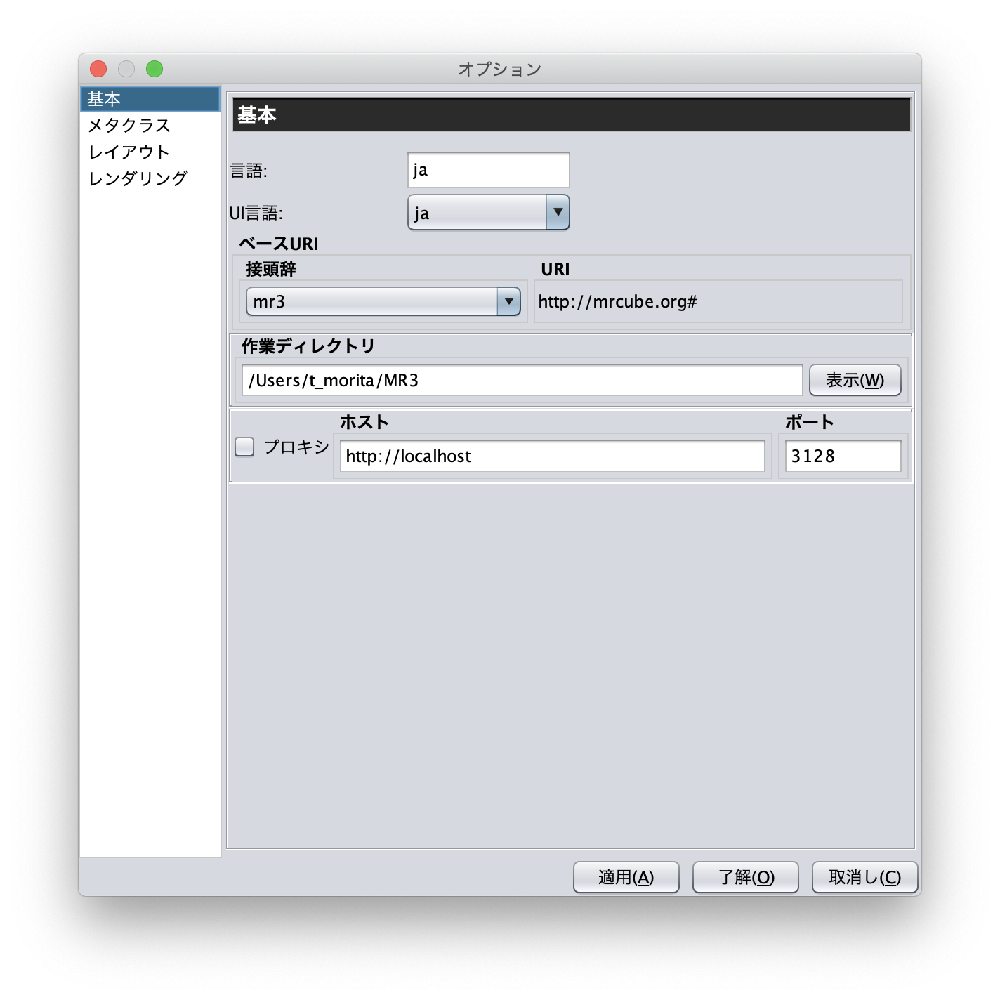

   設定ダイアログ: 基本

ディレクトリ
~~~~~~~~~~~~

設定ダイアログの「ディレクトリ」項目（ :numref:`config-directory` ）では，作業ディレクトリ，プラグインディレクトリ，リソースディレクトリを設定ができる．作業ディレクトリには，インポートダイアログにおいて，RDF(S)文書を含むフォルダを選択する際に最初に開くフォルダを設定する．プラグインディレクトリには， MR\ :sup:`3` \のプラグインが保存されているフォルダを設定する．リソースディレクトリは， MR\ :sup:`3` \のプロパティファイル（メニューなどに表示する言語ごとの設定ファイル）が保存されているフォルダを設定する．

.. _config-directory:
.. figure:: figures/config_dialog_directory.png
   :scale: 80 %
   :alt: 設定ダイアログ: ディレクトリ
   :align: center

   設定ダイアログ: ディレクトリ
   
プロキシ
~~~~~~~~

設定ダイアログの「プロキシ」項目（ :numref:`config-proxy` ）では，プロキシサーバを利用している場合に，プロキシサーバのホスト名とポート番号の設定を行うことができる．インポートダイアログからURI を指定して，RDF(S)文書をインポートする場合に設定が必要となる場合がある．   

.. _config-proxy:
.. figure:: figures/config_dialog_proxy.png
   :scale: 80 %
   :alt: 設定ダイアログ: プロキシ
   :align: center

   設定ダイアログ: プロキシ

メタクラス
~~~~~~~~~~

設定ダイアログの「メタクラス」項目（ :numref:`config-metaclass` ）では，「クラスクラス」および「プロパティクラス」の設定をすることができる．「クラスクラス」に設定したクラスをrdf:typeプロパティの値とするリソースを， MR\ :sup:`3` \はクラスとして認識し，クラスエディタにインポートすることができる．同様に，「プロパティクラス」に設定したクラスをrdf:type プロパティの値とするリソースを， MR\ :sup:`3` \はプロパティとして認識し，プロパティエディタにインポートすることができる．

初期状態では，「クラスクラス」にはrdfs:Class が設定されている．また，「プロパティクラス」には，rdf:Property が設定されている．owl:Class やowl:ObjectProperty をタイプとするリソースを，クラスまたはプロパティとしてMR\ :sup:`3` \にインポートしたい場合には， :numref:`config-metaclass` の「Class Class」タブまたは「Property Class」タブで設定を行う

.. _config-metaclass:
.. figure:: figures/config_dialog_metaclass.png
   :scale: 80 %
   :alt: 設定ダイアログ: メタクラス
   :align: center

   設定ダイアログ: メタクラス

レイアウト
~~~~~~~~~~

設定ダイアログの「レイアウト」項目（ :numref:`config-layout` ）では，各エディタ内のデータグラフのレイアウト方法を設定する．

.. _config-layout:
.. figure:: figures/config_dialog_layout.png
   :scale: 80 %
   :alt: 設定ダイアログ: レイアウト
   :align: center

   設定ダイアログ: レイアウト

レンダリング
~~~~~~~~~~~~
設定ダイアログの「レンダリング」項目（ :numref:`config-rendering` ）では，RDFリソース，RDFリテラル，RDFSクラス，RDFSプロパティの各ノードの色や，ノード選択時の色，エディタウィンドウの背景職をカスタマイズすることができる．「ノードに色をつける」チェックボックスのチェックをはずすと，すべてのノードが無色となる．「アンチエイリアス」チェックボックスにチェックをいれると各ノードの縁が滑らかに表示される．

.. _config-rendering:
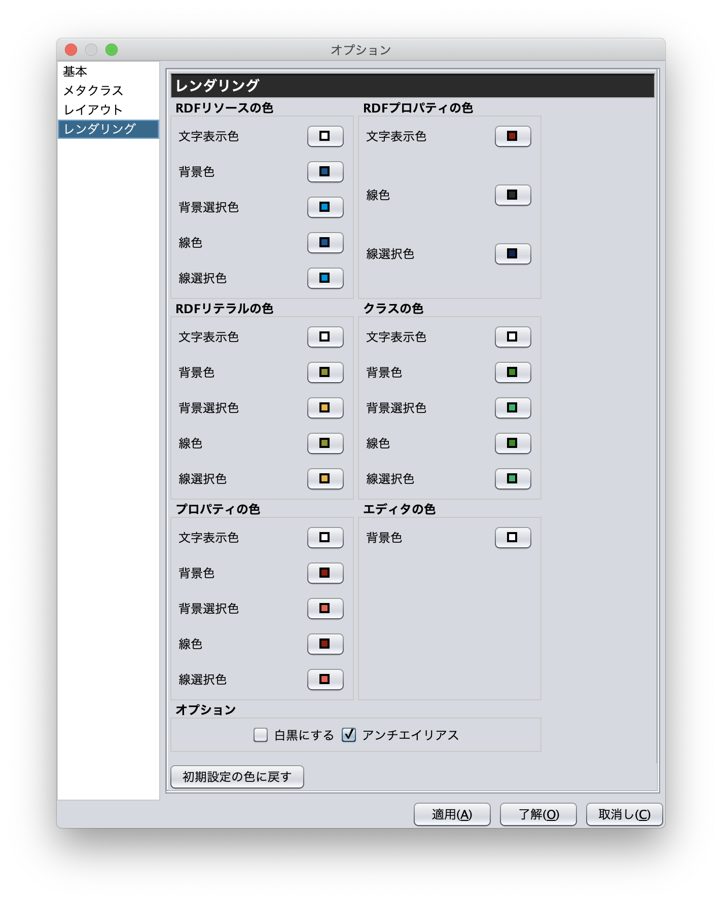

   設定ダイアログ: レンダリング    

拡張機能
---------
「ツール」メニューの「拡張機能」を選択すると，:numref:`plugin-dialog` に示すダイアログが表示される．
「拡張機能」には，設定ダイアログの「ディレクトリ」項目のプラグインディレクトリに指定したディレクトリに含まれる
jarファイルを読み込んで，プラグインリストを表示する．プラグインを選択すると，説明が画面下部に表示され，
「実行」ボタンを押すと，プラグインが実行される．プラグイン作成方法については，:doc:`plugin_development` 参照いただきたい．

.. _plugin-dialog:

   拡張機能

整合性検証
-----------
「ツール」メニューの「整合性検証」を選択すると，:numref:`validator-dialog` に示すダイアログが表示される．
「整合性検証」では，Jenaの `org.apache.jena.reasoner.ValidityReport <https://jena.apache.org/documentation/javadoc/jena/org/apache/jena/reasoner/ValidityReport.html>`_ を利用し，リテラルのデータ型がプロパティの値域の定義に基いて定義されているかどうかなどを検証することができる．

.. _validator-dialog:
.. figure:: figures/validator_dialog.png
   :scale: 80 %
   :alt:  整合性検証
   :align: center

   整合性検証

プロジェクト情報
------------------
「ツール」メニューの「プロジェクト情報」を選択すると，:numref:`project-info-dialog` に示すダイアログが表示される．
「プロジェクト情報」には，現在のプロジェクト名，インポート時間，モデルのリソース数，モデルのリテラル数，モデルのステートメント数，
クラス数，プロパティ数，すべてのリソース数，すべてのリテラル数，すべてのステートメント数が表示される．

.. _project-info-dialog:
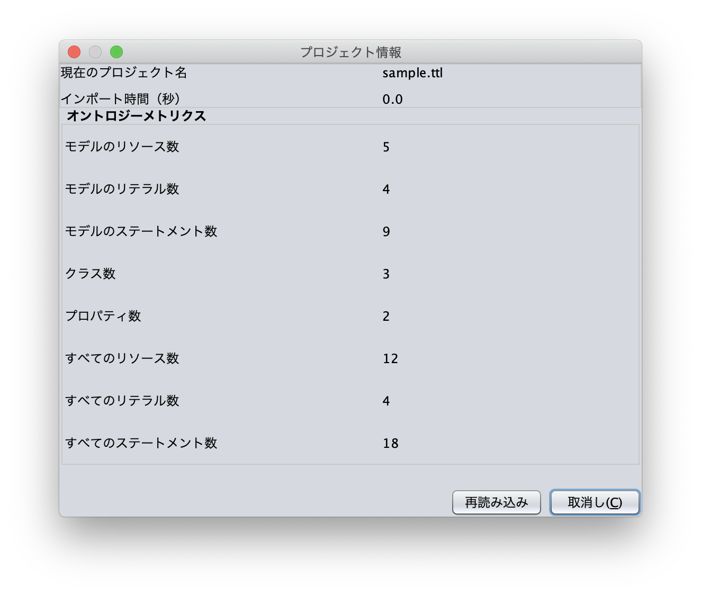

   プロジェクト情報

ログ・コンソール
-----------------
「ツール」メニューの「ログ・コンソールを表示」を選択すると，:numref:`log-console` に示すダイアログが表示される．
ログ・コンソールには，標準出力と標準エラー出力への出力結果が確認できる．

.. _log-console:
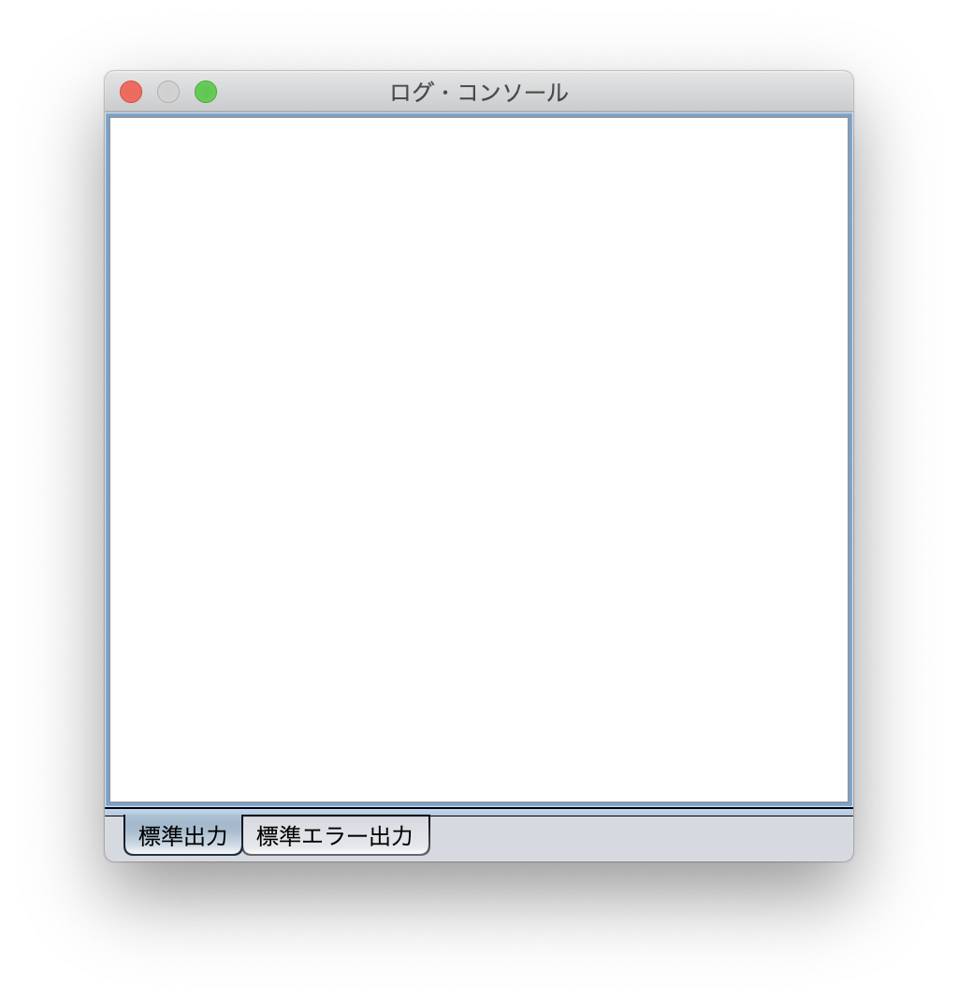

   ログ・コンソール

MR3について
-----------
「ヘルプ」メニューの「MR3について」を選択すると，:numref:`about-mr3` に示すダイアログが表示される．

.. _about-mr3:
.. figure:: figures/about_dialog.png
   :scale: 80 %
   :alt: MR3について
   :align: center

   MR3について

メニュー，ツールバー，ショートカットキー
----------------------------------------

メニュー
~~~~~~~~

ファイル
""""""""

ファイル->新規
    MR\ :sup:`3` \のプロジェクトを新規に開く．現在の作成中のプロジェクトは，保存するか破棄するかを選択する．
ファイル->開く
    MR\ :sup:`3` \のプロジェクトファイルを開く．
ファイル->保存
    MR\ :sup:`3` \のプロジェクトファイルを保存する．
ファイル->名前をつけて保存
    MR\ :sup:`3` \のプロジェクトファイルを別名で保存する．
ファイル->インポート
    インポートダイアログを表示．
ファイル->エクスポート
    エクスポートダイアログを表示．
ファイル->プラグイン
    プラグインのメニューが表示される．
ファイル->終了
    プログラムを終了する．

編集
""""
編集->検索
    リソース検索ダイアログを表示する．    
編集->選択->RDFエディタのノードをすべて選択
    　
編集->選択->クラスエディタのノードをすべて選択
     　   
編集->選択->プロパティエディタのノードをすべて選択
      　  
編集->設定
    設定ダイアログを表示し，各種設定を行う．

表示
""""

表示->URI表示
    各エディタのノード内に表示されるラベルを，URI形式で表示する．名前空間テーブルで接頭辞の表示を有効にしている場合，名前空間を接頭辞に置き換えて表示する．
表示->ID表示
    各エディタのノード内に表示されるラベルを，ID形式で表示する．
表示->ラベル表示
    各エディタのノード内に表示されるラベルを，rdfs:labelで定義されたラベルで表示する．rdfs:labelが定義されていない場合には，URI形式で表示する．
表示->リソースタイプの表示・非表示
    RDFリソースのタイプ（矩形）の表示・非表示を行う．
表示->ツールチップの表示・非表示
    ツールチップの表示・非表示を行う．
表示->グループ化・非グループ化
    RDFリソースとRDFリソースのタイプのグループ化・グループ化解除を行う．
表示->フォント設定
    エディタ上に表示される文字のフォントを変更．

ウィンドウ
""""""""""

ウィンドウ->RDFエディタオーバービューを表示
    RDFエディタの全体を表示する．表示されるウィンドウ内の赤色の四角をドラッグすることで，RDFエディタ内の移動を行うことができ る．また，四角の右下部分をドラッグして，四角の大きさを変更することにより，拡大・縮小を行うことができる．大きくすると拡大し，小さくすると縮小す る．
ウィンドウ->クラスエディタオーバービューを表示
    クラスエディタの全体を表示する．機能は，RDFエディタと同様．
ウィンドウ->プロパティエディタオーバービューを表示
    プロパティエディタの全体を表示する．機能は，RDFエディタと同様．
    
ウィンドウ->RDFエディタを前面に表示
        
ウィンドウ->クラスエディタを前面に表示
    
ウィンドウ->プロパティエディタを前面に表示
    
ウィンドウ->アトリビュートダイアログを前面に表示
    
ウィンドウ->名前空間テーブルを前面に表示
    
ウィンドウ->ソースダイアログを前面に表示
    
ウィンドウ->ログコンソールを表示
    MR\ :sup:`3` \の標準出力・標準エラー出力を表示するウィンドウを表示する．主にデバッグ用．
ウィンドウ->ウィンドウを再配置
    RDFエディタ，クラスエディタ，プロパティエディタを初期位置に戻す．

ヘルプ
""""""

ヘルプ->About MR\ :sup:`3` \
    MR\ :sup:`3` \のバージョン，HPのURL等を表示する．
 
 
ツールバー
~~~~~~~~~~

================================================== ===================================================================
        アイコン                                      説明                                                             
================================================== ===================================================================
 .. figure:: figures/toolbar/new.png                MR\ :sup:`3` \のプロジェクトを新規に開く                             
 .. figure:: figures/toolbar/open.png               MR\ :sup:`3` \のプロジェクトファイルを開く．                          
 .. figure:: figures/toolbar/save.png               MR\ :sup:`3` \のプロジェクトファイルを保存する．                       
 .. figure:: figures/toolbar/saveas.png             MR\ :sup:`3` \のプロジェクトファイルを別名で保存する．                  
 .. figure:: figures/toolbar/import.png             インポートダイアログを表示する                                  
 .. figure:: figures/toolbar/export.png             エクスポートダイアログを表示する                                  
 .. figure:: figures/toolbar/find.png               リソース検索ダイアログを表示する                                  
 .. figure:: figures/toolbar/rdf_editor.png         RDFエディタを前面に表示する                                   
 .. figure:: figures/toolbar/class_editor.png       クラスエディタを前面に表示する                                   
 .. figure:: figures/toolbar/property_editor.png    プロパティエディタを前面に表示する                                 
 .. figure:: figures/toolbar/attr_dialog.png        アトリビュートダイアログを前面に表示する                              
 .. figure:: figures/toolbar/namespace_table.png    名前空間テーブルを前面に表示する                                  
 .. figure:: figures/toolbar/cpr.png                クラス，プロパティ，RDFエディタを表示する
 .. figure:: figures/toolbar/cr.png                 クラス，RDFエディタを表示する
 .. figure:: figures/toolbar/pr.png                 プロパティ，RDFエディタを表示する
 .. figure:: figures/toolbar/arrow_left.png         前を検索 
 .. figure:: figures/toolbar/arrow_right.png        次を検索
 .. figure:: figures/toolbar/accept.png             整合性を検証する 
 .. figure:: figures/toolbar/plugin.png             プラグイン管理ダイアログを表示する
 .. figure:: figures/toolbar/information.png        プロジェクトの情報を表示する 
 .. figure:: figures/toolbar/log_console.png        ログコンソールを表示する
 .. figure:: figures/toolbar/cog.png                設定ダイアログを表示する
 .. figure:: figures/toolbar/help.png               MR\ :sup:`3` \について表示する
================================================== ===================================================================

ショートカットキー
~~~~~~~~~~~~~~~~~~

全体で使えるショートカットキー
""""""""""""""""""""""""""""""
Ctrl-N
    MR\ :sup:`3` \のプロジェクトを新規に開く．現在の作成中のプロジェクトは，保存するか破棄するかを選択する．
Ctrl-O
    MR\ :sup:`3` \のプロジェクトファイルを開く．
Ctrl-S
    MR\ :sup:`3` \のプロジェクトファイルを保存する．
Ctrl+Shift+S
    MR\ :sup:`3` \のプロジェクトファイルを別名で保存する．
Ctrl+Q
    メニューの終了のショートカット
Alt+R
    RDFエディタを前面に表示
Alt+C
    クラスエディタを前面に表示
Alt+P
    プロパティエディタを前面に表示
Alt+A
    アトリビュートダイアログを前面に表示
Alt+S
    ソースダイアログを前面に表示
Alt+N
    名前空間テーブルを前面に表示
Alt+F
    リソース検索ダイアログを前面に表示

エディタ内で使えるショートカットキー
""""""""""""""""""""""""""""""""""""
Ctrl-A
    エディタ内のノードをすべて選択する
Delete
    エディタ内の選択されたノードを削除する
Ctrl-C
    エディタ内の選択されたノードをコピーする
Ctrl-X
    エディタ内の選択されたノードをカットする
Ctrl-V
    コピーまたは，カットされたノードをエディタにペーストする

