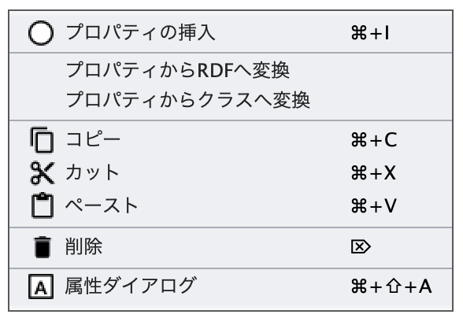
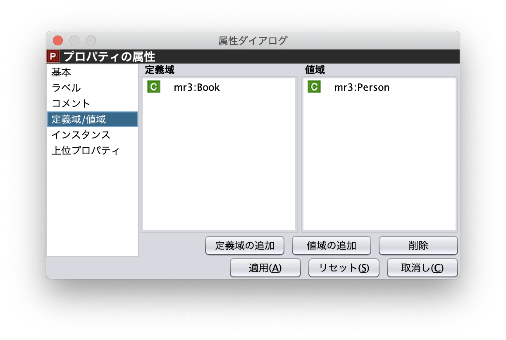
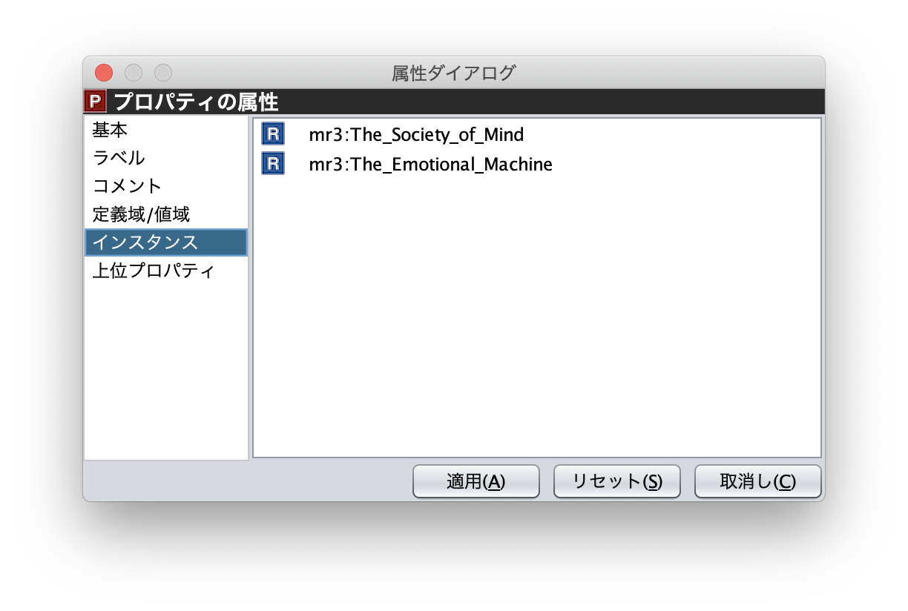

=====================
プロパティエディタ
=====================

.. contents:: コンテンツ 
   :depth: 2
   
プロパティエディタでは，RDFS プロパティの階層関係およびRDFS プロパティの属性編集を行うことができる．図1にプロパティエディタのスクリーンショットを示す．

.. figure:: figures/property_editor.png
   :scale: 50 %
   :alt: 図1: プロパティエディタ
   :align: center
   
   図1: プロパティエディタ
   
------------------------------------------------
プロパティエディタのポップアップメニュー
------------------------------------------------

プロパティエディタ内で，右クリックするとポップアップメニューが表示される．ポップアップメニューは，ノードを選択している場合としていない場合で表示内容が異なる．ポップアップメニューは，以下のとおり．

   
   ノードが選択されていない状態
   

   
   ノードが選択された状態

プロパティの挿入
接続モード
プロパティからRDFへ変換
RDFSプロパティからRDFリソースへ変換する．
プロパティからクラスへ変換
RDFSプロパティからRDFSクラスへ変換する．
コピー
カット
ペースト
削除
アトリビュートダイアログを表示

------------------------------------------------
プロパティエディタの属性編集
------------------------------------------------
プロパティエディタ内のRDFS プロパティを選択すると，RDFS プロパティの属性がアトリビュートダイアログに表示される（図2，図3，図4）．アトリビュートダイアログ左側のリストには，「基本」，「ラベル」，「コメント」，「範囲」，「インスタンス」，「上位プロパティ」項目が表示される．「基本」，「ラベル」，「コメント」の編集項目はRDFSクラスと同様である．「基本」のリソースタイプは，「設定」ダイアログのプロパティクラスリストから追加および削除を行うことができる．「範囲」にはRDFS プロパティの定義域および値域をクラスエディタから選択できる（図2）．「インスタンス」には選択したRDFS プロパティを有するRDF リソースのリストが表示される（図3）．リスト中の項目をクリックした際の動作は，RDFS クラスの場合と同様である．「上位プロパティ」には選択したRDFS プロパティの上位プロパティが表示される（図4）．

   
   図2: アトリビュートダイアログ（RDFSプロパティの範囲）
   

   
   図3: アトリビュートダイアログ（RDFSプロパティのインスタンス）
   
.. figure:: figures/attribute_dialog_rdfs_property_upper_property.png
   :scale: 50 %
   :alt: 図4: アトリビュートダイアログ（RDFSプロパティの上位クラス）
   :align: center
   
   図4: アトリビュートダイアログ（RDFSプロパティの上位クラス）