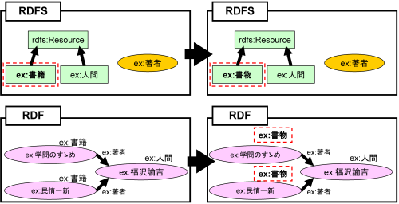
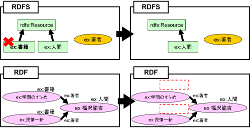
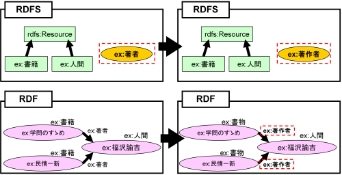
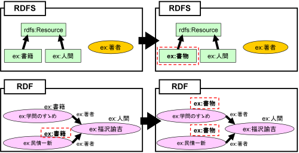
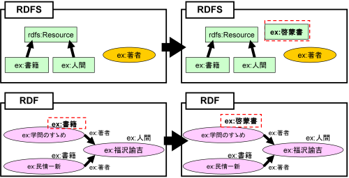
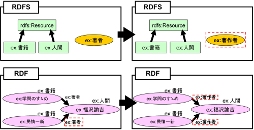
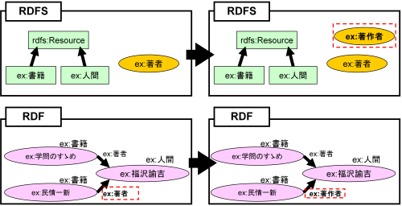
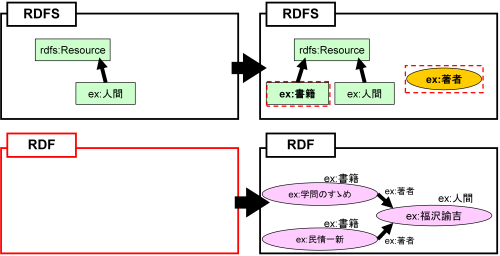

================================
RDF(S)コンテンツ管理機能の詳細
================================

.. contents:: コンテンツ 
   :depth: 2

------------------------   
O→M: RDFSクラスの編集
------------------------

RDF(S)コンテンツ管理機能がはたらくRDFSクラスの編集には，RDFSクラス名(URI)の変更とRDFSクラスの削除がある．

^^^^^^^^^^^^^^^^^^^^^^^^^
RDFSクラス名の変更
^^^^^^^^^^^^^^^^^^^^^^^^^

RDFSクラス名を変更する場合，そのRDFSクラスを参照しているRDFリソースのタイプ名(URI) も同時に変更される．図1 は，RDFSクラス名を変更する場合の具体例を表している．図1 の左側はRDFSクラスex:書籍を変更する前の状態を表しており，右側がRDFSクラスex:書籍をex:書物に変更した後の状態を表している．以下，RDF(S)コンテンツ管理機能の具体例を表す図中のRDFSにおける矩形はクラス，楕円はプロパティ，矢印はクラスの上位・下位関係を表す．矢印は，下位クラスから上位クラスに向かって伸びている．同様に，図中のRDFにおける楕円はRDFリソース，矢印はRDFプロパティ，楕円右上のラベルは，RDFリソースのタイプを表す．ex:学問のすゝめとex:民情一新は，ex:書籍をタイプとするRDFリソースである．RDFSクラスex:書籍をex:書物に変更すると，ex:書籍に対応するRDFリソースのタイプにも自動的に変更が反映される．つまり，RDFリソースex:学問のすゝめおよびex:民情一新のタイプは，ex:書物に自動的に変更される．
    

   図1: RDFSクラス名の変更

^^^^^^^^^^^^^^^^^^^^^
RDFSクラスの削除
^^^^^^^^^^^^^^^^^^^^^

RDFSクラスを削除する場合，そのRDFSクラスをタイプとするRDFリソースの一覧を示し，ユーザはRDFリソースのタイプとして，他のRDFSクラス（または空*1）を選択することができる．図2は，RDFSクラスを削除する場合の具体例を表している．ユーザがRDFSクラスex:書籍を削除したとする．ex:学問のすゝめおよびex:民情一新は，ex:書籍をタイプとするRDFリソースであるため，ex:書籍が削除されるとRDFコンテンツとRDFSコンテンツ間の整合性を保つことができない．図2では整合性を保つために，RDFリソースex:学問のすゝめおよびex:民情一新のタイプを空にしている．

   図2: RDFSクラスの削除

---------------------------
O→M: RDFSプロパティの編集
---------------------------

RDF(S) コンテンツ管理機能がはたらくRDFSプロパティの編集には，RDFSプロパティ名(URI) の変更とRDFSプロパティの削除がある．

^^^^^^^^^^^^^^^^^^^^^^^^^
RDFSプロパティ名の変更
^^^^^^^^^^^^^^^^^^^^^^^^^

RDFSプロパティ名を変更する場合，そのRDFSプロパティを参照しているRDFプロパティ名(URI）も同時に自動的に変更される．図3は，RDFSプロパティ名を変更する場合の具体例を表している．図3の左側はRDFSプロパティex:著者を変更する前の状態を表しており，右側はRDFSプロパティex:著者をex:著作者に変更した後の状態を表している．ex:学問のすゝめおよびex:民情一新は，ex:著者プロパティをもつRDFリソースである．ユーザがRDFSプロパティex:著者をex:著作者に変更すると，ex:著者と対応するRDFプロパティにも変更が反映される．つまり，RDFリソースex:学問のすゝめおよびex:民情一新がもつプロパティex:著者はex:著作者に自動的に変更される．

   図3: RDFSプロパティ名の変更

^^^^^^^^^^^^^^^^^^^^^
RDFSプロパティの削除
^^^^^^^^^^^^^^^^^^^^^

RDFSプロパティを削除する場合，そのRDFSプロパティを参照しているRDFプロパティの一覧を示し，ユーザはRDFプロパティとして，他のRDFSプロパティ（あるいは初期のプロパティ*2）を選択することができる．図4は，RDFSプロパティを削除する場合の具体例を表している．ユーザがRDFSプロパティex:著者を削除したとする．ex:学問のすゝめとex:民情一新は，ex:著者をプロパティとしてもつRDFリソースであるため，ex:著者が削除されるとRDFコンテンツとRDFSコンテンツ間の整合性を保つことができない．図4では，整合性を保つためにユーザは，RDFリソースex:学問のすゝめおよびex:民情一新がもつex:著者プロパティを初期のプロパティ(mr3:nil) にしている．

.. figure:: figures/remove_rdfs_property.png
   :scale: 50 %
   :alt: 図4: RDFSプロパティの削除
   :align: center

   図4: RDFSプロパティの削除

-------------------------------
M→O: RDFリソースのタイプの変更
-------------------------------

ユーザが変更したRDFリソースのタイプがRDFSクラスで定義されている場合は，RDF(S) コンテンツ構築支援ツールは，RDFリソースのタイプとそれに対応するRDFSクラスを対応づける．ユーザが変更したRDFリソースのタイプに対応するRDFSクラスが定義されていない場合，ユーザは次の二つのどちらかを選択できる．一つは，ユーザはRDFリソースのタイプを変更する前に参照していたRDFSクラス名を変更することができる．もう一つは，ユーザは，定義されていないRDFSクラスを新規に作成することができる．ユーザが変更する前のRDFリソースのタイプが空の場合には，RDFSクラス名の変更は選択できない．図5および図6は，それぞれ，RDFリソースのタイプを変更した場合の具体例を表している．

^^^^^^^^^^^^^^^^^^^^^^^^^^^^^^^
参照しているRDFSクラス名の変更
^^^^^^^^^^^^^^^^^^^^^^^^^^^^^^^

図5では，RDFSクラスex:書物が定義されていない状態で，ユーザがRDFリソースex:民情一新のタイプex:書籍をex:書物に変更している．ここでは，整合性を保つためにRDFSクラス名の変更をユーザが選択している．RDFSクラスex:書籍をex:書物に変更することにより，ex:学問のすゝめのタイプもex:書物に半自動的に変更される．

   図5: 参照しているRDFSクラス名の変更

^^^^^^^^^^^^^^^^^^^^^^^^^
RDFSクラスの新規作成
^^^^^^^^^^^^^^^^^^^^^^^^^

図6では，RDFSクラスex:啓蒙書が定義されていない状態で，ユーザがRDFリソースex:学問のすゝめのタイプex:書籍をex:啓蒙書に変更している．ここでは，整合性を保つためにRDFSクラスの新規作成をユーザが選択している．ex:啓蒙書クラスを新規に作成することによって，RDFコンテンツとRDFSコンテンツ間の整合性が保たれる．RDFSクラスex:啓蒙書は，rdfs:Resource のサブクラスとなる*3．

   図6: RDFSクラスの新規作成

--------------------------
M→O: RDFプロパティの変更
--------------------------

ユーザが変更したRDFプロパティがRDFSプロパティで定義されている場合は，RDF(S)コンテンツ構築支援ツールは，RDFプロパティとそれに対応するRDFSプロパティを対応づける．ユーザが変更したRDFプロパティに対応するRDFSプロパティが定義されていない場合，ユーザは次の二つのどちらかを選択できる．一つは，ユーザはRDFプロパティを変更する前に参照していたRDFSプロパティ名を変更することができる．もう一つは，ユーザは，定義されていないRDFSプロパティを新規に作成することができる．図7および図8は，それぞれ，RDFプロパティを変更した場合の具体例を表している．

^^^^^^^^^^^^^^^^^^^^^^^^^^^^^^^^^^
参照しているRDFSプロパティ名の変更
^^^^^^^^^^^^^^^^^^^^^^^^^^^^^^^^^^

図7では，RDFSプロパティex:著作者が定義されていない状態で，ユーザがRDFリソースex:民情一新が持つプロパティex:著者をex:著作者に変更している．ここでは，整合性を保つためにRDFSプロパティ名の変更をユーザが選択している．RDFSプロパティex:著者をex:著作者に変更することにより，ex:学問のすゝめが持つプロパティex:著者もex:著作者に半自動的に変更される．

   図7: 参照しているRDFSプロパティ名の変更

^^^^^^^^^^^^^^^^^^^^^^^^^^^
RDFSプロパティの新規作成
^^^^^^^^^^^^^^^^^^^^^^^^^^^

図8では，RDFSプロパティex:著作者が定義されていない状態で，ユーザがRDFリソースex:民情一新が持つプロパティex:著者をex:著作者に変更している．ここでは，整合性を保つためにRDFSプロパティの新規作成をユーザが選択している．RDFSプロパティex:著作者を新規に作成することによって，整合性を保つことができる．

   図8: RDFSプロパティの新規作成

------------------------
RDF文書のインポート
------------------------

RDF文書をRDF(S) コンテンツ構築支援ツールにインポートする場合，RDFリソースのタイプおよびRDFプロパティが，RDFSクラスおよびRDFSプロパティとして定義されていない場合がある．その場合，整合性を保つためにRDFSクラスとして定義されていないRDFリソースのタイプは，rdfs:Resource クラスのサブクラスとして新規作成する．同様に，RDFSプロパティとして定義されていないRDFプロパティについても新規作成する．

図9の左側は，RDF文書をインポートする前の状態を表しており，右側はRDF文書をインポートした後の状態を表している．RDFリソースex:学問のすゝめとex:民情一新のタイプex:書籍は，RDFSクラスとして定義されていない．RDFプロパティex:著者も同様に，RDFSプロパティとして定義されてない．整合性を保つために，RDFSクラスex:書籍とRDFSプロパティex:著者は，インポート時に自動的に作成される．

   図9: RDF文書のインポート

--------------------
要素名の一意性確保
--------------------

要素名の一意性確保は，RDF要素およびRDFS要素の名前変更および新規作成を行う際に，他の要素名と重複しないようにするための機能である．RDFS要素名の重複を許すと，RDFリソースのタイプおよびRDFプロパティに対応するRDFS要素が複数存在する場合が生じるため，整合性を保つことができない．RDFコンテンツとRDFSコンテンツ間の整合性を保つために，RDF(S) コンテンツ構築支援ツールでは，要素名の一意性を確保する．

注釈

RDFリソースのタイプが空の場合，rdfs:Resource クラスをタイプとして持つことになる．
RDF(S) コンテンツ構築支援ツールでは，初期のプロパティをmr3:nil としている．RDFSプロパティが定義されていない状態でRDFリソース間の関係を定義した場合，そのRDFリソース間の関係は初期のプロパティとなる．
rdfs:subClassOfプロパティが定義されていないクラスは，暗黙的にrdfs:Resourceのサブクラスとなる．

   

