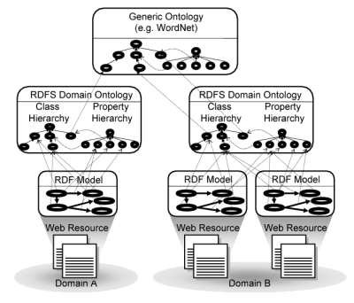
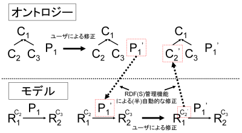
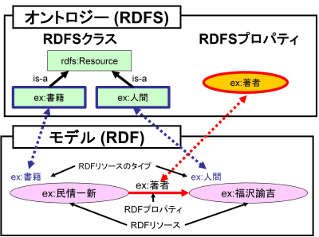

RDF(S)コンテンツ管理
====================

.. contents:: コンテンツ 
   :depth: 2

モデルとオントロジー
--------------------
MR\ :sup:`3` \における，モデルとオントロジーの関係は，次のように説明することができる．

.. index:: モデル

モデル
~~~~~~
Webコンテンツから些末な情報を排除し，機械処理させたい本質的なコンテンツをRDFにより記述したもの．具体的には，あるリソースがどのクラスに属するか，また，どのようなプロパティおよびプロパティ値を持つかをRDFにより記述したもの．モデルは，オントロジーによって提供されるモデル構成要素によって構成される．セマンティックWeb では，モデルはRDFコンテンツに相当する．また，モデルはOWL における事実(fact)と同義である．オントロジーによって提供される，RDFにおけるモデル構成要素は，RDFリソースにおけるrdf:type プロパティの値（RDFリソースのタイプ）およびRDF プロパティである．

.. index:: オントロジー

オントロジー
~~~~~~~~~~~~
クラスおよびプロパティとそれらの間の関係を定義したもの．セマンティックWebでは，オントロジーはRDFS およびOWLコンテンツに相当する．RDFSコンテンツでは，RDFコンテンツの構成要素である，RDF リソースのタイプをRDFS クラスとして，RDF プロパティをRDFSプロパティとして定義する．Webリソース，モデル，オントロジーの関係を :numref:`sw_paradigm` に示す．

各Web リソースには，それらの内容をモデル化したRDF データモデルを用意する．RDF データモデルをXML などの特定の構文で記述したものがRDF コンテンツである．RDF データモデル構築のために，領域オントロジーや汎用オントロジー（WordNet [Miller95]_ ，EDR 電子化辞書 [Yokoi95]_ など）を参照する． :numref:`sw_paradigm` 中のDomain B のように，複数のWeb リソースでも対象領域が同じであれば，同一の領域オントロジーを参照することが可能である．

.. _sw_paradigm:

   セマンティックWeb におけるWeb リソース，モデル，オントロジーの関係

RDF(S) コンテンツ管理の概念
---------------------------

本研究におけるRDF(S) コンテンツ管理の概念について述べる．

RDF およびRDFS コンテンツは共にRDF/XML により記述されるため，RDF およびRDFSコンテンツが混在する場合には，両者を区別することは困難である．ユーザはRDFおよびRDFS コンテンツを区別するために，リソースのタイプに着目する必要があり，このことはユーザの負担となる．

RDFS よりも詳細なオントロジーにおける記述（クラス公理やプロパティ公理など）が可能である，セマンティックWeb のためのオントロジー記述言語OWLの標準化についても，W3C が行っている．しかしながら，OWL もRDFS と同様に単一のフレームワーク（RDF/XML による記述）を採用しており，オントロジーとモデルの間の対応関係を管理するための仕組みは標準化されていない．

本研究では，上記の問題を解決するために，RDF(S)コンテンツ管理を提案する．RDF(S)コンテンツ管理とは，RDF コンテンツとRDFS コンテンツをモデルとオントロジーの関係として捉え，両者を明確に区別し，両者の間の整合性を（半）自動的に管理することと定義する．RDF(S) コンテンツ管理では，特に，オントロジーにおけるRDFS クラスおよびRDFS プロパティと，モデルにおけるRDF リソースのタイプおよびRDF プロパティを適切に管理する．

:numref:`metamodel_management_scenario` にRDF(S) コンテンツ管理の概念図を示す．

.. _metamodel_management_scenario:

   
   RDF(S) コンテンツ管理
   
RDF(S) コンテンツ管理のシナリオ
-------------------------------

セマンティックWeb 実現のためには，Web リソースに対して，オントロジー（RDFSおよびOWL コンテンツ）に基づいて，モデル（RDF コンテンツ）を構築する必要がある．しかし，モデル構築に適切なオントロジーが常に存在するとは限らない．その場合，モデラは，モデルおよびオントロジーを同時に構築することが考えられる．

オントロジーおよびモデルの構築は，実際には二つの異なる観点から行われることが考えられる．オントロジーは，現実世界のオブジェクトからは離れて，対象の概念化を考慮して構築が行われる．一方，モデルは現実世界のオブジェクトを考慮して構築が行われる．モデルの修正は，オントロジーの修正をもたらすことがあり，また，その逆もいえる．適切なオントロジーおよびモデルを構築するためには，モデラはモデルおよびオントロジーを相互に繰り返し修正しなければならない．そのような状況では，モデルおよびオントロジーの両方に頻繁に修正が発生するため，モデラの修正コストは大きくなる．

本研究で提案するRDF(S) コンテンツ構築支援ツールは，RDF(S) コンテンツの視覚的編集機能およびRDF(S) コンテンツ管理機能により，モデルおよびオントロジーの双方向に頻繁に発生する修正を支援する．RDF(S) コンテンツの視覚的編集機能は，モデルおよびオントロジーを明確に区別し，視覚的に表示および編集を可能にする機能であり，モデラがモデルとオントロジーの関係を容易にとらえることを可能にする．RDF(S) コンテンツ管理機能は，モデラが，モデル編集モードとオントロジー編集モードを頻繁に切り替えることなく，モデルまたはオントロジーの編集に集中することを可能にする．

:numref:`concept-of-mmm` にRDF(S) コンテンツ管理のシナリオを示す． :numref:`concept-of-mmm` の上部は，オントロジー修正プロセスを示している． :numref:`concept-of-mmm` の下部はモデル修正プロセスを示している． オントロジーにおけるC1，C2，C3 は，RDFS クラスを表す．オントロジーにおけるP1 は，RDFSプロパティを表す．モデルにおけるR1 およびR2 はRDF リソースを表す．モデルにおけるRDF リソースの右上に描いているC2 およびC3 は，RDF リソースのタイプを表す．モデルにおけるP1 は，RDF プロパティを表す．

:numref:`concept-of-mmm` では，はじめにオントロジーにおけるP1 がユーザによりP1′ に修正される．それに伴い，RDF(S) コンテンツ管理機能により，対応するモデルにおけるRDF プロパティが自動的に修正される．次に，RDF リソースのタイプであるモデルにおけるC2 がユーザによりC2′ に修正される．それに伴い，対応するオントロジーにおけるRDFS クラスがRDF(S) コンテンツ管理機能により半自動的に修正される．詳しくは，RDF(S) コンテンツ管理機能の詳細で述べる．

.. _concept-of-mmm:

   
   RDF(S) コンテンツ管理のシナリオ

参考文献
--------
.. [Miller95] G.A.Miller, “WordNet: A Lexical Database for English,” Commun. ACM, vol.38, no.11, pp.39.41, 1995.
.. [Yokoi95] T. Yokoi, “The EDR Electronic Dictionary,” Commun. ACM, vol.38, no.11, pp.42. 44, 1995, http://www2.nict.go.jp/r/r312/EDR/.
