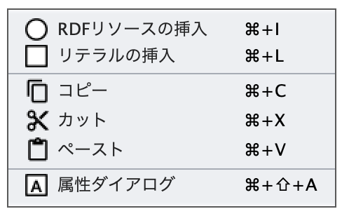
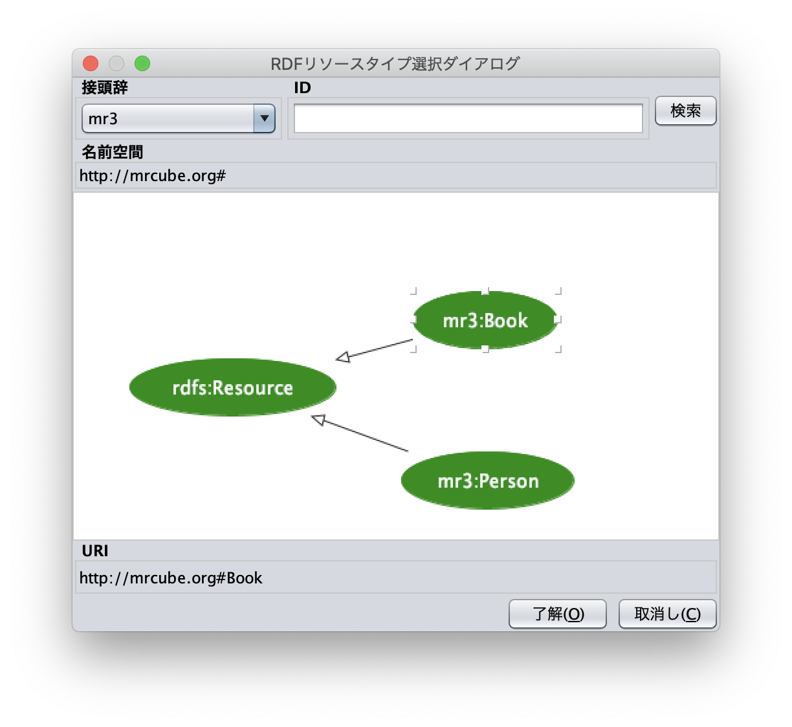
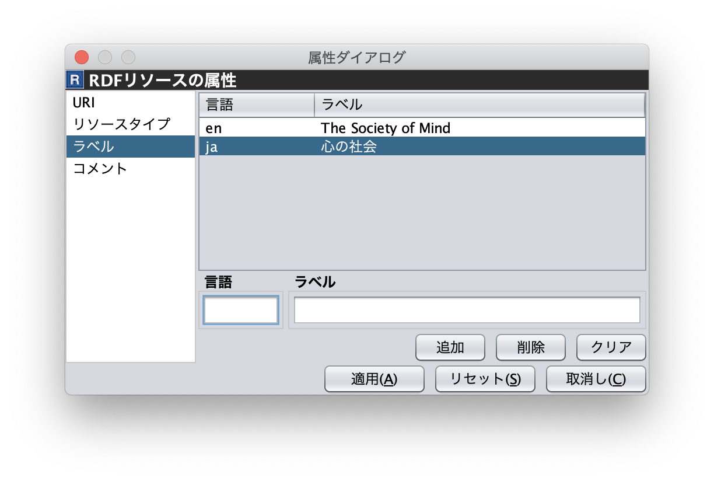

.. index:: RDFエディタ
=================
RDFエディタ
=================

.. contents:: コンテンツ 
   :depth: 2
   
RDFエディタでは，RDFリソース，RDFリソースのタイプ，RDFプロパティ，RDFリテラルの編集を行う．図1 に示すように，RDFリソースは楕円，RDFプロパティは矢印，RDFリテラルは矩形でRDFエディタ内に表示される．RDFリソースのタイプはRDFリソースの右上に表示される．

.. figure:: figures/rdf_editor.png
   :scale: 80 %
   :alt: 図1: RDFエディタ
   :align: center

   図1: RDFエディタ

------------------------------------------------
RDFエディタのポップアップメニュー
------------------------------------------------

RDFエディタ内で，右クリックするとポップアップメニューが表示される．ポップアップメニューは，ノードを選択している場合としていない場合で表示内容が異なる．ポップアップメニューは，以下のとおり．

   ノードが選択されていない状態

.. figure:: figures/popup_menu_selected_rdf_editor.png
   :scale: 80 %
   :alt: ノードが選択された状態
   :align: center

   ノードが選択された状態

RDFリソースの挿入
リテラルの挿入
接続モード
接続モードにきりかえる．接続モードでRDFリソースから別のRDFリソースまたは，RDFリテラルにドラッグ＆ドロップを行うと，リソース間をプロパティで接続することができる．
RDFからクラスへ変換
RDFリソースをRDFSクラスに変換する．
RDFからプロパティへ変換
RDFリソースをRDFSプロパティに変換する．
コピー
カット
ペースト
削除
アトリビュートダイアログを表示

------------------------------------------------
RDFリソースの属性編集
------------------------------------------------

RDFエディタ内のRDFリソースを選択すると，アトリビュートダイアログにRDFリソースの属性が表示される（図2から図7）．RDFリソースの属性編集では，RDFリソースのURI，RDFリソースのタイプ，RDFリソースが空白ノード(blank node) かどうかの選択，RDFリソースのラベルおよびコメントを編集することができる．ここで，空白ノードとは，URI により名前付けしないRDFリソースを表す．空白ノードは外部から参照することはできない．しかし，ステートメントにおける主語または目的語になることができ，URI により名前付けしにくいRDFリソースを記述したり，複数のRDFプロパティを構造化したRDFコンテンツを表現するために用いられる．

RDFリソースのURI を設定したい場合には，図2に示すように，アトリビュートダイアログ左側の一覧から「URI」を選択する．「接頭辞」コンボボックスには，名前空間テーブルに登録されている名前空間接頭辞の一覧が表示される．「接頭辞」コンボボックスから名前空間接頭辞を選択すると，対応する名前空間が「RDFリソース」テキストフィールドに出力される．ユーザは，「RDFリソース」テキストフィールドに設定したいRDFリソースのURI を入力する．RDFリソースを空白ノードとしたい場合には，「ブランク」チェックボックスにチェックをいれる．

.. figure:: figures/attribute_dialog_rdf_resource_uri.png
   :scale: 80 %
   :alt: 図2: アトリビュートダイアログ（RDFリソースのURI）
   :align: center

   図2: アトリビュートダイアログ（RDFリソースのURI）

RDFリソースのタイプを設定したい場合には，図3に示すように，アトリビュートダイアログ左側の一覧から「タイプ」を選択する．RDFリソースタイプを入力するには，「タイプ」チェックボックスをチェックする．RDFリソースのタイプを空にするには，「タ
イプ」チェックボックスのチェックをはずす．「タイプ選択」ボタンをクリックすると，図4に示す「RDFリソースタイプ選択」ダイアログが表示される．「RDFリソースタイプ選択」ダイアログには，クラスエディタで構築したクラス階層が表示される．RDFリソースのタイプとしたいクラスを選択すると，「RDFリソースタイプ選択」ダイアログのURI ラベルに，選択したクラスのURI が表示される．「了解」ボタンをクリックすると，アトリビュートダイアログの「接頭辞」コンボボックスと「リソースタイプID」テキストフィールドに，「RDFリソースタイプ選択」ダイアログで選択したURI が設定される．クラスエディタで定義されていないクラスのURI をRDFリソースのタイプとして入力した場合，RDF(S)コンテンツ管理機能が働き，図5に示す「RDF(S)コンテンツ管理」ダイアログが表示される．RDF(S)コンテンツ管理ダイアログでは，RDFSクラス名の変更またはRDFSクラスの新規作成のどちらかをユーザは選択することができる．「ジャンプクラス」ボタンをクリックすると，そのRDFリソースのタイプと対応するクラスエディタ内のRDFSクラスへジャンプする．また，アトリビュートダイアログにそのRDFSクラスの属性が表示される．

.. figure:: figures/attribute_dialog_rdf_resource_type.png
   :scale: 80 %
   :alt: 図3: アトリビュートダイアログ（RDFリソースのタイプ）
   :align: center

   図3: アトリビュートダイアログ（RDFリソースのタイプ）

   図4: RDFリソースタイプ選択ダイアログ

.. figure:: figures/rdf_and_rdfs_management_dialog.png
   :scale: 80 %
   :alt: 図5:RDF(S)コンテンツ管理ダイアログ
   :align: center

   図5:RDF(S)コンテンツ管理ダイアログ

RDFリソースに対して，rdfs:label プロパティを用いてRDFリソースのラベルを記述したい場合には，図6に示すように，アトリビュートダイアログ左側の一覧から「ラベル」を選択する．「言語」テキストフィールドに言語を，「ラベル」テキストフィールドにラベルを入力し，「追加」ボタンを押すと，アトリビュートダイアログ中央のテーブルに言語とラベルが追加される．テーブルの行を選択し，「削除」ボタンを押すと選択したラベルを削除することができる．

   図6: アトリビュートダイアログ（RDFリソースのラベル）

RDFリソースに対して，rdfs:comment プロパティを用いてRDFリソースのコメントを記述したい場合には，図7に示すように，アトリビュートダイアログ左側の一覧から「コメント」を選択する．「追加」ボタンを押すと，「コメント編集」ダイアログが表示される．「言語」テキストフィールドに言語を，「ラベル」テキストフィールドにラベルを入力し，「了解」ボタンを押すと，アトリビュートダイアログ中央のテーブルに言語とコメントが追加される．テーブルの行を選択し，「編集」ボタンを押すと「コメント編集」ダイアログが表示され，コメントを編集することができる．テーブルの行を選択し，「削除」ボタンを押すと選択したコメントを削除することができる．

.. figure:: figures/attribute_dialog_rdf_resource_comment.png
   :scale: 80 %
   :alt: 図7: アトリビュートダイアログ（RDFリソースのコメント）
   :align: center

   図7: アトリビュートダイアログ（RDFリソースのコメント）

------------------------------------------------
RDFプロパティの属性編集
------------------------------------------------

RDFエディタ内のRDFプロパティを選択すると，アトリビュートダイアログにRDFプロパティの属性が表示される（図8）．RDFプロパティの属性編集では，RDFプロパティのURI を編集することができる．「コンテナ」チェックボックスにチェックをして，数値を入力するとrdf: 1…rdf: n プロパティの入力を行うことができる．「プロパティの接頭辞のみ表示」チェックボックスにチェックをいれると，プロパティエディタで定義されているプロパティがもつ名前空間URI に対応する名前空間接頭辞のみを「接頭辞」コンボボックスから選択可能となる．チェックをはずすと，名前空間テーブルに登録されているすべての接頭辞を選択可能となる．

.. figure:: figures/attribute_dialog_rdf_property.png
   :scale: 80 %
   :alt: 図8: アトリビュートダイアログ（RDFプロパティ）
   :align: center

   図8: アトリビュートダイアログ（RDFプロパティ）

プロパティエディタで定義されていないプロパティのURI を入力した場合，RDF(S)コンテンツ管理機能が働き，図5に示す「RDF(S)コンテンツ管理」ダイアログが表示される．RDF(S)コンテンツ管理ダイアログでは，RDFSプロパティ名の変更またはRDFSプロパティの新規作成のどちらかをユーザは選択することができる．プロパティエディタ内で定義されているプロパティの中で，名前空間接頭辞に対応する名前空間URI をもつプロパティのID が「プロパティID」リストに表示される．「プロパティ」ボタンをクリックすると，選択したRDFプロパティに対応するプロパティエディタ内のRDFSプロパティにジャンプし，アトリビュートダイアログにそのRDFSプロパティの属性が表示される．

------------------------------------------------
RDFリテラルの属性編集
------------------------------------------------
RDFエディタ内のRDFリテラルを選択すると，アトリビュートダイアログにRDFリテラルの属性が表示される（図9）．RDFリテラルの編集では，リテラルの内容，言語属性（xml:lang 属性），データタイプの編集を行うことができる．「リテラル」テキストエリアには，リテラルの内容を入力する．「言語」テキストフィールドには，リテラルの記述言語を入力する．リテラルのデータタイプを設定したい場合には，「タイプ」チェックボックスにチェックを入れて，「タイプ」コンボボックスからデータタイプを選択することができる．リテラルのデータタイプを必要としない場合には，「タイプ」チェックボックスのチェックをはずす．言語とリテラルのタイプは排他的であり，どちらか一方しか設定することはできない

.. figure:: figures/attribute_dialog_rdf_literal.png
   :scale: 80 %
   :alt: 図9: アトリビュートダイアログ（RDFリテラル）
   :align: center

   図9: アトリビュートダイアログ（RDFリテラル）

