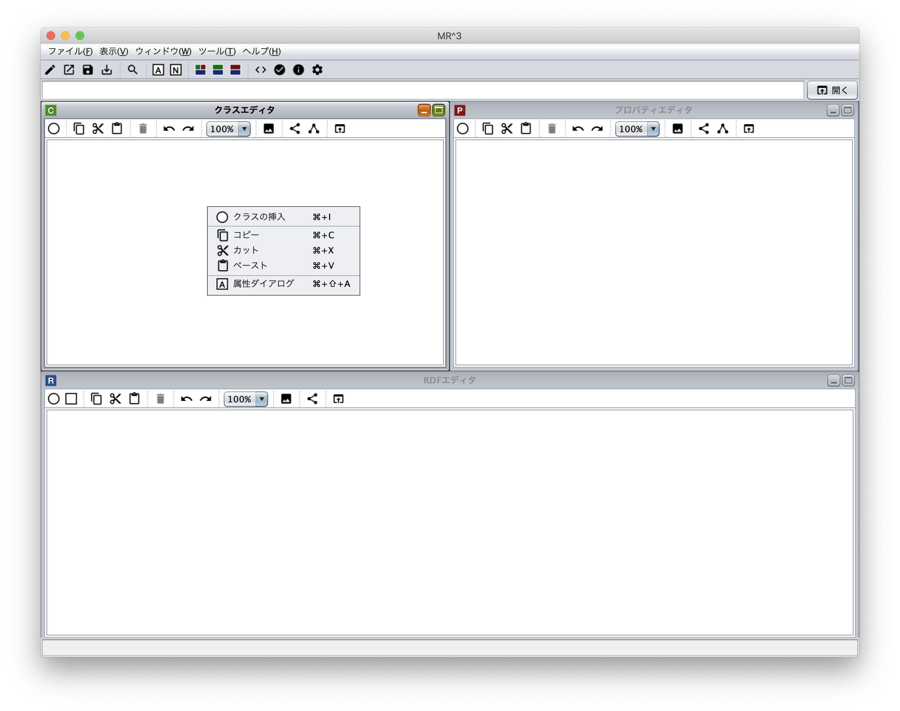
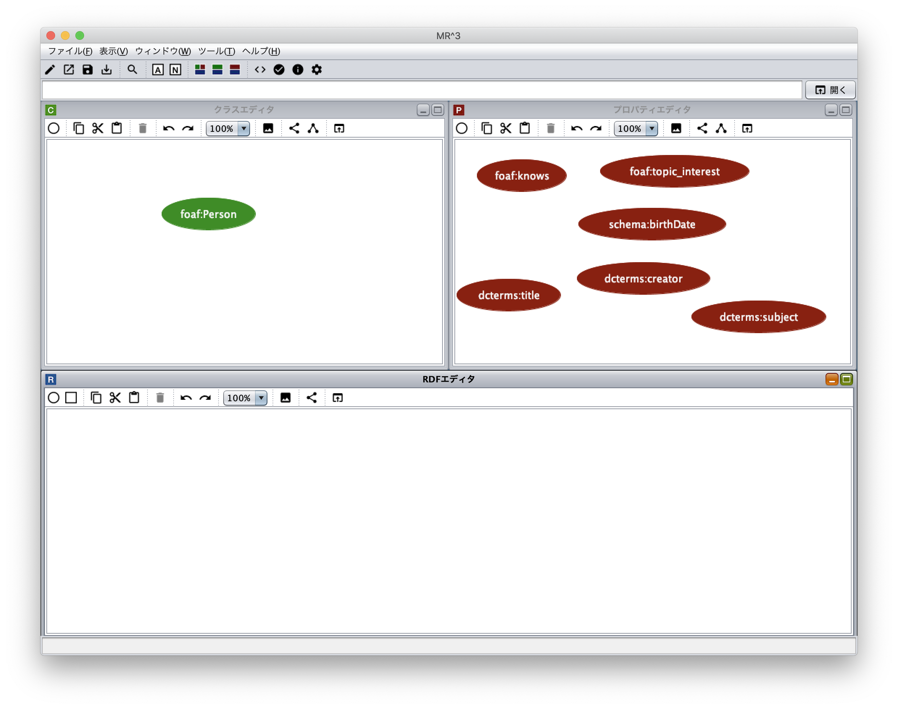
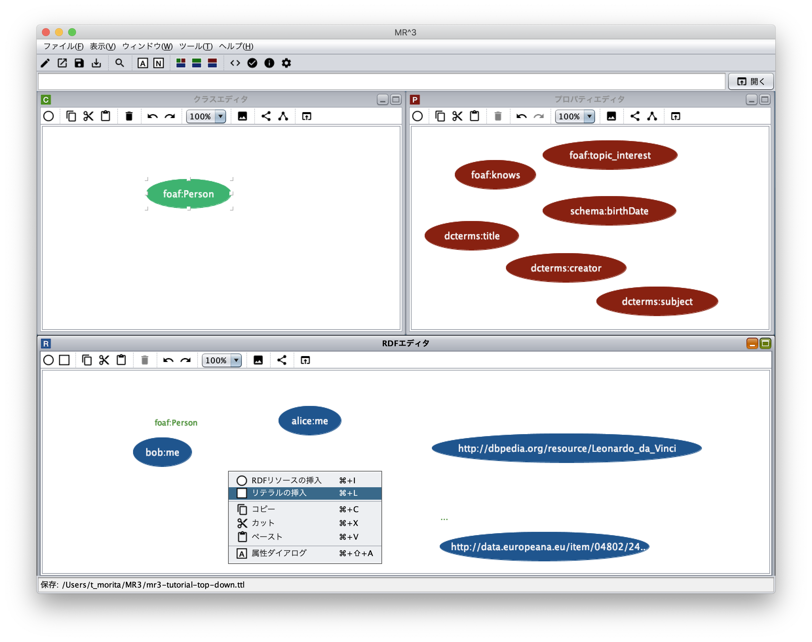
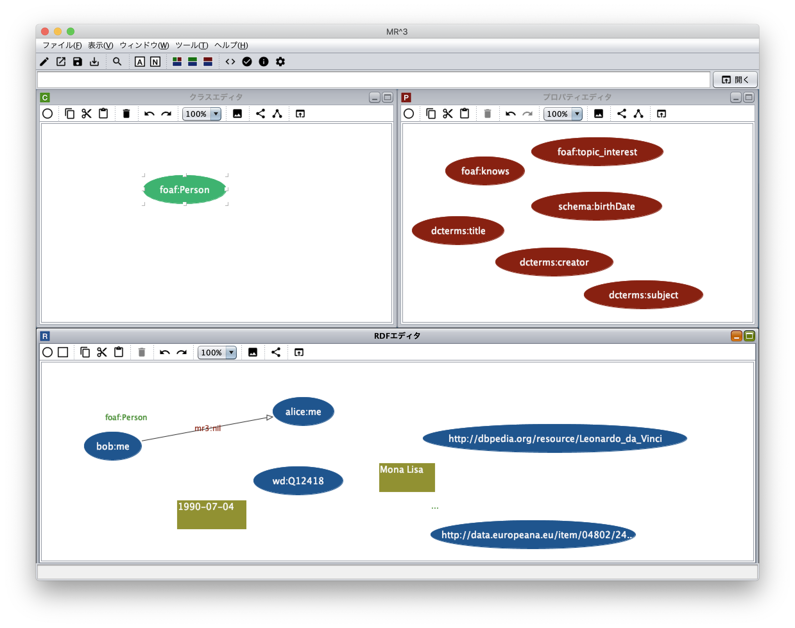
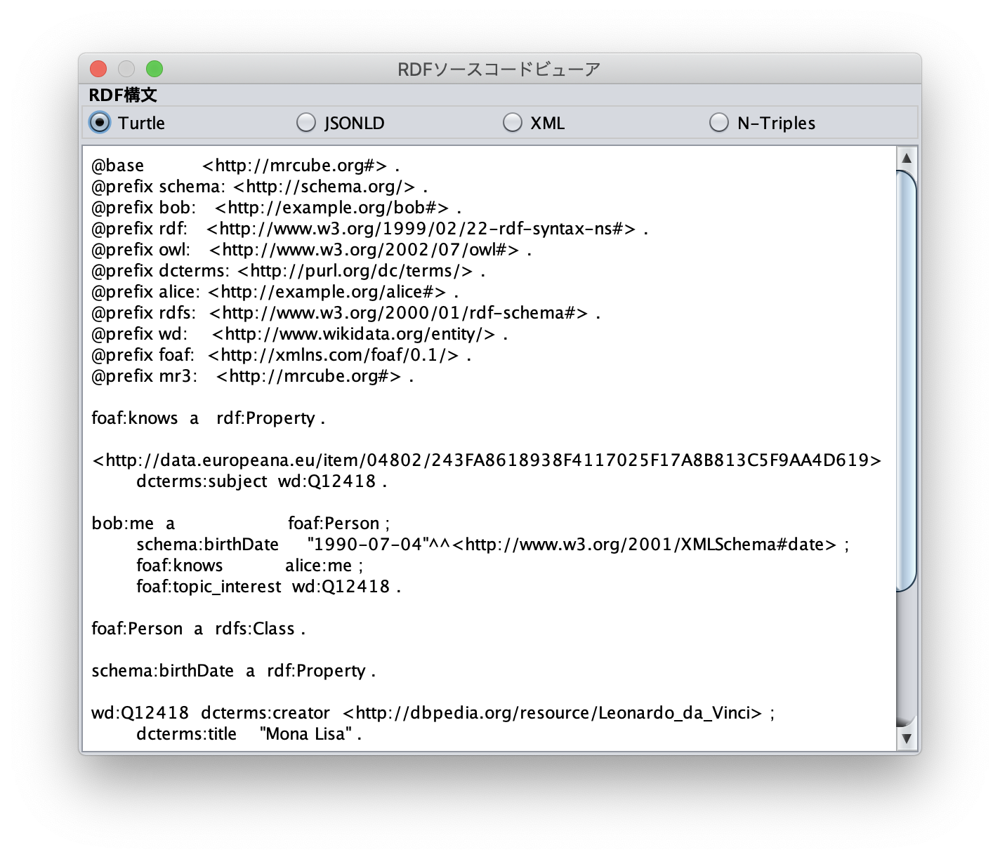
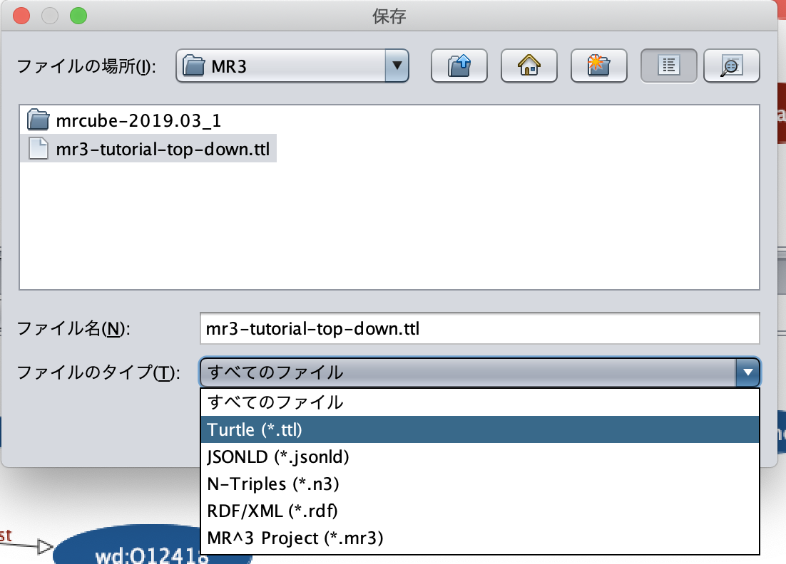
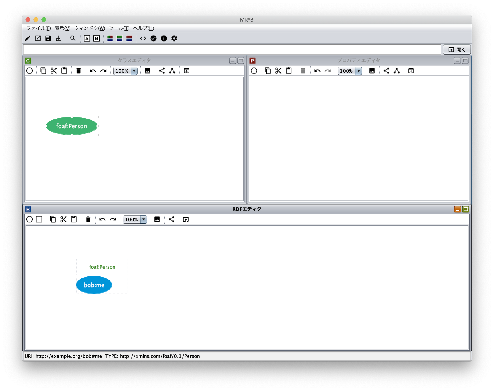
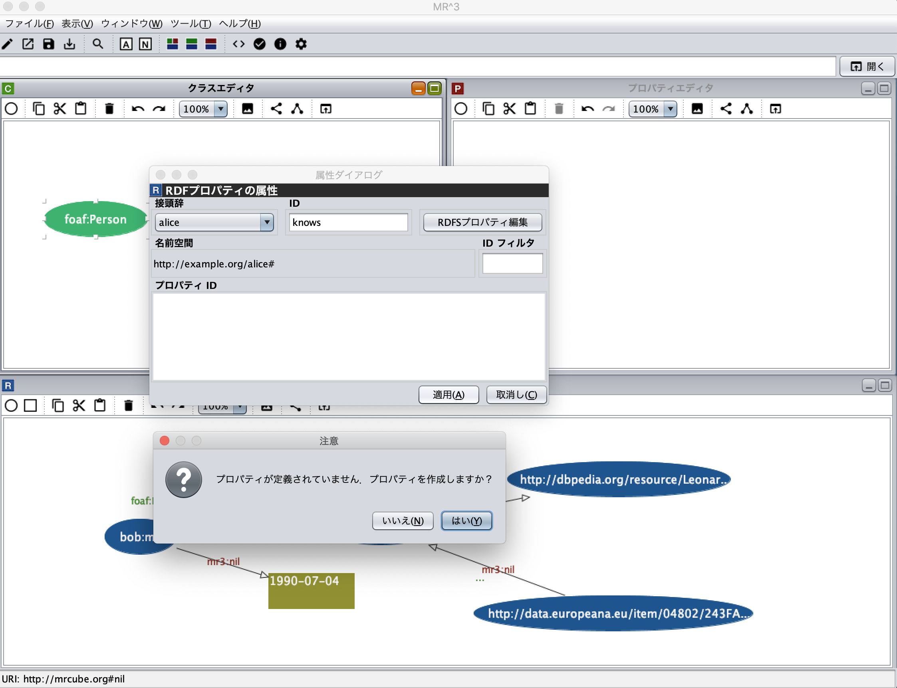
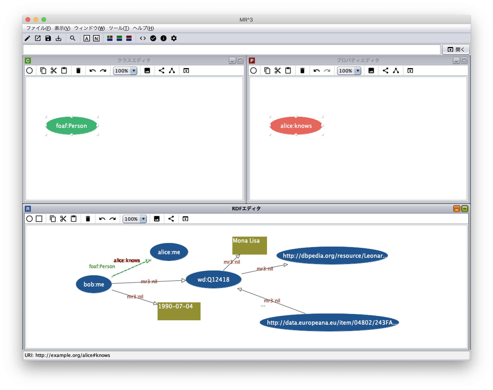

=================
チュートリアル
=================

.. contents:: コンテンツ 
   :depth: 3

------------------------------   
概要
------------------------------   
本チュートリアルでは，`RDF Primer <https://www.w3.org/TR/rdf11-primer/>`_ の中で紹介されているRDF文書をMR\ :sup:`3` \ を用いて作成していく．MR\ :sup:`3` \を 用いてRDFコンテンツを作成する方法には，RDFSコンテンツを作成した後に(RDFSコンテンツの語彙を用いて)RDFコンテンツを作成する方法 (トップダウン）とRDFコンテンツから作成する方法（ボトムアップ）がある．トップダウンでは，あらかじめRDFSコンテンツをインポートすることで， インポートしたRDFSコンテンツ(語彙）を用いてRDFコンテンツの作成ができる．ボトムアップでは，RDFモデルを作成しながら，RDFモデルの作成 に必要なリソースのタイプやプロパティを抽出し，RDFSクラスやプロパティに反映することができる．本チュートリアルでは，MR\ :sup:`3` \を用いて，トップダウンとボトムアップの2通りの方法で，以下に示すサンプルRDF文書の作成を行う．本チュートリアルと同様のRDF文書作成動画は `デモムービーのページ <http://mrcube.org/videos-ja.html>`_ から見ることができる．

.. code-block:: turtle

    BASE   <http://example.org/>
    PREFIX bob: <http://example.org/bob#>
    PREFIX alice: <http://example.org/alice#>
    PREFIX foaf: <http://xmlns.com/foaf/0.1/>
    PREFIX xsd: <http://www.w3.org/2001/XMLSchema#>
    PREFIX schema: <http://schema.org/>
    PREFIX dcterms: <http://purl.org/dc/terms/>
    PREFIX wd: <http://www.wikidata.org/entity/>
 
    bob:me
        a foaf:Person ;
        foaf:knows alice:me ;
        schema:birthDate "1990-07-04"^^xsd:date ;
        foaf:topic_interest wd:Q12418 .
   
    wd:Q12418
        dcterms:title "Mona Lisa" ;
        dcterms:creator <http://dbpedia.org/resource/Leonardo_da_Vinci> .
  
    <http://data.europeana.eu/item/04802/243FA8618938F4117025F17A8B813C5F9AA4D619>
        dcterms:subject wd:Q12418 .

---------------------------------------------
RDFコンテンツの作成 （トップダウン）
---------------------------------------------
^^^^^^^^^^^^^^^^^^^^^^^^^^^^^^^^^^^^^^^^^^^^^^^^^^^^^^^^^^^^^^^^^^^^^^^^^^^^^^^^^^^^^^^^^^^
1. RDFコンテンツ作成に利用する接頭辞と名前空間の登録
^^^^^^^^^^^^^^^^^^^^^^^^^^^^^^^^^^^^^^^^^^^^^^^^^^^^^^^^^^^^^^^^^^^^^^^^^^^^^^^^^^^^^^^^^^^
はじめに，RDFコンテンツ作成に必要な名前空間を名前空間テーブルに登録する．名前空間テーブルを表示するためには，ツールバーの |nstable| アイコンまたはウィンドウメニューの「名前空間テーブルを表示」を選択する．以下の図は，以下に示す名前空間接頭辞と名前空間の対応関係を名前空間テーブルに登録した状態を示している．名前空間接頭辞 **mr3**, **rdf**, **rdfs**, **owl** は，初期状態で登録されている．

.. csv-table::
   :header: 接頭辞, 名前空間
   :widths: 5, 30 

   mr3, http://mrcube.org#
   rdf, http://www.w3.org/1999/02/22-rdf-syntax-ns#
   rdfs, http://www.w3.org/2000/01/rdf-schema#
   owl, http://www.w3.org/2002/07/owl#
   foaf, http://xmlns.com/foaf/0.1/
   schema, http://schema.org/
   dcterms, http://purl.org/dc/terms/
   wd, http://www.wikidata.org/entity/
   bob,  http://example.org/bob#
   alice,  http://example.org/alice#

「接頭辞」テキストフィールドと「名前空間」テキストフィールドにそれぞれ，登録したい接頭辞および名前空間を入力し，「追加」ボタンを押すと接頭辞と対応する名前空間が名前空間テーブルに登録される．名前空間テーブルに登録された接頭辞は，各要素(RDFリソース，RDFプロパティ，RDFSクラス，RDFSプロパティ）作成する際に用いられる．

.. |nstable| image:: figures/toolbar/namespace_table.png 

.. figure:: figures/top-down-step1.png
   :scale: 25 %
   :align: center

^^^^^^^^^^^^^^^^^^^^^^^^^^^^^^^^^^^^^^^^^^^^^^^^^^^^^^^^^^^^^^^^^^^^^^^^^^^^^^^^^^^^^^^^^^^
2. RDFSクラスの挿入
^^^^^^^^^^^^^^^^^^^^^^^^^^^^^^^^^^^^^^^^^^^^^^^^^^^^^^^^^^^^^^^^^^^^^^^^^^^^^^^^^^^^^^^^^^^
RDFSクラスの挿入を行う．クラスエディタ内で右クリックをしてポップアップメニューを出す．ポップアップメニュー の中の「クラスの挿入」メニューを選択し，RDFSクラスの挿入を行う．サンプルRDF文書内では，**foaf:Person** が **bob:me** リソースのタイプとなっている．MR\ :sup:`3` \では，RDFリソースのタイプは，RDFSクラスから選択する．RDFSクラスは，クラスエディタ内で定義する．

「クラスの挿入」メニューを選択すると，以下のダイアログが表示される．「接頭辞」コンボボックスから名前空間テーブルに登録した接頭辞 **foaf** を選択し，「ID」テキストフィールドに **Person** を入力する．「了解」ボタンをクリックするとクラスエディタ内に RDFSクラス **foaf:Person** が挿入される．

.. figure:: figures/top-down-step2-2.png
   :scale: 50 %
   :align: center

^^^^^^^^^^^^^^^^^^^^^^^^^^^^^^^^^^^^^^^^^^^^^^^^^^^^^^^^^^^^^^^^^^^^^^^^^^^^^^^^^^^^^^^^^^^
3. RDFSプロパティの挿入
^^^^^^^^^^^^^^^^^^^^^^^^^^^^^^^^^^^^^^^^^^^^^^^^^^^^^^^^^^^^^^^^^^^^^^^^^^^^^^^^^^^^^^^^^^^
RDFSクラスと同様にRDFSプロパティ(**foaf:knows**, **schema:birthDate**, **foaf:topic_interest**, **dcterms:title**, **dcterms:creator**, **dcterms:subject**) も作成する．プロパティエディタ内で右クリックするとポップアップメニューが表示される．「プロパティの挿入」メニューを選択すると以下のダイアログが表示される．「了解」ボタンをクリックするとプロパティエディタ内にRDFSプロパティが挿入される．MR\ :sup:`3` \では，RDFプロパティは，RDFSプロパティから選択する．RDFSプロパティは，プロパティエディタ内で定義する．

.. figure:: figures/top-down-step3-1.png
   :scale: 50 %
   :align: center

RDFSクラス **foaf:Person** とRDFSプロパティ **foaf:knows**, **schema:birthDate**, **foaf:topic_interest**, **dcterms:title**, **dcterms:creator**, **dcterms:subject** をMR\ :sup:`3` \で作成すると以下の図のようになる．

^^^^^^^^^^^^^^^^^^^^^^^^^^^^^^^^^^^^^^^^^^^^^^^^^^^^^^^^^^^^^^^^^^^^^^^^^^^^^^^^^^^^^^^^^^^
4. RDFリソースの挿入
^^^^^^^^^^^^^^^^^^^^^^^^^^^^^^^^^^^^^^^^^^^^^^^^^^^^^^^^^^^^^^^^^^^^^^^^^^^^^^^^^^^^^^^^^^^
次に，手順1から3までで，作成したRDFSクラス及びプロパティを用いてRDFコンテンツの作成を行う．まずは， RDFリソースを作成する．RDFリソースは，RDFエディタ内で定義する．RDFエディタ内で右クリックするとポップアップメニューが表示される．ポップアップメニュー内の「RDFリソースの挿入」メニューを選択し，RDFリソースの挿入を行う．

.. figure:: figures/top-down-step4-1.png
   :scale: 25 %
   :align: center

「RDFリソースの挿入」メニューを選択すると以下のダイアログが表示される．「リソースタイプ」コンボボックスからリソースのタイプを選択する．リソースのタイプは，クラスエディタで作成されたRDFSクラスから選択できる．ここでは，**foaf:Person** クラスをリソースのタイプとして選択する．また，**http://example.org/bob#me** をRDFリソーステキストフィールドに入力する．リソースのタイプとRDFリソースを入力し，「了解」ボタンをクリックするとRDFリソースがRDFエディタに挿入される．

.. figure:: figures/top-down-step4-2.png
   :scale: 50 %
   :align: center

同様に，**alice:me**, **wd:Q12418**, **http://dbpedia.org/resource/Leonardo_da_Vinci**, **http://data.europeana.eu/item/04802/243FA8618938F4117025F17A8B813C5F9AA4D619** RDFリソースを挿入する．リソースのタイプは空欄を指定する．

^^^^^^^^^^^^^^^^^^^^^^^^^^^^^^^^^^^^^^^^^^^^^^^^^^^^^^^^^^^^^^^^^^^^^^^^^^^^^^^^^^^^^^^^^^^
5. RDFリテラルの挿入
^^^^^^^^^^^^^^^^^^^^^^^^^^^^^^^^^^^^^^^^^^^^^^^^^^^^^^^^^^^^^^^^^^^^^^^^^^^^^^^^^^^^^^^^^^^
次に，**"1990-07-04"^^xsd:date** と **"Mona Lisa"** リテラルを作成する．RDFエディタ上で右クリックをして，ポップアップメニューから「リテラルの挿入」メニューを選択すると「リテラルの挿入」ダイアログが表示される．

以下の図は，「リテラルの挿入」ダイアログを表している．「リテラル」テキストエリアに文字列を入力し，「了解」ボタンをクリックするとリテラルがRDFエディタに挿入される．「データタイプ」チェックボックスにチェックを入れると，リテラルのデータ型が選択できる．ここでは，**"1990-07-04"** リテラルのデータ型として「http://www.w3.org/2001/XMLSchema#date」(xsd:date)を選択する．

.. figure:: figures/top-down-step5-2.png
   :scale: 50 %
   :align: center

^^^^^^^^^^^^^^^^^^^^^^^^^^^^^^^^^^^^^^^^^^^^^^^^^^^^^^^^^^^^^^^^^^^^^^^^^^^^^^^^^^^^^^^^^^^
6. RDFプロパティの挿入
^^^^^^^^^^^^^^^^^^^^^^^^^^^^^^^^^^^^^^^^^^^^^^^^^^^^^^^^^^^^^^^^^^^^^^^^^^^^^^^^^^^^^^^^^^^
次に，RDFプロパティの挿入を行う．RDFプロパティを挿入するためには，主語リソースの中心にカーソルを合わせる．カーソルが矢印から十字に変わった状態で， 目的語リソースまたはリテラルの中心に向けてカーソルをドラッグし，同様にカーソルが十字に変わった状態でドロップすることで，RDFプロパティが挿入される．作成されるRDFプロパティは **mr3#nil** (MR\ :sup:`3` \が提供する）となる．RDFプロパティを挿入する際に，あらかじめプロパティエディタにおいて，挿入したいプロパティを選択してある場合には，選択されたプロパティがRDFプロパティとして挿入される．ここでは，**bob:me** リソースと**alice:me** リソースの間に **foaf:knows** プロパティ，**bob:me** リソースと **"1990-07-04"** リテラルの間に **shema:birthDate** プロパティ，**bob:me** リソースと **wd:Q12418** リソースの間に **foaf:topic_interest** プロパティ，**wd:Q12418** リソースと **http://dbpedia.org/resource/Leonardo_da_Vinci** リソースの間に **dcterms:creator** プロパティ，**wd:Q12418** リソースと **"Mona Lisa"** リテラルの間に **dcterms:title** プロパティ，**http://data.europeana.eu/item/04802/243FA8618938F4117025F17A8B813C5F9AA4D619** リソース と **wd:Q12418** リソースとの間に **dcterms:subject** プロパティを挿入する．

.. |connect| image:: figures/toolbar/connect.gif 

RDFプロパティを編集するためには，アトリビュートダイアログを表示する．アトリビュートダイアログを表示するためには，ツールバーの |attribute-dialog| アイコンをクリックするか，ポップアップメニューから「アトリビュートダイアログを表示」メニューを選択する．RDFプロパティ**foaf:knows** に変更するためには，「接頭辞」コンボボックスから接頭辞 **foaf** を選択し，「プロパティID」リストから **knows** を選択する．「適用」ボタンをクリックすると変更が反映される．

.. figure:: figures/top-down-step6-2.png
   :scale: 50 %
   :align: center

^^^^^^^^^^^^^^^^^^^^^^^^^^^^^^^^^^^^^^^^^^^^^^^^^^^^^^^^^^^^^^^^^^^^^^^^^^^^^^^^^^^^^^^^^^^
7. 作成したRDFコンテンツをRDF/XML形式でファイルに保存する
^^^^^^^^^^^^^^^^^^^^^^^^^^^^^^^^^^^^^^^^^^^^^^^^^^^^^^^^^^^^^^^^^^^^^^^^^^^^^^^^^^^^^^^^^^^
ここまでの作業で，以下の図のようなRDFSクラス，RDFSプロパティ，RDFモデルが作成されている．

.. figure:: figures/top-down-step7-1.png
   :scale: 25 %
   :align: center

作成したRDFコンテンツが，どのように出力されるかを確認するには，RDFソースコードビューアを表示する．RDFソースコードビューアは，ツールメニューのRDFソースコードビューアを選択するか，ツールバーの |rdf_source_code_viewer| を選択する．ラジオボタンから構文として，**Turtle**，**JSONLD**，**XML**，**N-Triples** の形式が選択できる．ボタンを選択すると，指定した構文でRDFソースコードが表示される．

作成したRDFコンテンツをファイルに出力したい場合には，ファイルメニューの「名前を付けて保存」ボタンを選択する．「保存」ダイアログが表示されるため，保存したいフォルダを選択し，「ファイルのタイプ」からエクスポートしたいRDFの形式を選択し，「保存」ボタンを押すと，RDFコンテンツが指定した形式でファイルに保存される．ここでは，「Turtle（¥*.ttl)」を選択してTurtle形式でファイルを保存する．

   
---------------------------------------------
RDFコンテンツの作成 （ボトムアップ）
---------------------------------------------

^^^^^^^^^^^^^^^^^^^^^^^^^^^^^^^^^^^^^^^^^^^^^^^^^^^^^^^^^^^^^^^^^^^^^^^^^^^^^^^^^^^^^^^^^^^
1. RDFコンテンツ作成に利用する接頭辞と名前空間の登録
^^^^^^^^^^^^^^^^^^^^^^^^^^^^^^^^^^^^^^^^^^^^^^^^^^^^^^^^^^^^^^^^^^^^^^^^^^^^^^^^^^^^^^^^^^^
トップダウン手法の手順1と同様にRDFコンテンツ作成に利用する接頭辞と名前空間を登録する．

^^^^^^^^^^^^^^^^^^^^^^^^^^^^^^^^^^^^^^^^^^^^^^^^^^^^^^^^^^^^^^^^^^^^^^^^^^^^^^^^^^^^^^^^^^^
2. RDFリソースの挿入
^^^^^^^^^^^^^^^^^^^^^^^^^^^^^^^^^^^^^^^^^^^^^^^^^^^^^^^^^^^^^^^^^^^^^^^^^^^^^^^^^^^^^^^^^^^
トップダウン手法の手順4と同様の手順でRDFリソースを挿入する．

トップダウン手法との違いは，この時点では， **bob:me** リソースのタイプがクラスエディタで定義されていない点である．ボトムアップの手法では，RDFリソースを編集中にRDFSクラスを作成する．

アトリビュートダイアログを表示し，RDFリソース **bob:me** を選択する．RDFリソースの属性がアトリビュートダイアログに表示される．左側に表示されるリストの中から「タイプ」を選択する．「接頭辞」コンボボックスから **foaf** を選択し，リソースタイプIDとして **Person** を入力する．RDFSクラスに指定したいクラスが定義されている場合には，「タイプ選択」ボタンをクリックすれば，クラスエディタからクラスを選択することができる．今回は，ボトムアップにRDFコンテンツ作成しているため，RDFSクラスに **foaf:Person** クラスが作成されておらず，選択することができない．指定したいリソースのタイプ **foaf:Person** を入力した状態で，「適用」ボタンをクリックする．「クラスが定義されていません.クラスを作成しますか?」と尋ねるダイアログが表示されるため，「はい」ボタンをクリックする．

.. figure:: figures/bottom-up-step2-1.png
   :scale: 25 %
   :align: center

以下の図のように，クラスエディタに **foaf:Person** クラスが作成される．

^^^^^^^^^^^^^^^^^^^^^^^^^^^^^^^^^^^^^^^^^^^^^^^^^^^^^^^^^^^^^^^^^^^^^^^^^^^^^^^^^^^^^^^^^^^
3. RDFリテラルの挿入
^^^^^^^^^^^^^^^^^^^^^^^^^^^^^^^^^^^^^^^^^^^^^^^^^^^^^^^^^^^^^^^^^^^^^^^^^^^^^^^^^^^^^^^^^^^
トップダウンの手順5と同様にRDFリテラルを挿入する．

^^^^^^^^^^^^^^^^^^^^^^^^^^^^^^^^^^^^^^^^^^^^^^^^^^^^^^^^^^^^^^^^^^^^^^^^^^^^^^^^^^^^^^^^^^^
4. RDFプロパティの挿入
^^^^^^^^^^^^^^^^^^^^^^^^^^^^^^^^^^^^^^^^^^^^^^^^^^^^^^^^^^^^^^^^^^^^^^^^^^^^^^^^^^^^^^^^^^^
トップダウン手法の手順6と同様にRDFプロパティを挿入する．

トップダウン手法との違いは，この時点では，RDFSプロパティがプロパティエディタに定義されていない点である．ボトムアップの手法では，RDFリソースを編集中にRDFSプロパティを作成していく．ここでは，**bob:me** と **alice:me** の間に **foaf:knows** プロパティを作成する例を説明する．

アトリビュートダイアログを表示し，**bob:me** と **alice:me** の間に張られたRDFプロパティを選択する．「接頭辞」コンボボックスから **foaf** を選択する．「プロパティID」リストには，RDFSプロパティで定義されているプロパティのID一覧が表示されるが，今回は定義されていないため表示されない．「ID」テキストフィールドに **knows** と入力し，「適用」ボタンをクリックする．「プロパティが定義されていません.プロパティを作成しますか?」と尋ねるダイアログが表示されるため，「はい」ボタンをクリックする．

以下の図のように，プロパティエディタに **foaf:knows** プロパティが作成される．

同様に，**schema:birthDate** , **foaf:topic_interest** , **dcterms:title** , **dcterms:creator** , **dcterms:subject** プロパティも作成する．
   
^^^^^^^^^^^^^^^^^^^^^^^^^^^^^^^^^^^^^^^^^^^^^^^^^^^^^^^^^^^^^^^^^^^^^^^^^^^^^^^^^^^^^^^^^^^
5. 作成したRDFコンテンツをTurtle形式でファイルに保存する
^^^^^^^^^^^^^^^^^^^^^^^^^^^^^^^^^^^^^^^^^^^^^^^^^^^^^^^^^^^^^^^^^^^^^^^^^^^^^^^^^^^^^^^^^^^
トップダウン手法の手順7と同様に，Turtle形式でRDF文書をファイルに保存する．
