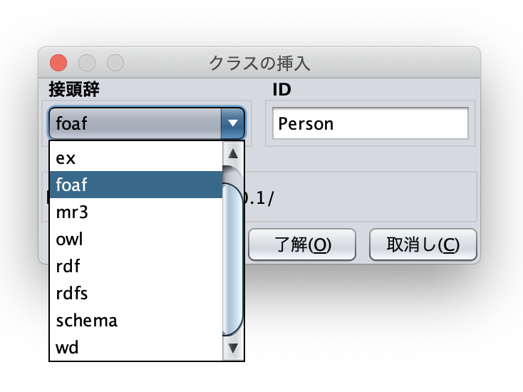
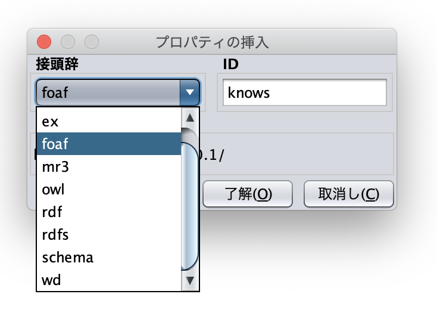
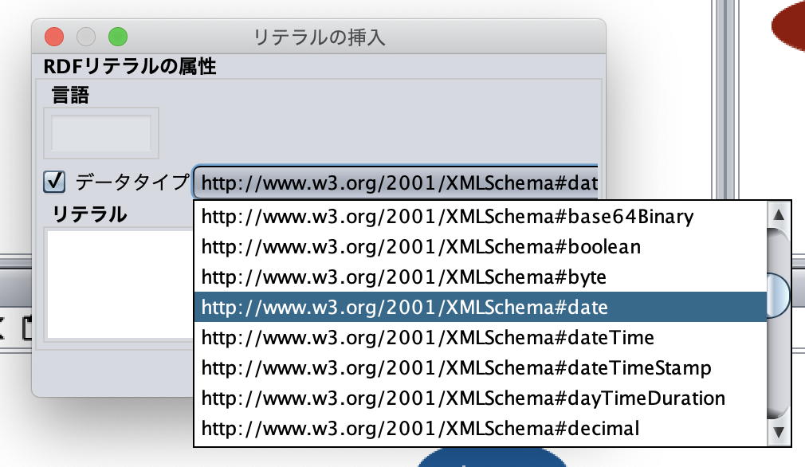
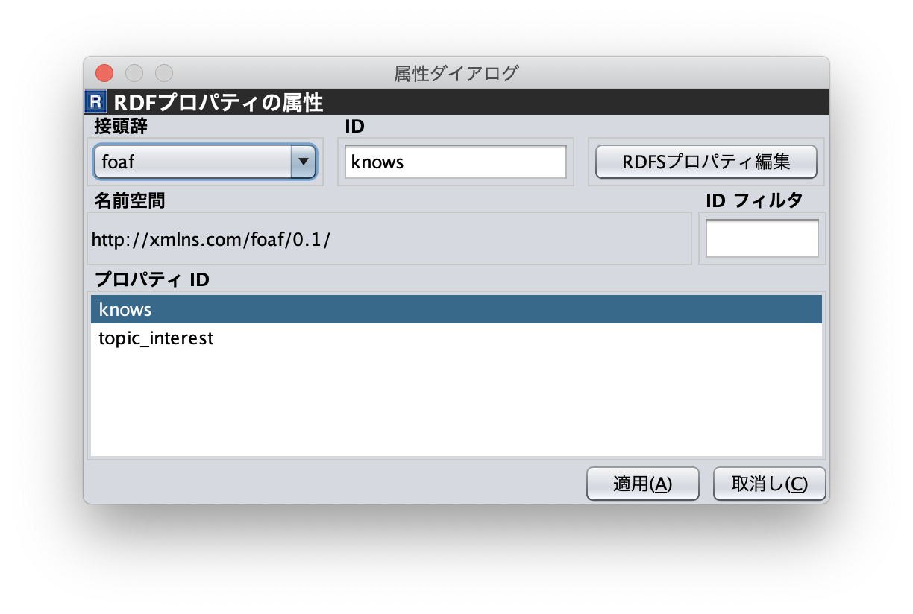
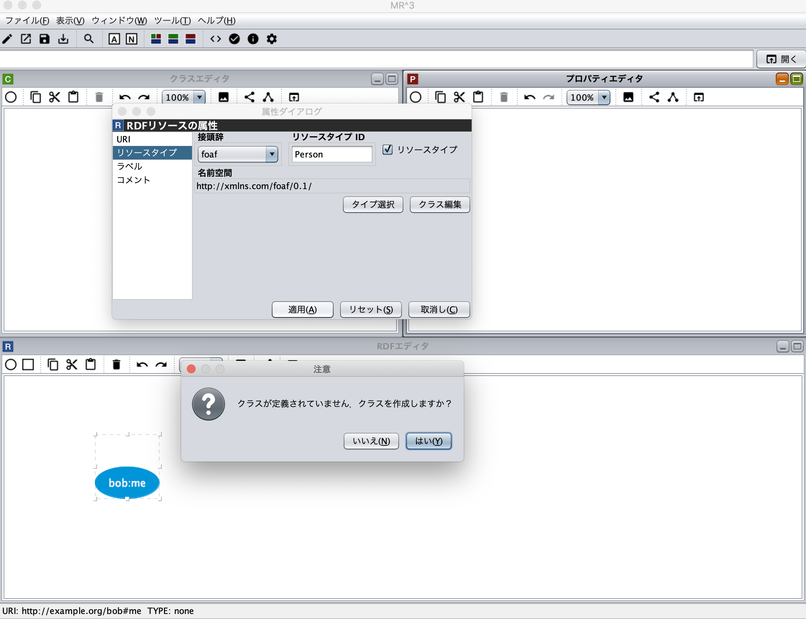

=================
チュートリアル
=================

.. contents:: コンテンツ 
   :depth: 3

------------------------------   
概要
------------------------------   
本チュートリアルでは，`RDF Primer <https://www.w3.org/TR/rdf11-primer/>`_ の中で紹介されているRDF文書をMR\ :sup:`3` \ を用いて作成していく．MR\ :sup:`3` \を 用いてRDFコンテンツを作成する方法には，RDFSコンテンツを作成した後に(RDFSコンテンツの語彙を用いて)RDFコンテンツを作成する方法 (トップダウン）とRDFコンテンツから作成する方法（ボトムアップ）がある．トップダウンでは，あらかじめRDFSコンテンツをインポートすることで， インポートしたRDFSコンテンツ(語彙）を用いてRDFコンテンツの作成ができる．ボトムアップでは，RDFモデルを作成しながら，RDFモデルの作成 に必要なリソースのタイプやプロパティを抽出し，RDFSクラスやプロパティに反映することができる．本チュートリアルでは，MR\ :sup:`3` \を用いて，トップダウンとボトムアップの2通りの方法で，以下に示すサンプルRDF文書の作成を行う．本チュートリアルと同様のRDF文書作成動画は `デモムービーのページ <http://mrcube.org/videos-ja.html>`_ から見ることができる．

.. code-block:: turtle

    BASE   <http://example.org/>
    PREFIX bob: <http://example.org/bob#>
    PREFIX alice: <http://example.org/alice#>
    PREFIX foaf: <http://xmlns.com/foaf/0.1/>
    PREFIX xsd: <http://www.w3.org/2001/XMLSchema#>
    PREFIX schema: <http://schema.org/>
    PREFIX dcterms: <http://purl.org/dc/terms/>
    PREFIX wd: <http://www.wikidata.org/entity/>
 
    bob:me
        a foaf:Person ;
        foaf:knows alice:me ;
        schema:birthDate "1990-07-04"^^xsd:date ;
        foaf:topic_interest wd:Q12418 .
   
    wd:Q12418
        dcterms:title "Mona Lisa" ;
        dcterms:creator <http://dbpedia.org/resource/Leonardo_da_Vinci> .
  
    <http://data.europeana.eu/item/04802/243FA8618938F4117025F17A8B813C5F9AA4D619>
        dcterms:subject wd:Q12418 .

---------------------------------------------
RDFコンテンツの作成 （トップダウン）
---------------------------------------------
^^^^^^^^^^^^^^^^^^^^^^^^^^^^^^^^^^^^^^^^^^^^^^^^^^^^^^^^^^^^^^^^^^^^^^^^^^^^^^^^^^^^^^^^^^^
1. RDFコンテンツ作成に利用する接頭辞と名前空間の登録
^^^^^^^^^^^^^^^^^^^^^^^^^^^^^^^^^^^^^^^^^^^^^^^^^^^^^^^^^^^^^^^^^^^^^^^^^^^^^^^^^^^^^^^^^^^
はじめに，RDFコンテンツ作成に必要な名前空間を名前空間テーブルに登録する．名前空間テーブルを表示するためには，ツールバーの |nstable| アイコンまたはウィンドウメニューの「名前空間テーブルを表示」を選択する．以下の図は，以下に示す名前空間接頭辞と名前空間の対応関係を名前空間テーブルに登録した状態を示している．名前空間接頭辞: mr3, rdf, rdfs, owlは，初期状態で登録されている．

.. csv-table::
   :header: 接頭辞, 名前空間
   :widths: 5, 30 

   mr3, http://mrcube.org#
   rdf, http://www.w3.org/1999/02/22-rdf-syntax-ns#
   rdfs, http://www.w3.org/2000/01/rdf-schema#
   owl, http://www.w3.org/2002/07/owl#
   foaf, http://xmlns.com/foaf/0.1/
   schema, http://schema.org/
   dcterms, http://purl.org/dc/terms/
   wd, http://www.wikidata.org/entity/
   bob,  http://example.org/bob#
   alice,  http://example.org/alice#

接頭辞テキスト フィールドと名前空間テキストフィールドにそれぞれ，登録したい接頭辞および名前空間を入力し，”追加”ボタンを押すと接頭辞と対応する名前空間が名前空間テーブルに登録される．名前空間テーブルに登録された接頭辞は，各要素(RDFリソース，RDFプロパティ，RDFSクラス，RDFSプロパティ）作成する際に用いられる．

.. |nstable| image:: figures/toolbar/namespace_table.png 

.. figure:: figures/top-down-step1.png
   :scale: 25 %
   :align: center

^^^^^^^^^^^^^^^^^^^^^^^^^^^^^^^^^^^^^^^^^^^^^^^^^^^^^^^^^^^^^^^^^^^^^^^^^^^^^^^^^^^^^^^^^^^
2. RDFSクラスの挿入
^^^^^^^^^^^^^^^^^^^^^^^^^^^^^^^^^^^^^^^^^^^^^^^^^^^^^^^^^^^^^^^^^^^^^^^^^^^^^^^^^^^^^^^^^^^
RDFSクラスの挿入を行う．クラスエディタ内で右クリックをしてポップアップメニューを出す．ポップアップメニュー の中の「クラスの挿入」メニューを選択し，RDFSクラスの挿入を行う．サンプルRDF文書内では，"foaf:Person"が"bob:me"リソースのタイプとなっている．MR\ :sup:`3` \では，RDFリソースのタイプは，RDFSクラスから選択する．RDFSクラスは，クラスエディタ内で定義する．

.. figure:: figures/top-down-step2-1.png
   :scale: 25 %
   :align: center

「クラスの挿入」メニューを選択すると，以下のダイアログが表示される．「接頭辞コンボボックス」から名前空間テーブルに登録した接頭辞foafを選択し，「IDテキストフィールド」にPersonを入力する．「了解ボタン」をクリックするとクラスエディタ内に RDFSクラス "foaf:Person" が挿入される．

^^^^^^^^^^^^^^^^^^^^^^^^^^^^^^^^^^^^^^^^^^^^^^^^^^^^^^^^^^^^^^^^^^^^^^^^^^^^^^^^^^^^^^^^^^^
3. RDFSプロパティの挿入
^^^^^^^^^^^^^^^^^^^^^^^^^^^^^^^^^^^^^^^^^^^^^^^^^^^^^^^^^^^^^^^^^^^^^^^^^^^^^^^^^^^^^^^^^^^
RDFSクラスと同様にExample 1文書内に含まれるRDFSプロパティ(foaf:knows, schema:birthDate, foaf:topic_interest, dcterms:title, dcterms:creator, dcterms:subject) も作成する．プロパティエディタ内で右クリックするとポップアップメニューが表示される．「プロパティの挿入」メニューを選択すると以下のダイアログが表示される．「了解ボタン」をクリックするとプロパティエディタ内にRDFSプロパティが挿入される．MR\ :sup:`3` \では，RDFプロパティは，RDFSプロパティから選択する．RDFSプロパティは，プロパティエディタ内で定義する．

RDFSクラス "foaf:Person" とRDFSプロパティ foaf:knows, schema:birthDate, foaf:topic_interest, dcterms:title, dcterms:creator, dcterms:subject をMR\ :sup:`3` \で作成すると以下の図のようになる．

.. figure:: figures/top-down-step3-2.png
   :scale: 25 %
   :align: center

^^^^^^^^^^^^^^^^^^^^^^^^^^^^^^^^^^^^^^^^^^^^^^^^^^^^^^^^^^^^^^^^^^^^^^^^^^^^^^^^^^^^^^^^^^^
4. RDFリソースの挿入
^^^^^^^^^^^^^^^^^^^^^^^^^^^^^^^^^^^^^^^^^^^^^^^^^^^^^^^^^^^^^^^^^^^^^^^^^^^^^^^^^^^^^^^^^^^
次に，手順1から3までで，作成したRDFSクラス及びプロパティを用いてRDFコンテンツの作成を行う．まずは， RDFリソースを作成する．RDFリソースは，RDFエディタ内で定義する．RDFエディタ内で右クリックするとポップアップメニューが表示される．ポップアップメニュー内の「RDFリソースの挿入」メニューを選択し，RDFリソースの挿入を行う．

.. figure:: figures/top-down-step4-1.png
   :scale: 25 %
   :align: center

「RDFリソースの挿入」メニューを選択すると以下のダイアログが表示される．「リソースタイプコンボボックス」からリソースのタイプを選択する．リソースのタイプは，クラスエディタで作成されたRDFSクラスから選択できる．ここでは，foaf:Personクラスをリソースのタイプとして選択する．また，「http://example.org/bob#me」をRDFリソーステキストフィールドに入力する．リソースのタイプとRDFリソースを入力し，「了解ボタン」をクリックするとRDFリソースがRDFエディタに挿入される．

.. figure:: figures/top-down-step4-2.png
   :scale: 50 %
   :align: center

同様に，リソースを挿入する．

^^^^^^^^^^^^^^^^^^^^^^^^^^^^^^^^^^^^^^^^^^^^^^^^^^^^^^^^^^^^^^^^^^^^^^^^^^^^^^^^^^^^^^^^^^^
5. RDFリテラルの挿入
^^^^^^^^^^^^^^^^^^^^^^^^^^^^^^^^^^^^^^^^^^^^^^^^^^^^^^^^^^^^^^^^^^^^^^^^^^^^^^^^^^^^^^^^^^^
次に，「Eric Miller」及び「Dr.」リテラルを作成する．ポップアップメニューから「リテラルの挿入」メニューを選択すると「リテラルの挿入ダイアログ」が表示される．

.. figure:: figures/top-down-step5-1.png
   :scale: 40 %
   :align: center

以下の図は，「リテラルの挿入ダイアログ」を表している．「リテラルテキストエリア」に文字列を入力し，「了解ボタン」をクリックするとリテラルがRDFエディタに挿入される．

^^^^^^^^^^^^^^^^^^^^^^^^^^^^^^^^^^^^^^^^^^^^^^^^^^^^^^^^^^^^^^^^^^^^^^^^^^^^^^^^^^^^^^^^^^^
6. RDFプロパティの挿入
^^^^^^^^^^^^^^^^^^^^^^^^^^^^^^^^^^^^^^^^^^^^^^^^^^^^^^^^^^^^^^^^^^^^^^^^^^^^^^^^^^^^^^^^^^^
次に，RDFプロパティの挿入を行う．RDFプロパティを挿入するためには，「接続モード」に切り替える．「接続モード」に切り替えるためには，RDFエディタ内で右クリックをして，ポップアップメニューを表示し，「接続モード」メニューを選択する．または，RDFエディタのツールバーにある， |connect| アイコンをクリックする．次に，subjectにあたるリソースの上にカーソルを合わせる．青色の枠が表示される．その状態で，objectにあたるリソースまたはリテラルに向けてカーソルをドラッグし，同様に枠が表示された状態でドロップすることで，RDFプロパティが挿入される．作成されるRDFプロパ ティはmr3#nil(MR\ :sup:`3` \が提供する）となる．RDFプロパティを挿入する際に，あらかじめプロパティエディタにおいて，挿入したいプロパティを選択してある場合には，選択されたプロパティがRDFプロパティとして挿入される．ここでは，「http: //www.w3.org/People/EM/contact#me」リソースと「Eric Miller」リテラルの間に「contact:fullName」プロパティを挿入する．同様に，「Dr.」リテラルの間に「contact: personalTitle」プロパティを，「mailto:em@w3.org」リソースの間に「contact:mailbox」プロパティを挿入する．

.. |connect| image:: figures/toolbar/connect.gif 

.. figure:: figures/top-down-step6-1.png
   :scale: 40 %
   :align: center

RDFプロパティを編集するためには，アトリビュートダイアログを表示する．アトリビュートダイアログを表示するためには，ツールバーの |attr-dialog| アイコンをクリックするか，ポップアップメニューから「アトリビュートダイアログを表示」メニューを選択する．RDFプロパティ「contact: personalTitle」に変更するためには，「接頭辞コンボボックス」から接頭辞contactを選択し，「プロパティIDリスト」からID personalTitleを選択する．「適用ボタン」をクリックすると変更が反映される．

.. |attr-dialog| image:: figures/toolbar/attr_dialog.png 

^^^^^^^^^^^^^^^^^^^^^^^^^^^^^^^^^^^^^^^^^^^^^^^^^^^^^^^^^^^^^^^^^^^^^^^^^^^^^^^^^^^^^^^^^^^
7. 作成したRDFコンテンツをRDF/XML形式でファイルに保存する
^^^^^^^^^^^^^^^^^^^^^^^^^^^^^^^^^^^^^^^^^^^^^^^^^^^^^^^^^^^^^^^^^^^^^^^^^^^^^^^^^^^^^^^^^^^
ここまでの作業で，以下の図のようなRDFSクラス，RDFSプロパティ，RDFモデルが作成されている．

.. figure:: figures/top-down-step7-1.png
   :scale: 60 %
   :align: center

作成したRDFコンテンツが，RDF/XML形式でどのように出力されるかを確認するには，エクスポートダイアログを表示する．エクスポートダイアログは，ファイルメニューのエクスポートを選択するか，ツールバーの|export|を選択する．構文として，RDF/XML（ラジオボタン）を選択する．データタイプとして，RDFチェックボックスを選択する．エクスポートダイアログ下部にある，テキストエリアに作成したRDFコンテンツがRDF/XML形式で出力される．

.. |export| image:: figures/toolbar/export.png 

.. figure:: figures/top-down-step7-2.png
   :scale: 60 %
   :align: center

作成したRDFコンテンツをRDF/XML形式でファイルに出力したい場合には，エクスポートダイアログの「ファイルボタン」を選択する．保存ダイアログが表示されるため，適当なフォルダにRDFファイルを保存する．
   
---------------------------------------------
RDFコンテンツの作成 （ボトムアップ）
---------------------------------------------

^^^^^^^^^^^^^^^^^^^^^^^^^^^^^^^^^^^^^^^^^^^^^^^^^^^^^^^^^^^^^^^^^^^^^^^^^^^^^^^^^^^^^^^^^^^
1. RDFコンテンツ作成に利用する接頭辞と名前空間の登録
^^^^^^^^^^^^^^^^^^^^^^^^^^^^^^^^^^^^^^^^^^^^^^^^^^^^^^^^^^^^^^^^^^^^^^^^^^^^^^^^^^^^^^^^^^^
トップダウン手法の手順1と同様にRDFコンテンツ作成に利用する接頭辞と名前空間を登録する．

^^^^^^^^^^^^^^^^^^^^^^^^^^^^^^^^^^^^^^^^^^^^^^^^^^^^^^^^^^^^^^^^^^^^^^^^^^^^^^^^^^^^^^^^^^^
2. RDFリソースの挿入
^^^^^^^^^^^^^^^^^^^^^^^^^^^^^^^^^^^^^^^^^^^^^^^^^^^^^^^^^^^^^^^^^^^^^^^^^^^^^^^^^^^^^^^^^^^
トップダウン手法の手順4とほぼ同様の手順でRDFリソースを挿入する．

トップダウン手法との違いは，この時点では， **http://www.w3.org/People/EM/contact#me** リソースのタイプがクラスエディタで定義されていない点である．ボトムアップの手法では，RDFリソースを編集中にRDFSクラスを作成することができる．

アトリビュートダイアログを表示し，RDFリソース「http: //www.w3.org/People/EM/contact#me」を選択する．RDFリソースの属性がアトリビュートダイアログに表示される．左側に表示されるリストの中から「タイプ」を選択する．「接頭辞コンボボックス」からcontactを選択し，リソースタイプIDとしてPersonを入力する．RDFSクラスに指定したいクラスが定義されている場合には，「タイプ選択ボタン」をクリックすれば，クラスエディタからクラスを選択することができる．今回は，ボトムアップにRDFコンテンツ作成しているため，RDFSクラスにcontact:Personクラスが作成されておらず，選択することができない．指定したいリソースのタイプcontact:Personを入力した状態で，「適用するボタン」をクリックする．「定義されていません.クラス を作成しますか?」と尋ねるダイアログが表示されるので，「はいボタン」をクリックする．

以下の図のように，クラスエディタにcontact:Personクラスが作成される．

.. figure:: figures/bottom-up-step2-2.png
   :scale: 60 %
   :align: center

^^^^^^^^^^^^^^^^^^^^^^^^^^^^^^^^^^^^^^^^^^^^^^^^^^^^^^^^^^^^^^^^^^^^^^^^^^^^^^^^^^^^^^^^^^^
3. RDFリテラルの挿入
^^^^^^^^^^^^^^^^^^^^^^^^^^^^^^^^^^^^^^^^^^^^^^^^^^^^^^^^^^^^^^^^^^^^^^^^^^^^^^^^^^^^^^^^^^^
トップダウンの手順5と同様にRDFリテラルを挿入する．

^^^^^^^^^^^^^^^^^^^^^^^^^^^^^^^^^^^^^^^^^^^^^^^^^^^^^^^^^^^^^^^^^^^^^^^^^^^^^^^^^^^^^^^^^^^
4. RDFプロパティの挿入
^^^^^^^^^^^^^^^^^^^^^^^^^^^^^^^^^^^^^^^^^^^^^^^^^^^^^^^^^^^^^^^^^^^^^^^^^^^^^^^^^^^^^^^^^^^
トップダウン手法の手順6とほぼ同様にRDFプロパティを挿入する．

トップダウン手法との違いは，この時点では，RDFSプロパティがプロパティエディタに何も定義されていない点である．ボトムアップの手法では，RDFリソースを編集中にRDFSプロパティを作成することができる．

アトリビュートダイアログを表示し，編集したいRDFプロパティを選択する．「プロパティの接頭辞のみ表示チェックボックス」にチェックがされているとRDFSプロパティで定義されているプロパティのみを表示，選択することができる．今回は，RDFSプロパティに指定したいプロパティが定義されていないので，このチェックをはずす．「接頭辞コンボボックス」から名前空間テーブルに登録したすべての接頭辞を選択できるようになるので，contactを選択する．「プロパティID」リストには，RDFSプロパティで定義されているプロパティのID一覧が表示されるが，今回は定義されていないので表示されない．「IDテキストフィールド」にfullNameと入力し，「適用ボタン」をクリックする．「定義されていません.プロパティを作成しますか?」と尋ねるダイアログが表示されるので，「はいボタン」をクリックする．

.. figure:: figures/bottom-up-step4-1.png
   :scale: 30 %
   :align: center

以下の図のように，プロパティエディタにcontact:fullNameプロパティが作成される．

.. figure:: figures/bottom-up-step4-2.png
   :scale: 60 %
   :align: center

同様に，contact:mailBox, contact:personalTitleプロパティも作成する．
   
^^^^^^^^^^^^^^^^^^^^^^^^^^^^^^^^^^^^^^^^^^^^^^^^^^^^^^^^^^^^^^^^^^^^^^^^^^^^^^^^^^^^^^^^^^^
5. 作成したRDFコンテンツをRDF/XML形式でファイルに保存する
^^^^^^^^^^^^^^^^^^^^^^^^^^^^^^^^^^^^^^^^^^^^^^^^^^^^^^^^^^^^^^^^^^^^^^^^^^^^^^^^^^^^^^^^^^^
トップダウン手法の手順7とほぼ同様にRDF/XML形式でRDF文書をファイルに保存する．

