=================
チュートリアル
=================

.. contents:: コンテンツ 
   :depth: 3

チュートリアルでは，RDFPrimerの中で紹介されているRDF文書(Example 1: RDF/XML Describing Eric Miller)をMR\ :sup:`3` \ 1.0を用いて，２通りの方法（トップダウンとボトムアップ）で作成していく．本チュートリアルと同様のRDF文書作成動画はデモムービーのページから見ることができる．また，RDFSの置換例を示す．

------------------------------   
概要
------------------------------   

RDFPrimerの中で紹介されているRDF文書(Example 1: RDF/XML Describing Eric Miller)をMR\ :sup:`3` \を用いて作成していく．MR\ :sup:`3` \を 用いてRDFsコンテンツを作成する方法には，RDFSコンテンツを作成した後に(RDFSコンテンツの語彙を用いて)RDFコンテンツを作成する方法 (トップダウン）とRDFコンテンツから作成する方法（ボトムアップ）がある．トップダウンでは，あらかじめRDFSコンテンツをインポートすることで， インポートしたRDFSコンテンツ(語彙）を用いてRDFコンテンツの作成ができる．ボトムアップでは，RDFモデルを作成しながら，RDFモデルの作成 に必要なリソースのタイプやプロパティを抽出し，RDFSクラスやプロパティに反映することができる．本チュートリアルでは，MR\ :sup:`3` \を用いて，トップダウンとボトムアップの２通りの方法で，以下に示すサンプルRDF文書の作成を行う．

Example 1: RDF/XML Describing Eric Miller

.. code-block:: xml

    <?xml version="1.0"?>
    <rdf:RDF xmlns:rdf="http://www.w3.org/1999/02/22-rdf-syntax-ns#"
             xmlns:contact="http://www.w3.org/2000/10/swap/pim/contact#">

      <contact:Person rdf:about="http://www.w3.org/People/EM/contact#me">
        <contact:fullName>Eric Miller</contact:fullName>
        <contact:mailbox rdf:resource="mailto:em@w3.org"/>
        <contact:personalTitle>Dr.</contact:personalTitle>
      </contact:Person>
    </rdf:RDF>

また，RDFS置換の例を示す．

---------------------------------------------
RDFコンテンツの作成 （トップダウン）
---------------------------------------------
^^^^^^^^^^^^^^^^^^^^^^^^^^^^^^^^^^^^^^^^^^^^^^^^^^^^^^^^^^^^^^^^^^^^^^^^^^^^^^^^^^^^^^^^^^^
手順１: RDFsコンテンツ作成に利用する接頭辞と名前空間の登録
^^^^^^^^^^^^^^^^^^^^^^^^^^^^^^^^^^^^^^^^^^^^^^^^^^^^^^^^^^^^^^^^^^^^^^^^^^^^^^^^^^^^^^^^^^^

はじめに，RDFsコンテンツ作成に必要な名前空間を名前空間テーブルに登録する．名前空間テーブルを表示するためには，ツールバーのnstableア イコンまたはウィンドウメニューの「名前空間テーブルを表示」を選択する．以下の図は，接頭辞を”contact”，対応する名前空間を”http: //www.w3.org/2000/10/swap/pim/contact#”として名前空間テーブルに登録した状態を示している．接頭辞テキスト フィールドと名前空間テキストフィールドにそれぞれ，登録したい接頭辞および名前空間を入力し，”追加”ボタンを押すと接頭辞と対応する名前空間が名前空 間テーブルに登録される．名前空間テーブルに登録された接頭辞は，各要素(RDFリソース，RDFプロパティ，RDFSクラス，RDFSプロパティ）作成 する際に用いられる．

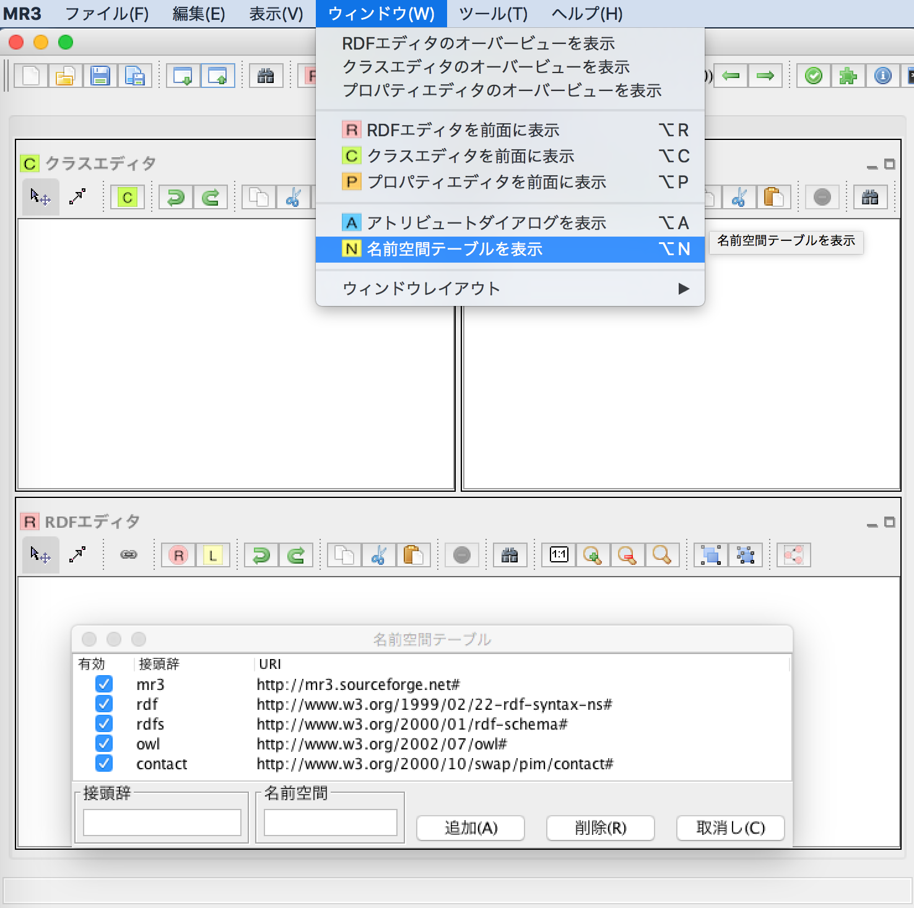

^^^^^^^^^^^^^^^^^^^^^^^^^^^^^^^^^^^^^^^^^^^^^^^^^^^^^^^^^^^^^^^^^^^^^^^^^^^^^^^^^^^^^^^^^^^
手順２: RDFSクラスの挿入
^^^^^^^^^^^^^^^^^^^^^^^^^^^^^^^^^^^^^^^^^^^^^^^^^^^^^^^^^^^^^^^^^^^^^^^^^^^^^^^^^^^^^^^^^^^

RDFSクラスの挿入を行う．クラスエディタ内で右クリックをしてポップアップメニューを出す．ポップアップメニュー の中の「クラスの挿入」メニューを選択し，RDFSクラスの挿入を行う．サンプルRDF文書内では，contact:Personがhttp: //www.w3.org/People/EM/contact#meリソースのタイプとなっている．MR\ :sup:`3` \では，RDFリソースのタイプは，RDFSクラスから選択する．RDFSクラスは，クラスエディタ内で定義する．

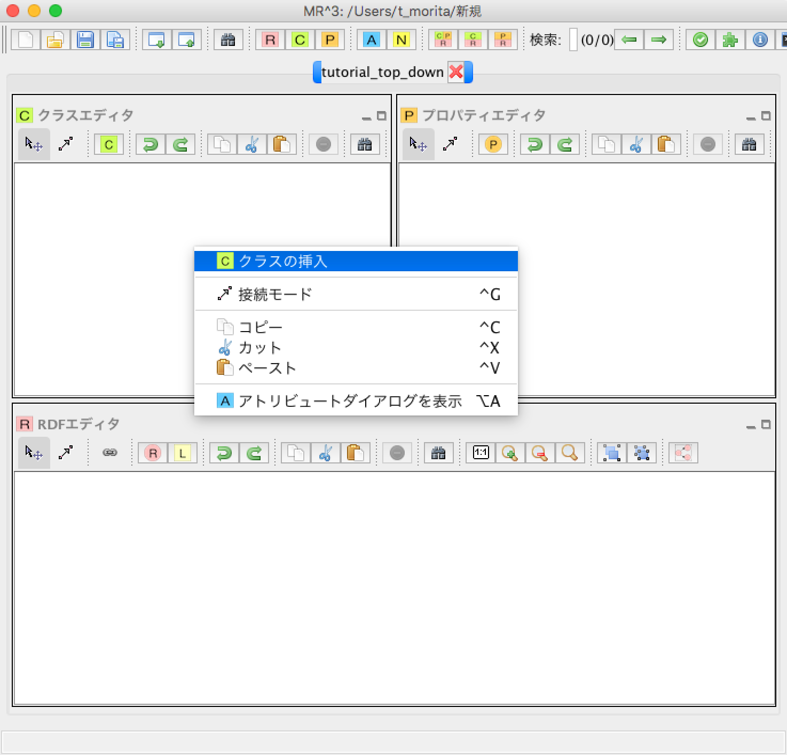

^^^^^^^^^^^^^^^^^^^^^^^^^^^^^^^^^^^^^^^^^^^^^^^^^^^^^^^^^^^^^^^^^^^^^^^^^^^^^^^^^^^^^^^^^^^
手順３: RDFSクラスの入力
^^^^^^^^^^^^^^^^^^^^^^^^^^^^^^^^^^^^^^^^^^^^^^^^^^^^^^^^^^^^^^^^^^^^^^^^^^^^^^^^^^^^^^^^^^^

「クラスの挿入」メニューを選択すると，以下のダイアログが表示される．「接頭辞コンボボックス」から名前空間テーブ ルに登録した接頭辞contactを選択し，「IDテキストフィールド」にPersonを入力する．「了解ボタン」をクリックするとクラスエディタ内に RDFSクラス（この場合，contact:Person）が挿入される．

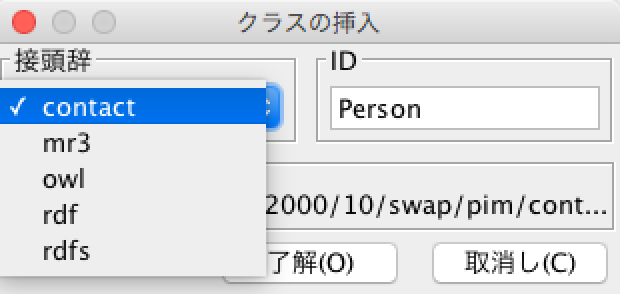

^^^^^^^^^^^^^^^^^^^^^^^^^^^^^^^^^^^^^^^^^^^^^^^^^^^^^^^^^^^^^^^^^^^^^^^^^^^^^^^^^^^^^^^^^^^
手順４: RDFSプロパティの入力
^^^^^^^^^^^^^^^^^^^^^^^^^^^^^^^^^^^^^^^^^^^^^^^^^^^^^^^^^^^^^^^^^^^^^^^^^^^^^^^^^^^^^^^^^^^

RDFSクラスと同様にexample 1文書内に含まれるRDFSプロパティ(contact:fullName，contact:mailbox，contact: personalTitle )も作成する．プロパティエディタ内で右クリックするとポップアップメニューが表示される．「プロパティの挿入」メニューを選択すると以下のダイアログが 表示される．「了解ボタン」をクリックするとプロパティエディタ内にRDFSプロパティが挿入される．MR\ :sup:`3` \では，RDFプロパティは，RDFSプロパティから選択する．RDFSプロパティは，プロパティエディタ内で定義する．

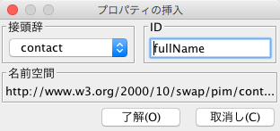

^^^^^^^^^^^^^^^^^^^^^^^^^^^^^^^^^^^^^^^^^^^^^^^^^^^^^^^^^^^^^^^^^^^^^^^^^^^^^^^^^^^^^^^^^^^
手順５: 現在の状態
^^^^^^^^^^^^^^^^^^^^^^^^^^^^^^^^^^^^^^^^^^^^^^^^^^^^^^^^^^^^^^^^^^^^^^^^^^^^^^^^^^^^^^^^^^^

contact:Personクラスとcontact:fullName，contact:mailbox，contact:personalTitleプロパティをMR\ :sup:`3` \で作成すると以下の図のようになる．

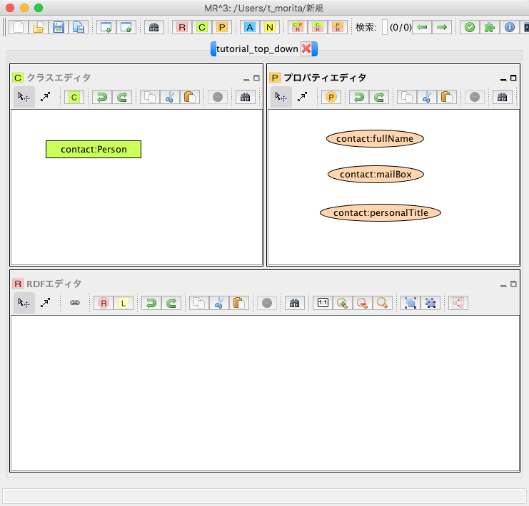

^^^^^^^^^^^^^^^^^^^^^^^^^^^^^^^^^^^^^^^^^^^^^^^^^^^^^^^^^^^^^^^^^^^^^^^^^^^^^^^^^^^^^^^^^^^
手順６: RDFリソースの挿入１
^^^^^^^^^^^^^^^^^^^^^^^^^^^^^^^^^^^^^^^^^^^^^^^^^^^^^^^^^^^^^^^^^^^^^^^^^^^^^^^^^^^^^^^^^^^

次に，手順１から５までで，作成したRDFSクラス及びプロパティを用いてRDFコンテンツの作成を行う．まずは， RDFリソースを作成する．RDFリソースは，RDFエディタ内で定義する．RDFエディタ内で右クリックするとポップアップメニューが表示される．ポッ プアップメニュー内の「RDFリソースの挿入」メニューを選択し，RDFリソースの挿入を行う．

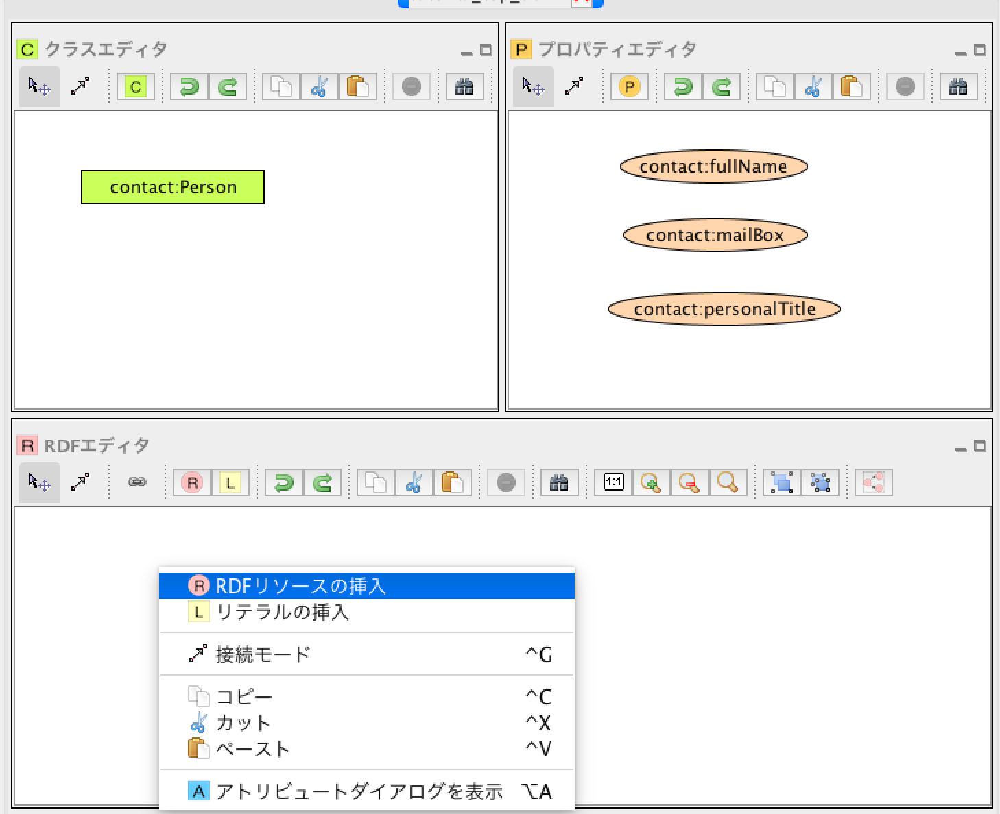

^^^^^^^^^^^^^^^^^^^^^^^^^^^^^^^^^^^^^^^^^^^^^^^^^^^^^^^^^^^^^^^^^^^^^^^^^^^^^^^^^^^^^^^^^^^
手順７: RDFリソースの挿入２
^^^^^^^^^^^^^^^^^^^^^^^^^^^^^^^^^^^^^^^^^^^^^^^^^^^^^^^^^^^^^^^^^^^^^^^^^^^^^^^^^^^^^^^^^^^

「RDFリソースの挿入」メニューを選択すると以下のダイアログが表示される．「リソースタイプコンボボックス」から リソースのタイプを選択する．リソースのタイプは，クラスエディタで作成されたRDFSクラスから選択できる．ここでは，contact:Personク ラスをリソースのタイプとして選択する．また，「http://www.w3.org/People/EM/contact#me」をRDFリソーステキ ストフィールドに入力する．（http://www.w3.org/People/EM/contact#名前空間を，今回は名前空間テーブルに登録して いないため，名前空間およびそのＩＤをここでは入力している．登録してある場合は接頭辞コンボボックスから登録した接頭辞を選択することで，名前空間の入 力を省略できる．また，「ブランクチェックボックス」にチェックをいれるとブランクノードとなる．）リソースのタイプとRDFリソースを入力し，「了解ボ タン」をクリックするとRDFリソースがRDFエディタに挿入される．

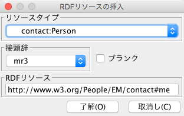

^^^^^^^^^^^^^^^^^^^^^^^^^^^^^^^^^^^^^^^^^^^^^^^^^^^^^^^^^^^^^^^^^^^^^^^^^^^^^^^^^^^^^^^^^^^
手順８: RDFリテラルの挿入および編集
^^^^^^^^^^^^^^^^^^^^^^^^^^^^^^^^^^^^^^^^^^^^^^^^^^^^^^^^^^^^^^^^^^^^^^^^^^^^^^^^^^^^^^^^^^^

次に，「Eric Miller」及び「Dr.」リテラルを作成する．ポップアップメニューから「リテラルの挿入」メニューを選択すると「リテラルの挿入ダイアログ」が表示される．

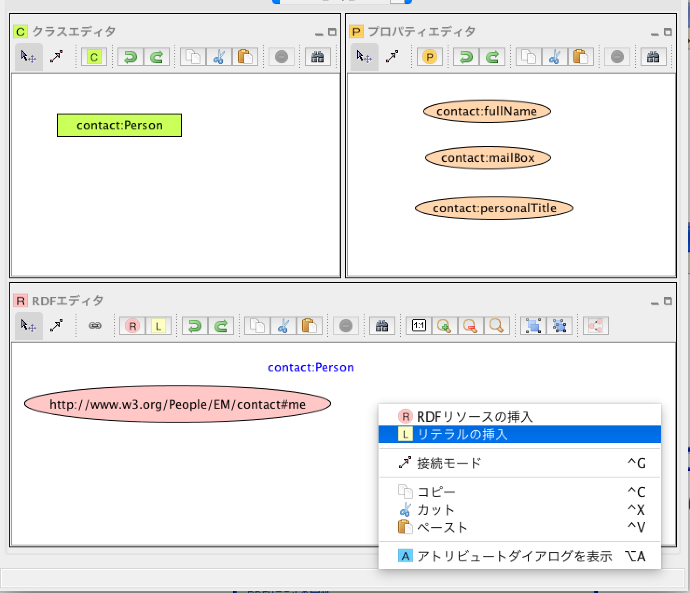

以下の図は，「リテラルの挿入ダイアログ」を表している．「リテラルテキストエリア」に文字列を入力し，「了解ボタン」をクリックするとリテラルがRDFエディタに挿入される．

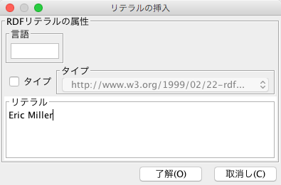

^^^^^^^^^^^^^^^^^^^^^^^^^^^^^^^^^^^^^^^^^^^^^^^^^^^^^^^^^^^^^^^^^^^^^^^^^^^^^^^^^^^^^^^^^^^
手順９: RDFリソース(mailto:em@w3.org)の挿入
^^^^^^^^^^^^^^^^^^^^^^^^^^^^^^^^^^^^^^^^^^^^^^^^^^^^^^^^^^^^^^^^^^^^^^^^^^^^^^^^^^^^^^^^^^^

手順７と同様に，mailto:em@w3.orgリソースを作成する．

^^^^^^^^^^^^^^^^^^^^^^^^^^^^^^^^^^^^^^^^^^^^^^^^^^^^^^^^^^^^^^^^^^^^^^^^^^^^^^^^^^^^^^^^^^^
手順１０: RDFプロパティの挿入
^^^^^^^^^^^^^^^^^^^^^^^^^^^^^^^^^^^^^^^^^^^^^^^^^^^^^^^^^^^^^^^^^^^^^^^^^^^^^^^^^^^^^^^^^^^

次に，RDFプロパティの挿入を行う．RDFプロパティを挿入するためには，「接続モード」に切り替える．「接続モー ド」に切り替えるためには，RDFエディタ内で右クリックをして，ポップアップメニューを表示し，「接続モード」メニューを選択する．または，RDFエ ディタのツールバーにある，arrowア イコンをクリックする．次に，subjectにあたるリソースの上にカーソルを合わせる．青色の枠が表示される．その状態で，objectにあたるリソー スまたはリテラルに向けてカーソルをドラッグし，同様に枠が表示された状態でドロップすることで，RDFプロパティが挿入される．作成されるRDFプロパ ティはmr3#nil(MR\ :sup:`3` \が提供する）となる．RDFプロパティを挿入する際に，あらかじめプロパティエディタにおいて，挿入したいプロパティを選択 してある場合には，選択されたプロパティがRDFプロパティとして挿入される．ここでは，「http: //www.w3.org/People/EM/contact#me」リソースと「Eric Miller」リテラルの間に「contact:fullName」プロパティを挿入する．同様に，「Dr.」リテラルの間に「contact: personalTitle」プロパティを，「mailto:em@w3.org」リソースの間に「contact:mailbox，」プロパティを挿入 する．

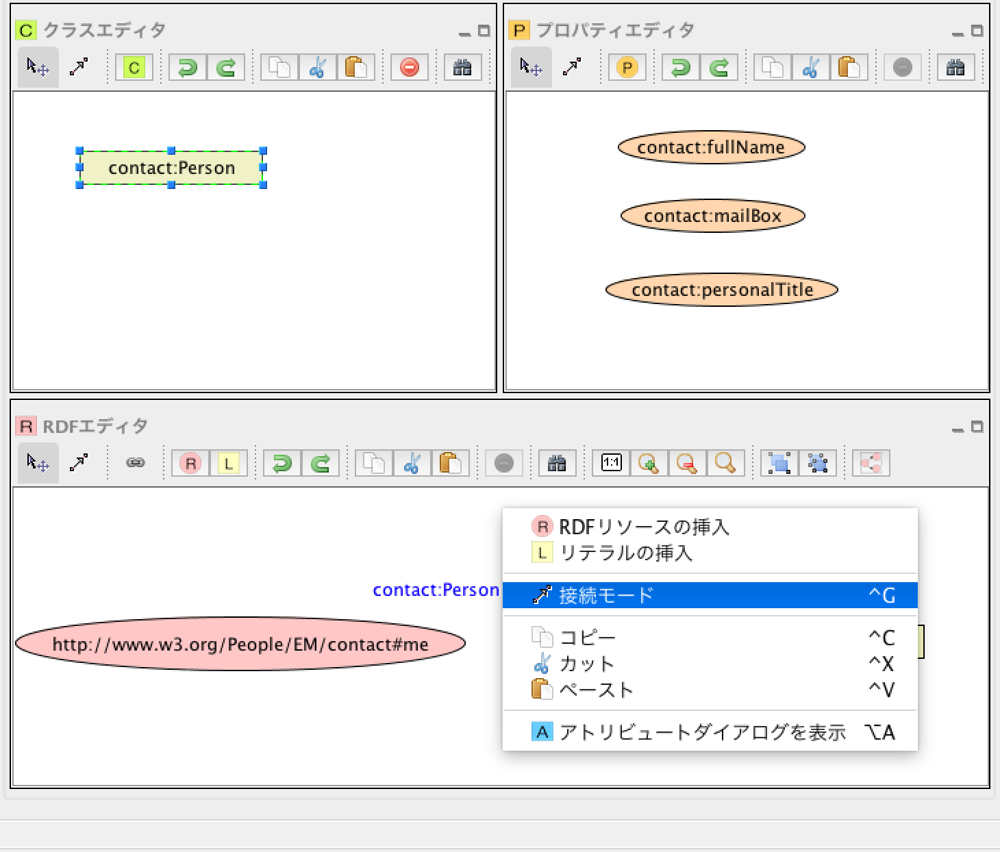

RDFプロパティを編集するためには，アトリビュートダイアログを表示する．アトリビュートダイアログを表示するためには，ツールバーのattrDialogIconア イコンをクリックするか，ポップアップメニューから「アトリビュートダイアログを表示」メニューを選択する．RDFプロパティcontact: personalTitleに変更するためには，「接頭辞コンボボックス」から接頭辞contactを選択し，「プロパティIDリスト」からID personalTitleを選択する．「適用ボタン」をクリックすると変更が反映される．

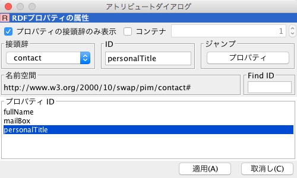

^^^^^^^^^^^^^^^^^^^^^^^^^^^^^^^^^^^^^^^^^^^^^^^^^^^^^^^^^^^^^^^^^^^^^^^^^^^^^^^^^^^^^^^^^^^
手順１１: 作成したRDFコンテンツをRDF/XML形式でエクスポートダイアログに出力
^^^^^^^^^^^^^^^^^^^^^^^^^^^^^^^^^^^^^^^^^^^^^^^^^^^^^^^^^^^^^^^^^^^^^^^^^^^^^^^^^^^^^^^^^^^

ここまでの作業で，以下の図のようなRDFSクラス，RDFSプロパティ，RDFモデルが作成されている．

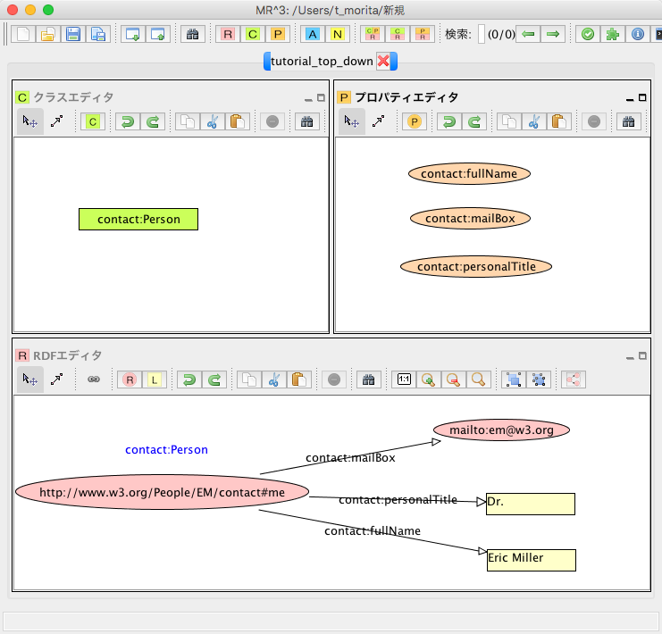

作成したRDFコンテンツが，RDF/XML形式でどのように出力されるかを確認するには，エクスポートダイアログを表示する．エクスポートダイアログは，ファイルメニューのエクスポートを選択するか，ツールバーのexportを選択する．構文として，RDF/XML（ラジオボタン）を選択する．データタイプとして，RDFチェックボックスを選択する．エクスポートダイアログ下部にある，テキストエリアに作成したRDFコンテンツがRDF/XML形式で出力される．

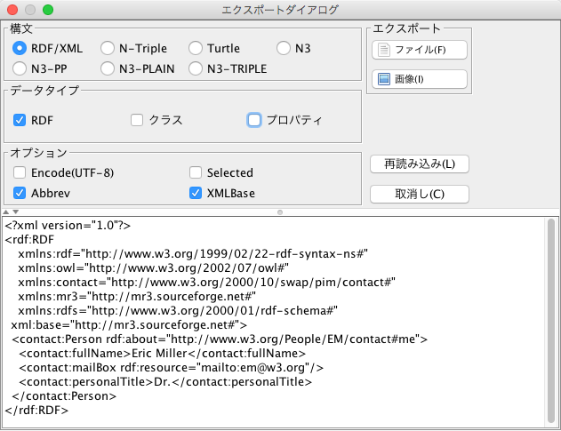

^^^^^^^^^^^^^^^^^^^^^^^^^^^^^^^^^^^^^^^^^^^^^^^^^^^^^^^^^^^^^^^^^^^^^^^^^^^^^^^^^^^^^^^^^^^
手順１２: 作成したRDFコンテンツをRDF/XML形式でファイルに出力
^^^^^^^^^^^^^^^^^^^^^^^^^^^^^^^^^^^^^^^^^^^^^^^^^^^^^^^^^^^^^^^^^^^^^^^^^^^^^^^^^^^^^^^^^^^

作成したRDFコンテンツをRDF/XML形式でファイルに出力したい場合には，エクスポートダイアログの「ファイルボタン」を選択する．保存ダイアログが表示されるため，適当なフォルダにRDFファイルを保存する．
   
---------------------------------------------
RDFコンテンツの作成 （ボトムアップ）
---------------------------------------------

^^^^^^^^^^^^^^^^^^^^^^^^^^^^^^^^^^^^^^^^^^^^^^^^^^^^^^^^^^^^^^^^^^^^^^^^^^^^^^^^^^^^^^^^^^^
手順１: RDFsコンテンツ作成に利用する接頭辞と名前空間の登録
^^^^^^^^^^^^^^^^^^^^^^^^^^^^^^^^^^^^^^^^^^^^^^^^^^^^^^^^^^^^^^^^^^^^^^^^^^^^^^^^^^^^^^^^^^^

トップダウンの手順１と同様

^^^^^^^^^^^^^^^^^^^^^^^^^^^^^^^^^^^^^^^^^^^^^^^^^^^^^^^^^^^^^^^^^^^^^^^^^^^^^^^^^^^^^^^^^^^
手順２: RDFリソースの挿入
^^^^^^^^^^^^^^^^^^^^^^^^^^^^^^^^^^^^^^^^^^^^^^^^^^^^^^^^^^^^^^^^^^^^^^^^^^^^^^^^^^^^^^^^^^^

トップダウンの手順６，７，９と同様にRDFリソースを挿入する．

^^^^^^^^^^^^^^^^^^^^^^^^^^^^^^^^^^^^^^^^^^^^^^^^^^^^^^^^^^^^^^^^^^^^^^^^^^^^^^^^^^^^^^^^^^^
手順３: RDFリテラルの挿入
^^^^^^^^^^^^^^^^^^^^^^^^^^^^^^^^^^^^^^^^^^^^^^^^^^^^^^^^^^^^^^^^^^^^^^^^^^^^^^^^^^^^^^^^^^^

トップダウンの手順８と同様にRDFリテラルを挿入する．

^^^^^^^^^^^^^^^^^^^^^^^^^^^^^^^^^^^^^^^^^^^^^^^^^^^^^^^^^^^^^^^^^^^^^^^^^^^^^^^^^^^^^^^^^^^
手順４: RDFプロパティの挿入
^^^^^^^^^^^^^^^^^^^^^^^^^^^^^^^^^^^^^^^^^^^^^^^^^^^^^^^^^^^^^^^^^^^^^^^^^^^^^^^^^^^^^^^^^^^

トップダウンの手順１０と同様にRDFプロパティを挿入する．

^^^^^^^^^^^^^^^^^^^^^^^^^^^^^^^^^^^^^^^^^^^^^^^^^^^^^^^^^^^^^^^^^^^^^^^^^^^^^^^^^^^^^^^^^^^
手順５: RDFリソースの編集
^^^^^^^^^^^^^^^^^^^^^^^^^^^^^^^^^^^^^^^^^^^^^^^^^^^^^^^^^^^^^^^^^^^^^^^^^^^^^^^^^^^^^^^^^^^

アトリビュートダイアログを表示し，RDFリソース「http: //www.w3.org/People/EM/contact#me」を選択する．RDFリソースの属性がアトリビュートダイアログに表示される．左側 に表示されるリストの中から「タイプ」を選択する．「接頭辞コンボボックス」からcontactを選択し，リソースタイプIDとしてPersonを入力す る．RDFSクラスに指定したいクラスが定義されている場合には，「タイプ選択ボタン」をクリックすれば，クラスエディタからクラスを選択することができ る．今回は，ボトムアップにRDFコンテンツ作成しているため，RDFSクラスにcontact:Personクラスが作成されておらず，選択することが できない．指定したいリソースのタイプcontact:Personを入力した状態で，「適用するボタン」をクリックする．「定義されていません.クラス を作成しますか?」と尋ねるダイアログが表示されるので，「はいボタン」をクリックする．

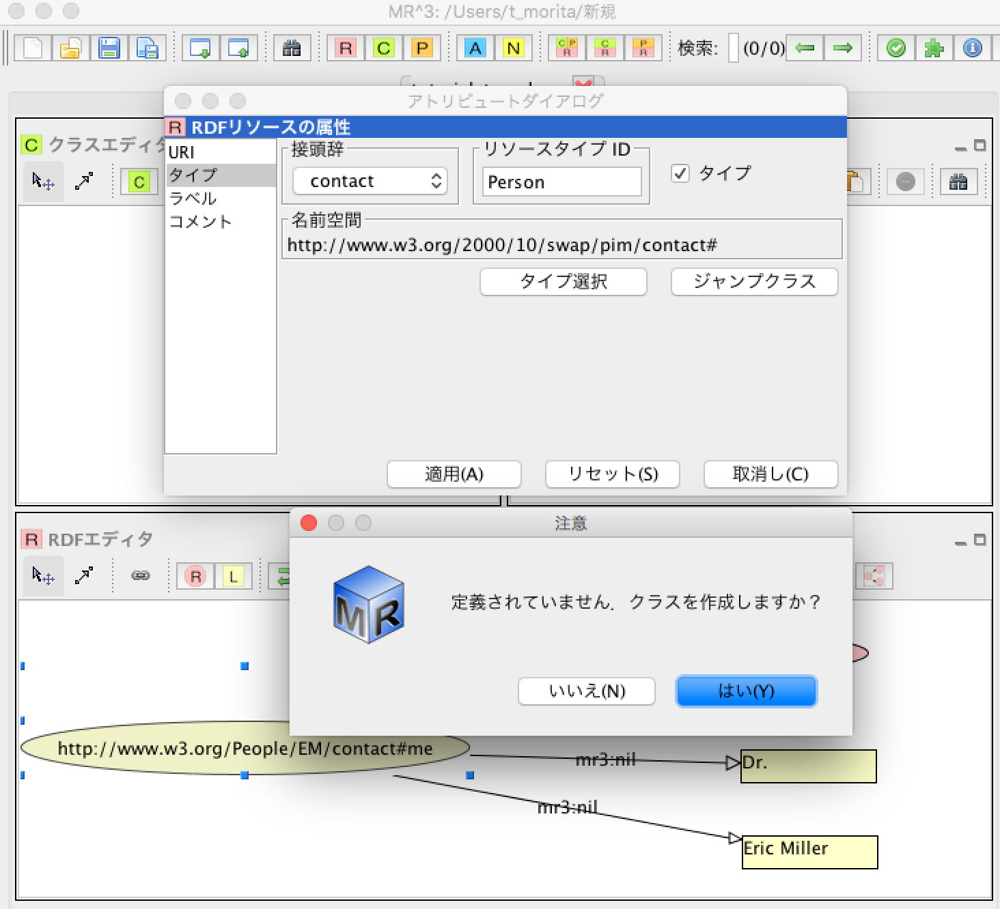

^^^^^^^^^^^^^^^^^^^^^^^^^^^^^^^^^^^^^^^^^^^^^^^^^^^^^^^^^^^^^^^^^^^^^^^^^^^^^^^^^^^^^^^^^^^
手順６: RDFSクラスの作成
^^^^^^^^^^^^^^^^^^^^^^^^^^^^^^^^^^^^^^^^^^^^^^^^^^^^^^^^^^^^^^^^^^^^^^^^^^^^^^^^^^^^^^^^^^^

以下の図のように，クラスエディタにcontact:Personクラスが作成される．

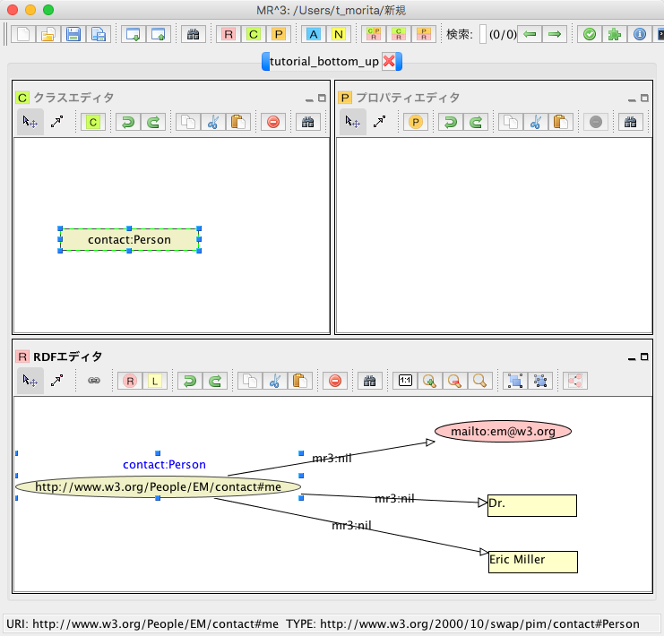

^^^^^^^^^^^^^^^^^^^^^^^^^^^^^^^^^^^^^^^^^^^^^^^^^^^^^^^^^^^^^^^^^^^^^^^^^^^^^^^^^^^^^^^^^^^
手順７: RDFプロパティの編集１
^^^^^^^^^^^^^^^^^^^^^^^^^^^^^^^^^^^^^^^^^^^^^^^^^^^^^^^^^^^^^^^^^^^^^^^^^^^^^^^^^^^^^^^^^^^

アトリビュートダイアログを表示し，編集したいRDFプロパティを選択する．「プロパティの接頭辞のみ表示チェック ボックス」にチェックがされているとRDFSプロパティで定義されているプロパティのみを表示，選択することができる．今回は，RDFSプロパティに指定 したいプロパティが定義されていないので，このチェックをはずす．「接頭辞コンボボックス」から名前空間テーブルに登録したすべての接頭辞を選択できるよ うになるので，contactを選択する．「プロパティID」リストには，RDFSプロパティで定義されているプロパティのID一覧が表示されるが，今回 は定義されていないので表示されない．「IDテキストフィールド」にfullNameと入力し，「適用ボタン」をクリックする．「定義されていません.プロパティを作成しますか?」と尋ねるダイアログが表示されるので，「はいボタン」をクリックする．

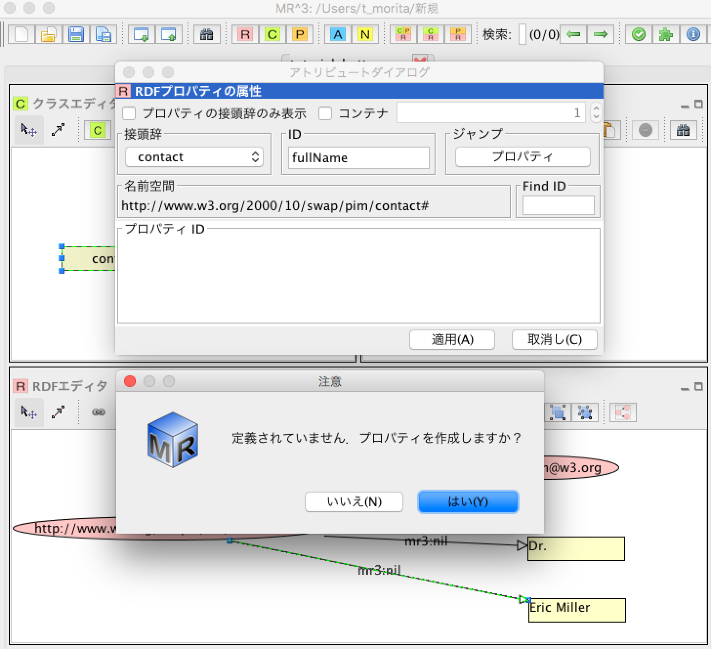
   
^^^^^^^^^^^^^^^^^^^^^^^^^^^^^^^^^^^^^^^^^^^^^^^^^^^^^^^^^^^^^^^^^^^^^^^^^^^^^^^^^^^^^^^^^^^
手順８: RDFプロパティの編集２
^^^^^^^^^^^^^^^^^^^^^^^^^^^^^^^^^^^^^^^^^^^^^^^^^^^^^^^^^^^^^^^^^^^^^^^^^^^^^^^^^^^^^^^^^^^

以下の図のように，プロパティエディタにcontact:fullNameプロパティが作成される．

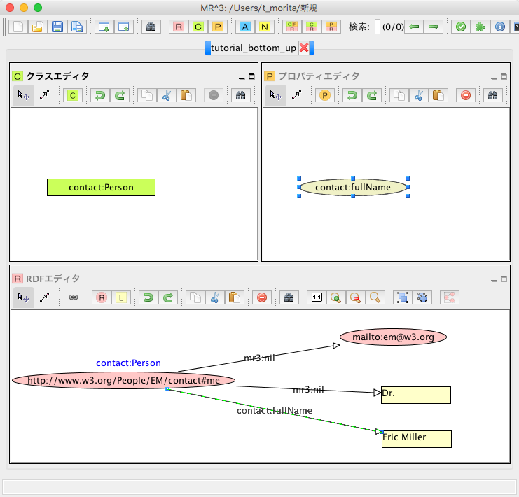
   
^^^^^^^^^^^^^^^^^^^^^^^^^^^^^^^^^^^^^^^^^^^^^^^^^^^^^^^^^^^^^^^^^^^^^^^^^^^^^^^^^^^^^^^^^^^
手順９: 以上の手順を繰り返す
^^^^^^^^^^^^^^^^^^^^^^^^^^^^^^^^^^^^^^^^^^^^^^^^^^^^^^^^^^^^^^^^^^^^^^^^^^^^^^^^^^^^^^^^^^^

同様に，contact:mailBox, contact:personalTitleプロパティも編集し，RDFSプロパティとしてボトムアップに定義する．以上の手順を繰り返し行うことで，RDFコンテンツをボトムアップに作成できる．

---------------------------------------------
RDFSの置換例
---------------------------------------------

以下の図に示すように，インポートダイアログにおいて，「データタイプ」に「RDFS」，「インポート方法」に「置き換え」を選択して，実行するとRDFS の置換を行うことができる．以下の説明の中で，接頭辞animalは，http://example.com/animal#をあらわす．接頭辞mr3は， http://mr3.sourceforege.net#をあらわす．

.. figure:: figures/import_dialog_rdfs_replace.png
   :scale: 70 %
   :align: center

^^^^^^^^^^^^^^^^^^^^^^^^^^^^^^^^^^^^^^^^^^^^^^^^^^^^^^^^^^^^^^^^^^^^^^^^^^^^^^^^^^^^^^^^^^^
置換前
^^^^^^^^^^^^^^^^^^^^^^^^^^^^^^^^^^^^^^^^^^^^^^^^^^^^^^^^^^^^^^^^^^^^^^^^^^^^^^^^^^^^^^^^^^^

例として，以下のRDFs文書のRDFSの置換を行う．以下のRDFs文書には「mr3:動物」クラスのサブクラス に，「mr3:猫」クラスと「mr3:犬」クラスがある．また，RDFモデルには，「mr3:ポチ」（「mr3:犬」クラスのインスタンス）と「mr3:タマ」 （「mr3:猫」クラスのインスタンス）リソースが定義されており，「mr3:ポチ」と「mr3:タマ」には，「mr3:じゃれる」という関係がある．

変換前のRDFS

.. code-block:: xml

    <?xml version="1.0"?>
    <rdf:RDF
        xmlns:rdf="http://www.w3.org/1999/02/22-rdf-syntax-ns#"
        xmlns:owl="http://www.w3.org/2002/07/owl#"
        xmlns:mr3="http://mr3.sourceforge.net#"
        xmlns:rdfs="http://www.w3.org/2000/01/rdf-schema#"
        xmlns:animal="http://example.com/animal#"
        xml:base="http://mr3.sourceforge.net#">
        <rdfs:Class rdf:ID="犬">
            <rdfs:subClassOf>
            <rdfs:Class rdf:ID="動物"/>
            </rdfs:subClassOf>
        </rdfs:Class>
        <rdfs:Class rdf:ID="猫">
            <rdfs:subClassOf rdf:resource="#動物"/>
        </rdfs:Class>
        <rdf:Property rdf:ID="じゃれる"/>
    </rdf:RDF>

      
変換前のRDF

.. code-block:: xml

    <?xml version="1.0"?>
    <rdf:RDF
        xmlns:rdf="http://www.w3.org/1999/02/22-rdf-syntax-ns#"
        xmlns:owl="http://www.w3.org/2002/07/owl#"
        xmlns:mr3="http://mr3.sourceforge.net#"
        xmlns:rdfs="http://www.w3.org/2000/01/rdf-schema#"
        xmlns:animal="http://example.com/animal#"
        xml:base="http://mr3.sourceforge.net#">
        <mr3:犬 rdf:ID="ポチ">
            <mr3:じゃれる>
                <mr3:猫 rdf:ID="タマ"/>
            </mr3:じゃれる>
        </mr3:犬>
    </rdf:RDF>

.. figure:: figures/rdfs_replace_before.png
   :scale: 60 %
   :align: center

^^^^^^^^^^^^^^^^^^^^^^^^^^^^^^^^^^^^^^^^^^^^^^^^^^^^^^^^^^^^^^^^^^^^^^^^^^^^^^^^^^^^^^^^^^^  
置換するクラス及びプロパティ
^^^^^^^^^^^^^^^^^^^^^^^^^^^^^^^^^^^^^^^^^^^^^^^^^^^^^^^^^^^^^^^^^^^^^^^^^^^^^^^^^^^^^^^^^^^

以下のRDFSを置換前のRDFSと置き換える．

置換するRDFS

.. code-block:: xml

    <?xml version="1.0"?>
    <rdf:RDF
        xmlns:rdf="http://www.w3.org/1999/02/22-rdf-syntax-ns#"
        xmlns:owl="http://www.w3.org/2002/07/owl#"
        xmlns:mr3="http://mr3.sourceforge.net#"
        xmlns:rdfs="http://www.w3.org/2000/01/rdf-schema#"
        xmlns:animal="http://example.com/animal#"
        xml:base="http://mr3.sourceforge.net#">
      <rdfs:Class rdf:about="http://example.com/animal#動物"/>
      <rdfs:Class rdf:about="http://example.com/animal#猫">
        <rdfs:subClassOf rdf:resource="http://example.com/animal#動物"/>
      </rdfs:Class>
      <rdfs:Class rdf:about="http://example.com/animal#犬">
        <rdfs:subClassOf rdf:resource="http://example.com/animal#動物"/>
      </rdfs:Class>
      <rdf:Property rdf:about="http://example.com/animal#じゃれる"/>
    </rdf:RDF>

^^^^^^^^^^^^^^^^^^^^^^^^^^^^^^^^^^^^^^^^^^^^^^^^^^^^^^^^^^^^^^^^^^^^^^^^^^^^^^^^^^^^^^^^^^^  
RDFS置換ダイアログ
^^^^^^^^^^^^^^^^^^^^^^^^^^^^^^^^^^^^^^^^^^^^^^^^^^^^^^^^^^^^^^^^^^^^^^^^^^^^^^^^^^^^^^^^^^^

RDFSの置換を実行するとRDFS置換ダイアログが表示される．RDFS置換ダイアログには，置換前と置換後のクラスとプロパティのリストが表示される．上，下のボタンを押して，置換前と置換後のクラス及びプロパティを同じ行に合わせることで，置換するクラス及びプロパティを指定することができる．ここでは，「mr3:動物」クラスを「animal:動物」クラスに，「mr3:犬」クラスを「animal:犬」クラスに，「mr3:猫」クラスを「animal:猫」クラスに置換する．また，「mr3:じゃれる」プロパティを「animal:じゃれる」プロパティに置換する．以下の図のようにして， 適用するボタンを押すと置換が行われる．置換前と置換後のリストの項目の初期位置は，以下の優先順で決められる．

1. URIが同一の場合
2. IDが同一の場合

1と2に該当するクラス及びプロパティがない場合には，NULLとなる．NULLまたは，置換前よりも置換後のクラス及びプロパティの数が少ない場合には，クラスは空に，プロパティは「mr3:nil」となる．

.. figure:: figures/rdfs_replace_dialog.png
   :scale: 80 %
   :align: center
   

^^^^^^^^^^^^^^^^^^^^^^^^^^^^^^^^^^^^^^^^^^^^^^^^^^^^^^^^^^^^^^^^^^^^^^^^^^^^^^^^^^^^^^^^^^^
置換後
^^^^^^^^^^^^^^^^^^^^^^^^^^^^^^^^^^^^^^^^^^^^^^^^^^^^^^^^^^^^^^^^^^^^^^^^^^^^^^^^^^^^^^^^^^^

置換後は，以下のようになる．RDFSを置換したことで，RDFモデルのリソースのタイプやプロパティの置換も同時に行われる．今回の例では，リソース「ポチ」のタイプが「mr3:犬」から「animal:犬」に，リソース「タマ」のタイプが「mr3:猫」から「animal:猫」に変更されている．また，ポチとタマの関係が「mr3:じゃれる」プロパティから「animal:じゃれる」プロパティに変更されている．

置換後のRDF

.. code-block:: xml

    <?xml version="1.0"?>
    <rdf:RDF
        xmlns:rdf="http://www.w3.org/1999/02/22-rdf-syntax-ns#"
        xmlns:owl="http://www.w3.org/2002/07/owl#"
        xmlns:mr3="http://mr3.sourceforge.net#"
        xmlns:rdfs="http://www.w3.org/2000/01/rdf-schema#"
        xmlns:animal="http://example.com/animal#"
        xml:base="http://mr3.sourceforge.net#">
      <animal:犬 rdf:ID="ポチ">
        <animal:じゃれる>
          <animal:猫 rdf:ID="タマ"/>
        </animal:じゃれる>
      </animal:犬>
    </rdf:RDF>

     

   
   