ユーザマニュアル
========================

.. contents:: コンテンツ 
   :depth: 4

MR\ :sup:`3` \のアーキテクチャ
---------------------------------------
:numref:`mr3-architecture` にMR\ :sup:`3` \の実装アーキテクチャを示す．MR\ :sup:`3` \は，Java言語用いて実装している． MR\ :sup:`3` \では，RDFおよびRDFSデータグラフを視覚化するために `JGraph <http://www.jgraph.com/>`_ を用いてグラフィカルモデラを実装している．また，MR\ :sup:`3` \は，セマンティックWeb コンテンツ（RDF，RDFS，OWLコンテンツ）のインポートとエクスポートを行うために， `Apache Jena <https://jena.apache.org/>`_ を用いてパーサとジェネレータを実装している．

.. _mr3-architecture:

   MR\ :sup:`3` \の実装アーキテクチャ

MR\ :sup:`3` \のシステム構成図
----------------------------------------
:numref:`system-overview` にMR\ :sup:`3` \のシステム構成を示す． MR\ :sup:`3` \は，パーサ，ジェネレータ，RDF(S)コンテンツ管理，グラフィカルモデラから構成される．グラフィカルモデラは，主に，RDFエディタ，クラスエディタ，プロパティエディタから構成される．ユーザはグラフィカルモデラを介して，RDFおよびRDFSコンテンツを視覚的に編集することができる．MR\ :sup:`3` \の入力と出力はRDF(S)文書である．パーサはRDF(S)文書を解析して，Apache Jena のモデルオブジェクトに変換し，その後，RDF(S)コンテンツ管理を行うことができるようにMR\ :sup:`3` \の内部データに変換する．ジェネレータは， MR\ :sup:`3` \の内部データをApache Jena のモデルオブジェクトに変換し，その後，RDF(S)文書に変換する．

.. _system-overview:

   MR\ :sup:`3` \のシステム構成

MR\ :sup:`3` \の画面構成
------------------------
:numref:`mr3-screenshot` にMR\ :sup:`3` \のグラフィカルモデラのスクリーンショットを示す．グラフィカルモデラは，RDFエディタ，クラスエディタ，プロパティエディタ，属性ダイアログ，名前空間テーブル，削除ダイアログ，リソース検索ダイアログ，インポートダイアログ，エクスポートダイアログ，設定ダイアログから構成される．

 .. _mr3-screenshot:
 .. figure:: figures/screenshot_of_mr3.png
   :scale: 25 %
   :alt: MR\ :sup:`3` \のグラフィカルモデラのスクリーンショットs
   :align: center

   MR\ :sup:`3` \のグラフィカルモデラのスクリーンショット
   
   
.. index:: RDFエディタ

RDFエディタ
-----------
RDFエディタでは，RDFリソース，RDFリソースのタイプ，RDFプロパティ，RDFリテラルの編集を行う．:numref:`rdf-editor` に示すように，RDFリソースは楕円，RDFプロパティは矢印，RDFリテラルは矩形でRDFエディタ内に表示される．RDFリソースのタイプはRDFリソースの左上に表示される．

.. _rdf-editor:
.. figure:: figures/rdf_editor.png
   :scale: 30 %
   :alt: RDFエディタ
   :align: center

   RDFエディタ

RDFエディタのツールバー
~~~~~~~~~~~~~~~~~~~~~~~
以下にRDFエディタのツールバーにおけるアイコンと対応する機能を示す．

.. csv-table::
   :header: アイコン, 機能
   :align: center
   :widths: 3, 10 

   .. figure:: figures/toolbar/resource.png, RDFリソースを挿入する      
   .. figure:: figures/toolbar/literal.png, RDFリテラルを挿入する                           
   .. figure:: figures/toolbar/copy.png, ノードをコピーする                                         
   .. figure:: figures/toolbar/cut.png, ノードをカットする                                         
   .. figure:: figures/toolbar/paste.png, ノードをペーストする                                        
   .. figure:: figures/toolbar/delete.png, ノードを削除する                                          
   .. figure:: figures/toolbar/undo.png, アンドゥ
   .. figure:: figures/toolbar/redo.png, リドゥ
   .. figure:: figures/toolbar/export_graph_img.png,   RDFグラフを画像ファイルに保存する
   .. figure:: figures/toolbar/l_to_r_layout.png,      RDFグラフの自動整列を実行する（左から右）
   .. figure:: figures/toolbar/open_resource.png,      選択したRDFリソースを開く

RDFエディタのポップアップメニュー
~~~~~~~~~~~~~~~~~~~~~~~~~~~~~~~~~
RDFエディタ内で，右クリックするとポップアップメニューが表示される．ポップアップメニューは，ノードを選択している場合としていない場合で表示内容が異なる．

:numref:`rdf-editor-popup-menu-1` にノードが選択されていない状態のRDFエディタ内で表示されるポップアップメニューのスクリーンショットを示す． :numref:`rdf-editor-popup-menu-2` にノードが選択された状態のRDFエディタ内で表示されるポップアップメニューのスクリーンショットを示す．

.. _rdf-editor-popup-menu-1:
.. figure:: figures/popup_menu_rdf_editor.png
   :scale: 50 %
   :alt: ノードが選択されていない状態
   :align: center

   ノードが選択されていない状態

.. _rdf-editor-popup-menu-2:
.. figure:: figures/popup_menu_selected_rdf_editor.png
   :scale: 50 %
   :alt: ノードが選択された状態
   :align: center

   ノードが選択された状態

各メニューの説明は以下のとおりである．

RDFリソースの挿入
    マウスの右クリックで指定した位置にRDFリソースを挿入する．
リテラルの挿入
    マウスの右クリックで指定した位置にリテラルを挿入する．
リソースタイプの変換
    RDFリソースのタイプをクラスエディタで選択しているクラスに変換する．
RDFからクラスへ変換
    RDFリソースをRDFSクラスに変換する．
RDFからプロパティへ変換
    RDFリソースをRDFSプロパティに変換する．
コピー
    RDFリソース，プロパティ，リテラルをコピーする．
カット
    RDFリソース，プロパティ，リテラルをカットする．
ペースト
    RDFリソース，プロパティ，リテラルをペーストする．
削除
    RDFリソース，プロパティ，リテラルを削除する．
属性ダイアログを表示
    属性ダイアログを表示する 

RDFリソースの属性編集
~~~~~~~~~~~~~~~~~~~~~
RDFエディタ内のRDFリソースを選択すると，属性ダイアログにRDFリソースの属性が表示される（ :numref:`attr-rdf-res-uri` から :numref:`attr-rdf-res-comment` ）．RDFリソースの属性編集では，RDFリソースのURI，RDFリソースのタイプ，RDFリソースが空白ノード(blank node) かどうかの選択，RDFリソースのラベルおよびコメントを編集することができる．ここで，空白ノードとは，URI により名前付けしないRDFリソースを表す．空白ノードは外部から参照することはできない．しかし，ステートメントにおける主語または目的語になることができ，URI により名前付けしにくいRDFリソースを記述したり，複数のRDFプロパティを構造化したRDFコンテンツを表現するために用いられる．

RDFリソースのURI を設定したい場合には， :numref:`attr-rdf-res-uri` に示すように，属性ダイアログ左側の一覧から「URI」を選択する．「接頭辞」コンボボックスには，名前空間テーブルに登録されている名前空間接頭辞の一覧が表示される．「接頭辞」コンボボックスから名前空間接頭辞を選択すると，対応する名前空間が「RDFリソース」テキストフィールドに出力される．ユーザは，「RDFリソース」テキストフィールドに設定したいRDFリソースのURI を入力する．RDFリソースを空白ノードとしたい場合には，「ブランクノード」チェックボックスにチェックをいれる．

.. _attr-rdf-res-uri:
.. figure:: figures/attribute_dialog_rdf_resource_uri.png
   :scale: 50 %
   :alt: 属性ダイアログ（RDFリソースのURI）
   :align: center

   属性ダイアログ（RDFリソースのURI）

RDFリソースのタイプを設定したい場合には， :numref:`attr-rdf-res-type` に示すように，属性ダイアログ左側の一覧から「リソースタイプ」を選択する．RDFリソースタイプを入力するには，「リソースタイプ」チェックボックスをチェックする．RDFリソースのタイプを空にするには，「リソースタイプ」チェックボックスのチェックをはずす．「タイプ選択」ボタンをクリックすると， :numref:`rdf-res-type-selection-dialog` に示す「RDFリソースタイプ選択」ダイアログが表示される．「RDFリソースタイプ選択」ダイアログには，クラスエディタで構築したクラス階層が表示される．RDFリソースのタイプとしたいクラスを選択すると，「RDFリソースタイプ選択」ダイアログのURI ラベルに，選択したクラスのURI が表示される．「了解」ボタンをクリックすると，属性ダイアログの「接頭辞」コンボボックスと「リソースタイプID」テキストフィールドに，「RDFリソースタイプ選択」ダイアログで選択したURI が設定される．クラスエディタで定義されていないクラスのURI をRDFリソースのタイプとして入力した場合，RDF(S)コンテンツ管理機能が働き， :numref:`rdf-and-rdfs-management-dialog` に示す「RDF(S)コンテンツ管理」ダイアログが表示される．RDF(S)コンテンツ管理ダイアログでは，RDFSクラス名の変更またはRDFSクラスの新規作成のどちらかをユーザは選択することができる．「クラス編集」ボタンをクリックすると，そのRDFリソースのタイプと対応するクラスエディタ内のRDFSクラスが選択され，そのRDFSクラスの属性が属性ダイアログに表示される．

.. _attr-rdf-res-type:
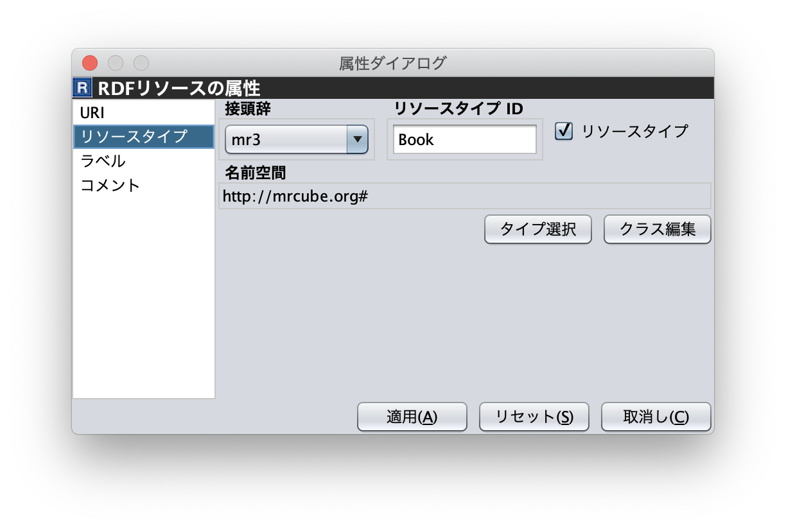

   属性ダイアログ（RDFリソースのタイプ）

.. _rdf-res-type-selection-dialog:
.. figure:: figures/rdf_resource_type_selection_dialog.png
   :scale: 40 %
   :alt: RDFリソースタイプ選択ダイアログ
   :align: center

   RDFリソースタイプ選択ダイアログ

.. _rdf-and-rdfs-management-dialog:
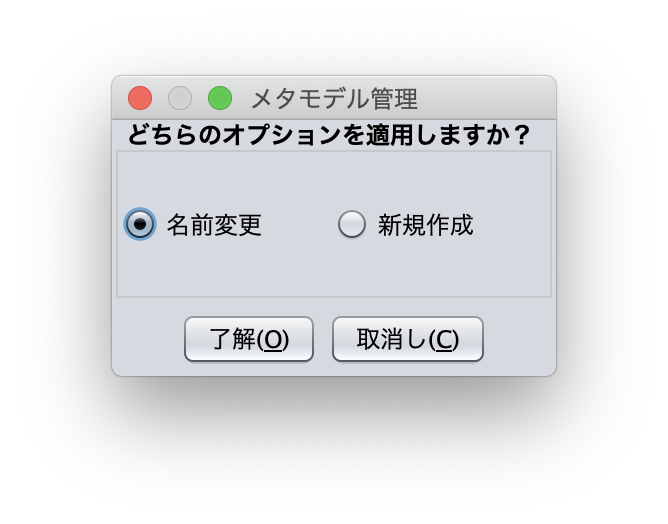

   RDF(S)コンテンツ管理ダイアログ

RDFリソースに対して，rdfs:label プロパティを用いてRDFリソースのラベルを記述したい場合には， :numref:`attr-rdf-res-label` に示すように，属性ダイアログ左側の一覧から「ラベル」を選択する．「言語」テキストフィールドに言語を，「ラベル」テキストフィールドにラベルを入力し，「追加」ボタンを押すと，属性ダイアログ中央のテーブルに言語とラベルが追加される．テーブルの行を選択し，「削除」ボタンを押すと選択したラベルを削除することができる．

.. _attr-rdf-res-label:
.. figure:: figures/attribute_dialog_rdf_resource_label.png
   :scale: 50 %
   :alt: 属性ダイアログ（RDFリソースのラベル）
   :align: center

   属性ダイアログ（RDFリソースのラベル）

RDFリソースに対して，rdfs:comment プロパティを用いてRDFリソースのコメントを記述したい場合には， :numref:`attr-rdf-res-comment` に示すように，属性ダイアログ左側の一覧から「コメント」を選択する．「追加」ボタンを押すと，「コメント編集」ダイアログが表示される．「言語」テキストフィールドに言語を，「ラベル」テキストフィールドにラベルを入力し，「了解」ボタンを押すと，属性ダイアログ中央のテーブルに言語とコメントが追加される．テーブルの行を選択し，「編集」ボタンを押すと「コメント編集」ダイアログが表示され，コメントを編集することができる．テーブルの行を選択し，「削除」ボタンを押すと選択したコメントを削除することができる．

.. _attr-rdf-res-comment:
.. figure:: figures/attribute_dialog_rdf_resource_comment.png
   :scale: 50 %
   :alt: 属性ダイアログ（RDFリソースのコメント）
   :align: center

   属性ダイアログ（RDFリソースのコメント）

RDFプロパティの属性編集
~~~~~~~~~~~~~~~~~~~~~~~
RDFエディタ内のRDFプロパティを選択すると，属性ダイアログにRDFプロパティの属性が表示される（ :numref:`attr-rdf-property` ）．RDFプロパティの属性編集では，RDFプロパティのURI を編集することができる．プロパティエディタで定義されていないプロパティのURI を入力した場合，RDF(S)コンテンツ管理機能が働き， :numref:`rdf-and-rdfs-management-dialog` に示す「RDF(S)コンテンツ管理」ダイアログが表示される．RDF(S)コンテンツ管理ダイアログでは，RDFSプロパティ名の変更またはRDFSプロパティの新規作成のどちらかをユーザは選択することができる．プロパティエディタ内で定義されているプロパティの中で，名前空間接頭辞に対応する名前空間URI をもつプロパティのID が「プロパティID」リストに表示される．「RDFSプロパティ編集」ボタンをクリックすると，選択したRDFプロパティに対応するプロパティエディタ内のRDFSプロパティが選択され，属性ダイアログにそのRDFSプロパティの属性が表示される．

.. _attr-rdf-property:
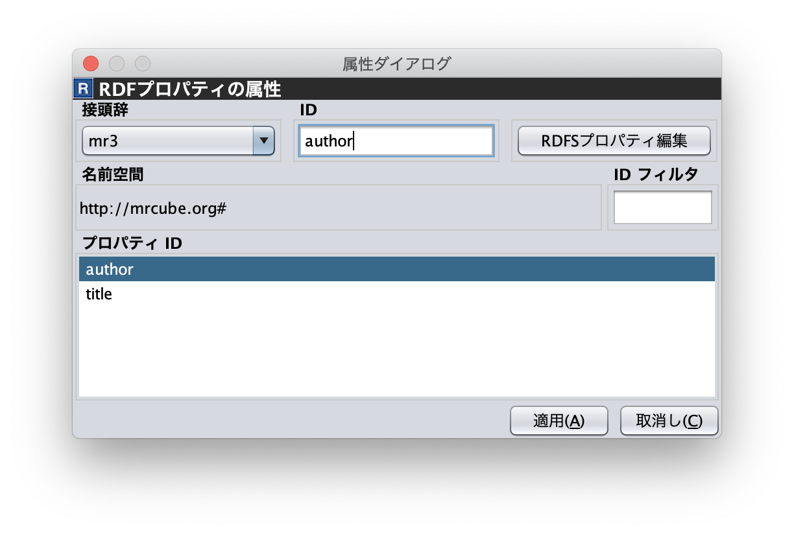

   属性ダイアログ（RDFプロパティ）

RDFリテラルの属性編集
~~~~~~~~~~~~~~~~~~~~~
RDFエディタ内のRDFリテラルを選択すると，属性ダイアログにRDFリテラルの属性が表示される（ :numref:`attr-rdf-literal` ）．RDFリテラルの編集では，リテラルの内容，言語属性（xml:lang 属性），データタイプの編集を行うことができる．「リテラル」テキストエリアには，リテラルの内容を入力する．「言語」テキストフィールドには，リテラルの記述言語を入力する．リテラルのデータタイプを設定したい場合には，「データタイプ」チェックボックスにチェックを入れて，コンボボックスからデータタイプを選択することができる．リテラルのデータタイプを必要としない場合には，「データタイプ」チェックボックスのチェックをはずす．言語とリテラルのタイプは排他的であり，どちらか一方しか設定することはできない

.. _attr-rdf-literal:
.. figure:: figures/attribute_dialog_rdf_literal.png
   :scale: 50 %
   :alt: 属性ダイアログ（RDFリテラル）
   :align: center

   属性ダイアログ（RDFリテラル）

.. index:: クラスエディタ

クラスエディタ
--------------

クラスエディタでは，RDFSクラスの階層関係およびRDFSクラスの属性編集を行うことができる． :numref:`class-editor` にクラスエディタのスクリーンショットを示す

.. _class-editor:
.. figure:: figures/class_editor.png
   :scale: 30 %
   :alt: クラスエディタ
   :align: center
   
   クラスエディタ

クラスエディタのツールバー
~~~~~~~~~~~~~~~~~~~~~~~~~~
以下にクラスエディタのツールバーにおけるアイコンと対応する機能を示す．

.. csv-table::
   :header: アイコン, 機能
   :align: center
   :widths: 3, 10 

    .. figure:: figures/toolbar/resource.png,                RDFSクラスを挿入する    
    .. figure:: figures/toolbar/copy.png,                    ノードをコピーする                                         
    .. figure:: figures/toolbar/cut.png,                     ノードをカットする                                         
    .. figure:: figures/toolbar/paste.png,                   ノードをペーストする                                        
    .. figure:: figures/toolbar/delete.png,                  ノードを削除する                                          
    .. figure:: figures/toolbar/undo.png,                    アンドゥ
    .. figure:: figures/toolbar/redo.png,                    リドゥ
    .. figure:: figures/toolbar/export_graph_img.png,        クラスグラフを画像ファイルに保存する
    .. figure:: figures/toolbar/l_to_r_layout.png,           RDFグラフの自動整列を実行（左から右）する
    .. figure:: figures/toolbar/u_to_d_layout.png,           RDFグラフの自動整列を実行（上から下）する
    .. figure:: figures/toolbar/open_resource.png,           選択したRDFSクラスを開く

クラスエディタのポップアップメニュー
~~~~~~~~~~~~~~~~~~~~~~~~~~~~~~~~~~~~
クラスエディタ内で，右クリックするとポップアップメニューが表示される．ポップアップメニューは，ノードを選択している場合としていない場合で表示内容が異なる．

:numref:`class-editor-popup-menu-1` にノードが選択されていない状態のクラスエディタ内で表示されるポップアップメニューのスクリーンショットを示す． :numref:`class-editor-popup-menu-2` にノードが選択された状態のクラスエディタ内で表示されるポップアップメニューのスクリーンショットを示す．

.. _class-editor-popup-menu-1:
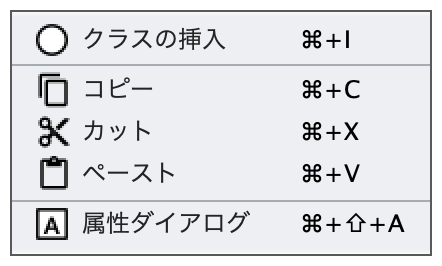
   
   ノードが選択されていない状態
   
.. _class-editor-popup-menu-2:
.. figure:: figures/popup_menu_selected_class_editor.png
   :scale: 50 %
   :alt: ノードが選択された状態
   :align: center
   
   ノードが選択された状態

各メニューの説明は以下のとおりである．

クラスの挿入
    マウスの右クリックで指定した場所にクラスを挿入する．他のクラスを選択した状態でクラスの挿入を行うと，選択したクラスのサブクラスとして，新規クラスが挿入される．
クラスからRDFへ変換
    RDFSクラスからRDFリソースへ変換する．
クラスからプロパティへ変換
    RDFSクラスからRDFSプロパティへ変換する．
コピー
    クラスとクラス間の関係をコピーする．
カット
    クラスとクラス間の関係をカットする．
ペースト
    クラスとクラス間の関係をカットする．
削除
    クラスとクラス間の関係を削除する．
属性ダイアログを表示
    属性ダイアログを表示する．

クラスエディタの属性編集
~~~~~~~~~~~~~~~~~~~~~~~~
クラスエディタ内のRDFSクラスを選択すると，RDFSクラスの属性が属性ダイアログに表示される（ :numref:`attr-class-basic` から :numref:`attr-class-upper-class` ）．属性ダイアログ左側のリストから「基本」，「ラベル」，「コメント」，「インスタンス」，「上位クラス」項目を選択し，RDFSクラスの属性の編集を行う．「基本」では，リソースタイプおよびURI を編集することができる（ :numref:`attr-class-basic` ）．リソースタイプで選択できる項目は，「設定」ダイアログのクラスクラスリストから追加および削除を行うことができる．「ラベル」では，rdfs:label プロパティの編集を行うことができる．「コメント」では，rdfs:commentの編集を行うことができる．ラベルとコメントの編集方法は，RDFリソースと同様である．「インスタンス」には選択したRDFSクラスのインスタンスのリストが表示される（ :numref:`attr-class-instance` ）．リスト中の項目をクリックすると対応するRDFエディタ内のRDFリソースにジャンプし，そのRDFリソースの属性が属性ダイアログに表示される．「上位クラス」には，選択したRDFSクラスの上位クラスのリストが表示される（ :numref:`attr-class-upper-class` ）．

.. _attr-class-basic:
.. figure:: figures/attribute_dialog_rdfs_class_basic.png
   :scale: 50 %
   :alt: 属性ダイアログ（RDFSクラスの基本）
   :align: center
   
   属性ダイアログ（RDFSクラスの基本）
 
.. _attr-class-instance:
.. figure:: figures/attribute_dialog_rdfs_class_instance.png
   :scale: 50 %
   :alt: 属性ダイアログ（RDFSクラスのインスタンス）
   :align: center
   
   属性ダイアログ（RDFSクラスのインスタンス）
  
.. _attr-class-upper-class:
.. figure:: figures/attribute_dialog_rdfs_class_upper_class.png
   :scale: 50 %
   :alt: 属性ダイアログ（RDFSクラスの上位クラス）
   :align: center
   
   属性ダイアログ（RDFSクラスの上位クラス）

.. index:: プロパティエディタ

プロパティエディタ
------------------
プロパティエディタでは，RDFS プロパティの階層関係およびRDFS プロパティの属性編集を行うことができる． :numref:`property-editor` にプロパティエディタのスクリーンショットを示す．

.. _property-editor:
.. figure:: figures/property_editor.png
   :scale: 30 %
   :alt: プロパティエディタ
   :align: center
   
   プロパティエディタ

プロパティエディタのツールバー
~~~~~~~~~~~~~~~~~~~~~~~~~~~~~~

以下にプロパティエディタのツールバーにおけるアイコンと対応する機能を示す．

.. csv-table::
   :header: アイコン, 機能
   :align: center
   :widths: 3, 10 
     
   .. figure:: figures/toolbar/resource.png,                RDFSプロパティを挿入する    
   .. figure:: figures/toolbar/copy.png,                    ノードをコピーする                                         
   .. figure:: figures/toolbar/cut.png,                     ノードをカットする                                         
   .. figure:: figures/toolbar/paste.png,                   ノードをペーストする                                        
   .. figure:: figures/toolbar/delete.png,                  ノードを削除する                                          
   .. figure:: figures/toolbar/undo.png,                    アンドゥ
   .. figure:: figures/toolbar/redo.png,                    リドゥ
   .. figure:: figures/toolbar/export_graph_img.png,        プロパティグラフを画像ファイルに保存する
   .. figure:: figures/toolbar/l_to_r_layout.png,           RDFグラフの自動整列を実行（左から右）
   .. figure:: figures/toolbar/u_to_d_layout.png,           RDFグラフの自動整列を実行（上から下）
   .. figure:: figures/toolbar/open_resource.png,           選択したRDFSプロパティを開く

プロパティエディタのポップアップメニュー
~~~~~~~~~~~~~~~~~~~~~~~~~~~~~~~~~~~~~~~~
プロパティエディタ内で，右クリックするとポップアップメニューが表示される．ポップアップメニューは，ノードを選択している場合としていない場合で表示内容が異なる．

:numref:`property-editor-popup-menu-1` にノードが選択されていない状態のプロパティエディタ内で表示されるポップアップメニューのスクリーンショットを示す． :numref:`property-editor-popup-menu-2` にノードが選択された状態のプロパティエディタ内で表示されるポップアップメニューのスクリーンショットを示す．

.. _property-editor-popup-menu-1:
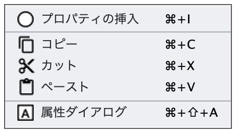
   
   ノードが選択されていない状態
   
.. _property-editor-popup-menu-2:
.. figure:: figures/popup_menu_selected_property_editor.png
   :scale: 50 %
   :alt: ノードが選択された状態
   :align: center
   
   ノードが選択された状態

各メニューの説明は以下のとおりである．

プロパティの挿入
    マウスの右クリックで指定した場所にプロパティを挿入する．他のクラスを選択した状態でプロパティの挿入を行うと，選択したプロパティのサブプロパティとして，新規プロパティが挿入される．
プロパティからRDFへ変換
    RDFSプロパティからRDFリソースへ変換する．
プロパティからクラスへ変換
    RDFSプロパティからRDFSクラスへ変換する．
コピー
    プロパティとプロパティ間関係をコピーする．
カット
    プロパティとプロパティ間関係をカットする．
ペースト
    プロパティとプロパティ間関係をペーストする．
削除
    プロパティとプロパティ間関係を削除する．
属性ダイアログを表示
    属性ダイアログを表示する．

プロパティエディタの属性編集
~~~~~~~~~~~~~~~~~~~~~~~~~~~~
プロパティエディタ内のRDFS プロパティを選択すると，RDFS プロパティの属性が属性ダイアログに表示される（ :numref:`attr-property-region` と :numref:`attr-property-instance` ）．属性ダイアログ左側のリストには，「基本」，「ラベル」，「コメント」，「定義域/値域」，「インスタンス」，「上位プロパティ」項目が表示される．「基本」，「ラベル」，「コメント」の編集項目はRDFSクラスと同様である．「基本」のリソースタイプは，「設定」ダイアログのプロパティクラスリストから追加および削除を行うことができる．「定義域/値域」にはRDFS プロパティの定義域および値域をクラスエディタから選択できる（ :numref:`attr-property-region` ）．「インスタンス」には選択したRDFS プロパティを有するRDF リソースのリストが表示される（ :numref:`attr-property-instance` ）．リスト中の項目をクリックした際の動作は，RDFS クラスの場合と同様である．「上位プロパティ」には選択したRDFS プロパティの上位プロパティが表示される．

.. _attr-property-region:
.. figure:: figures/attribute_dialog_rdfs_property_region.png
   :scale: 50 %
   :alt: 属性ダイアログ（RDFSプロパティの範囲）
   :align: center
   
   属性ダイアログ（RDFSプロパティの範囲）
  
.. _attr-property-instance:
.. figure:: figures/attribute_dialog_rdfs_property_instance.png
   :scale: 50 %
   :alt: 属性ダイアログ（RDFSプロパティのインスタンス）
   :align: center
   
   属性ダイアログ（RDFSプロパティのインスタンス）

.. index:: リソース検索ダイアログ

リソース検索ダイアログ
----------------------
リソース検索ダイアログでは，RDFエディタ，クラスエディタ，プロパティエディタ内に定義されているRDF(S) 要素の検索を行うことができる． :numref:`resource-search-dialog` にリソース検索ダイアログを示す．「キーワード」テキストフィールドに文字列を入力すると，RDFリソース，RDFSクラス，RDFSプロパティのURI，ラベル，コメントにその文字列が含まれる場合に，該当するリソース一覧が， :numref:`resource-search-dialog` 下部の「検索結果」リストに表示される．「検索結果」リストの項目を選択すると，選択したリソースを含むエディタ内のノードが選択され，属性ダイアログにそのリソースの属性が表示される．

 .. _resource-search-dialog:
 .. figure:: figures/resource_search_dialog.png
   :scale: 50 %
   :alt: リソース検索ダイアログ
   :align: center

   リソース検索ダイアログ
 
.. index:: 名前空間テーブル

名前空間テーブル
----------------
名前空間テーブルでは，名前空間URI を名前空間接頭辞に置換して表示するために，名前空間接頭辞と名前空間URI の管理を行う． :numref:`namespace-table` に名前空間テーブルのスクリーンショットを示す．「接頭辞」テキストフィールドに名前空間接頭辞を，「名前空間」テキストフィールドに名前空間URI を入力して，「追加」ボタンを押すと名前空間接頭辞と名前空間URI の対応がテーブルに追加される．対応を削除したい場合には，削除したいテーブルの行を選択し，「削除」ボタンを押す．「有効」チェックボックスをチェックすると，URI表示にしている場合に名前空間URI が名前空間接頭辞で置換される．

「有効」チェックボックスのチェックをはずすと名前空間接頭辞が名前空間URI に置換される．RDF(S) 要素のURI を入力する際に名前空間テーブルが参照される．RDF(S) 要素のURI を入力するためには，名前空間接頭辞とID（ローカル名）を入力する必要がある．名前空間テーブルに登録されている名前空間接頭辞をコンボボックスから選択することができる．入力したいURI の名前空間URI および，その名前空間接頭辞をあらかじめ名前空間テーブルに登録する必要がある．名前空間接頭辞を選択すると対応する名前空間URIが「名前空間」ラベルに表示される．

.. _namespace-table:
.. figure:: figures/namespace_table.png
   :scale: 50 %
   :alt: 名前空間テーブル
   :align: center

   名前空間テーブル
 

.. index:: 削除ダイアログ

削除ダイアログ
--------------
削除対象のRDFSクラスを，RDFリソースのタイプまたはRDFプロパティの定義域または値域が参照している場合，そのRDFSクラスを削除すると整合性を保つことができない．RDFプロパティが削除対象のRDFSプロパティを参照している場合も同様である．これらの場合，RDF(S)コンテンツ管理機能によって， :numref:`remove-dialog` に示す「削除」ダイアログが表示される． :numref:`remove-dialog` 上部の「削除リソース」リストには，削除対象のRDFSクラスのうち，削除すると整合性を保つことができないRDFSクラスまたはRDFSプロパティのリストが表示される． :numref:`remove-dialog` 下部の参照リスト内の「RDFエディタ」タブには，削除対象のRDFSクラスをタイプとして参照しているRDFリソースのリストまたは，削除対象のRDFSプロパティを参照しているRDFプロパティのリストが表示される．「プロパティエディタ」タブには，定義域または値域として，削除対象のRDFSクラスを参照しているRDFSプロパティの一覧が表示される．参照リストの「削除チェック」チェックボックスは，RDFSクラスまたは，RDFSプロパティの参照をやめるかどうかの決定に用いる．「削除チェック」チェックボックスをチェックした状態で「適用」ボタンをクリックすると，削除対象のRDFSクラスまたはRDFSプロパティへの参照がたたれる．「削除チェック」チェックボックスのチェックをはずした項目については，「適用」ボタンを押したときに整合性のチェックを行う．「全選択」ボタンは，すべての「削除」チェックボックスにチェックをつける．「全解除」ボタンは，すべての「削除チェック」チェックボックスのチェックをはずす．「反転」ボタンは，現在チェックされているものとされていないものを反転する．「編集」ボタンをクリックすると，該当リソースが各エディタ上で選択される．RDFリソースのタイプ，定義域，値域を変更したい場合は，「編集」ボタンにより変更を行うことができる．

.. _remove-dialog:
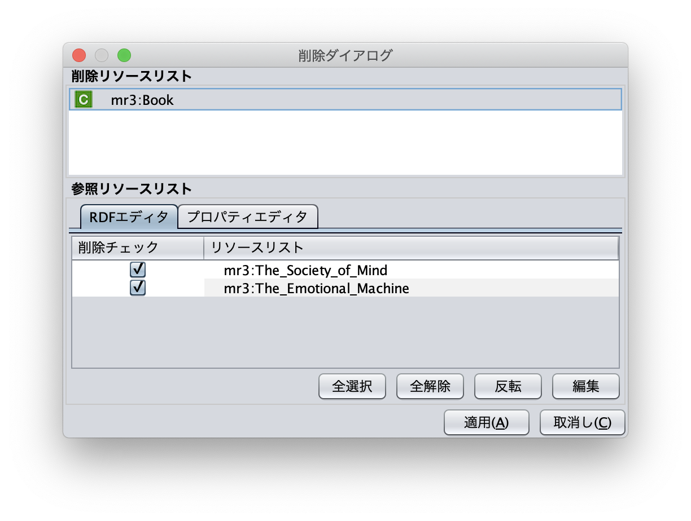

   削除ダイアログ
 

.. index:: インポートダイアログ

インポートダイアログ
--------------------
「ファイル」メニューの「開く」またはツールバーから |open| アイコンを選択すると，インポートダイアログが表示される．インポートダイアログでは，Turtle, JSONLD, N-Triples, RDF/XML 形式で記述されたRDF(S)文書またはMR^3プロジェクト形式のファイルを，MR\ :sup:`3` \にインポートすることができる． :numref:`import-dialog` にインポートダイアログのスクリーンショットを示す．インポートしたいファイルと「ファイルのタイプ」コンボボックスからファイルの形式を選択し，「開く」ボタンをクリックすると，選択したファイルをインポートすることができる．

 .. _import-dialog:
 .. figure:: figures/import_dialog.png
   :scale: 50 %
   :alt: インポートダイアログ
   :align: center

   インポートダイアログ

「ファイルのタイプ」として「すべてのファイル」を選択した場合には，ファイルの拡張子によりファイルの形式が自動判別される．拡張子とファイルの形式の対応関係を以下に示す． 

.. _ext-description:
.. csv-table::
   :header: 拡張子, ファイルの形式
   :align: center
   :widths: 5, 10 

   ttl, Turtle
   jsonld, JSONLD
   n3, N-Triples
   rdf, RDF/XML
   mr3, MR^3 プロジェクト

.. index:: エクスポートダイアログ

エクスポートダイアログ
----------------------
「ファイル」メニューの「名前を付けて保存」またはツールバーから |saveas| アイコンを選択すると，エクスポートダイアログが表示される．エクスポートダイアログでは，MR\ :sup:`3` \ で構築したRDF(S) データグラフをTurtle, JSONLD, N-Triples, RDF/XML 形式でファイルに保存することができる．また，MR^3プロジェクト形式でファイルを保存することもできる． :numref:`export-dialog` にエクスポートダイアログのスクリーンショットを示す．保存したいファイル名を入力し，「ファイルのタイプ」コンボボックスからファイルの形式を選択し，「保存」ボタンをクリックすると，ファイルを保存することができる．「ファイルのタイプ」として「すべてのファイル」を選択した場合には，ファイルの拡張子によりファイルの形式が自動判別される．

.. _export-dialog:

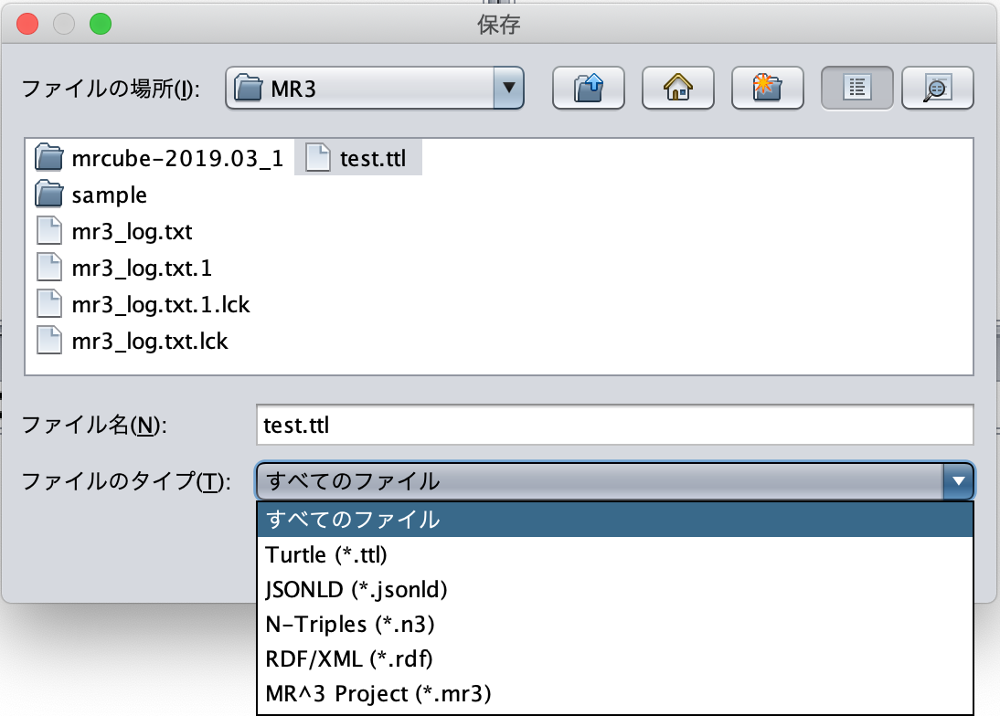

   エクスポートダイアログ

.. |saveas| image:: figures/toolbar/saveas.png 

    
.. index:: 設定ダイアログ

設定ダイアログ
--------------
設定ダイアログでは，「基本」，「メタクラス」，「レイアウト」，「レンダリング」について設定を行うことができる．

基本
~~~~
設定ダイアログの「基本」項目（ :numref:`config-basic` ）では，「言語」，「UI 言語」，「ベースURI」，「作業ディレクトリ」，「プロキシ」の設定ができる．「言語」はラベル表示を行う際に優先して表示する言語を設定できる．「UI 言語」は，メニューなどに表示する言語を設定できる．言語は，ja（日本語），en（英語），zh（中国語）を選択できる．「ベースURI」 には，エクスポート時の初期の名前空間URI を設定する．「作業ディレクトリ」には，インポートダイアログにおいて，RDF(S)文書を含むフォルダを選択する際に最初に開くフォルダを設定する．「プロキシ」では，プロキシサーバを利用している場合に，プロキシサーバのホスト名とポート番号の設定を行うことができる．URI を指定して，RDF(S)文書をインポートする場合に設定が必要となる場合がある．   

.. _config-basic:

.. figure:: figures/config_dialog_basic.png
   :scale: 50 %
   :alt: 設定ダイアログ: 基本
   :align: center

   設定ダイアログ: 基本

メタクラス
~~~~~~~~~~
設定ダイアログの「メタクラス」項目（ :numref:`config-metaclass` ）では，「クラスクラス」および「プロパティクラス」の設定をすることができる．「クラスクラス」に設定したクラスをrdf:typeプロパティの値とするリソースを， MR\ :sup:`3` \はクラスとして認識し，クラスエディタにインポートすることができる．同様に，「プロパティクラス」に設定したクラスをrdf:type プロパティの値とするリソースを， MR\ :sup:`3` \はプロパティとして認識し，プロパティエディタにインポートすることができる．

初期状態では，「クラスクラス」にはrdfs:Class が設定されている．また，「プロパティクラス」には，rdf:Property が設定されている．owl:Class やowl:ObjectProperty をタイプとするリソースを，クラスまたはプロパティとしてMR\ :sup:`3` \にインポートしたい場合には， :numref:`config-metaclass` の「クラス　クラス」タブまたは「プロパティ クラス」タブで設定を行う

.. _config-metaclass:
.. figure:: figures/config_dialog_metaclass.png
   :scale: 50 %
   :alt: 設定ダイアログ: メタクラス
   :align: center

   設定ダイアログ: メタクラス

レイアウト
~~~~~~~~~~
設定ダイアログの「レイアウト」項目（ :numref:`config-layout` ）では，各エディタ内のデータグラフのレイアウト方法を設定する．

.. _config-layout:
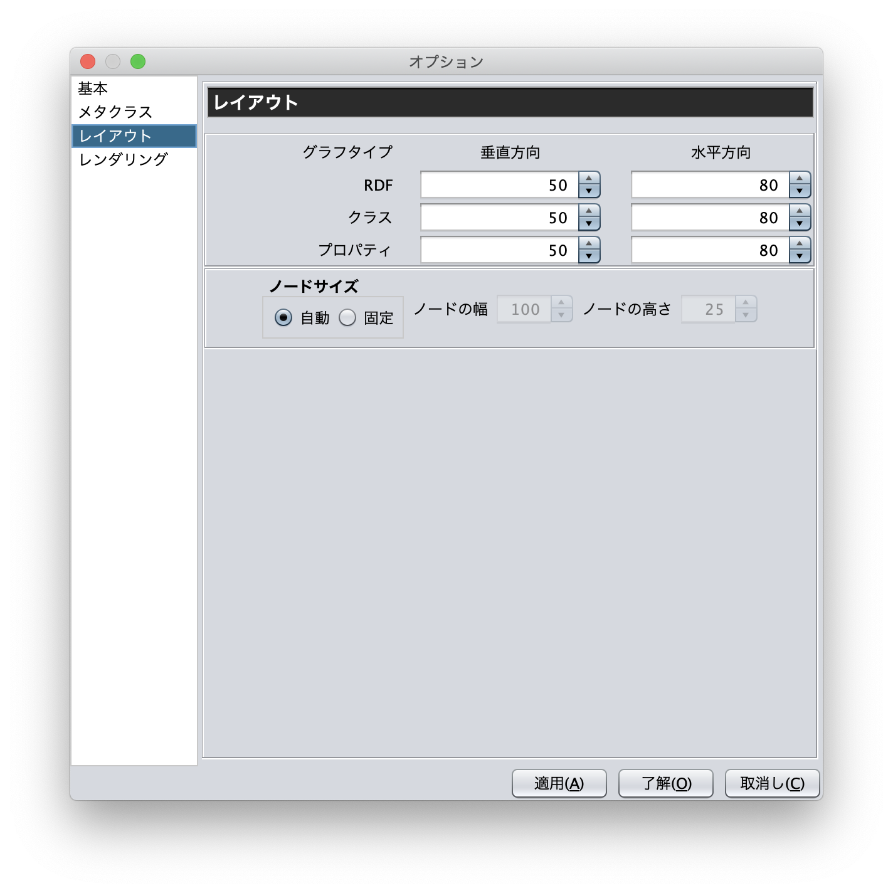

   設定ダイアログ: レイアウト

レンダリング
~~~~~~~~~~~~~~~~~~~~~~
設定ダイアログの「レンダリング」項目（ :numref:`config-rendering` ）では，各エディタ内のデータグラフの構成要素（RDFリソース，RDFプロパティ，RDFリテラル，クラス，プロパティ，エディタ）についての色（文字表示色，背景色，背景選択色，線色，線選択色）を設定することができる．「白黒にする」チェックボックスにチェックをつけると全ての色と白黒に変更する．「アンチエイリアス」にチェックをつけると，ジャギー（ピクセルのギザギザ）を目立たなくさせることができる．「初期設定の色に戻す」ボタンを押すと，全ての要素の色を初期値に戻すことができる．

.. _config-rendering:
.. figure:: figures/config_dialog_rendering.png
   :scale: 50 %
   :alt: 設定ダイアログ: レンダリング
   :align: center

   設定ダイアログ: レンダリング

RDFソースコードビューア
---------------------------------------
「ツール」メニューの「RDFソースコードビューア」を選択すると， :numref:`rdf-source-code-viewer` に示すウィンドウが表示される．「RDFソースコードビューア」では，各エディタで構築したRDFモデルを指定した構文で出力することができる． **Turtle, JSONLD, XML, N-Triples** のいずれから構文は選択できる．

.. _rdf-source-code-viewer:
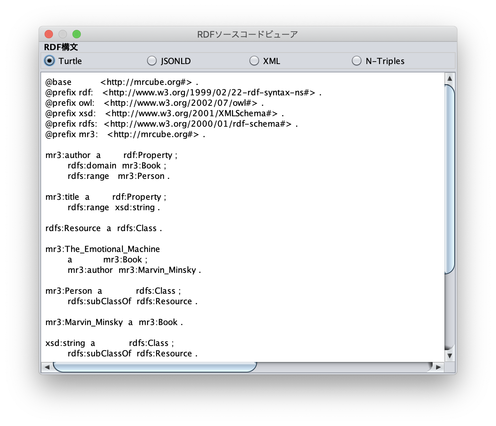

   RDFソースコードビューア

SPARQLクエリダイアログ
---------------------------------------
「ツール」メニューの「SPARQLクエリダイアログ」を選択すると，:numref:`sparql-query-dialog` に示すダイアログが表示される．
「SPARQLクエリダイアログ」では，SPARQLのSELECTクエリを「SPARQLクエリ」テキストエリアに記入し，「クエリ実行」ボタンを押すと，「クエリ実行結果」に指定した変数の検索結果が表示される．リソースまたはリテラルを選択すると，各グラフ上の対応するリソースまたはリテラルが選択される．

.. _sparql-query-dialog:
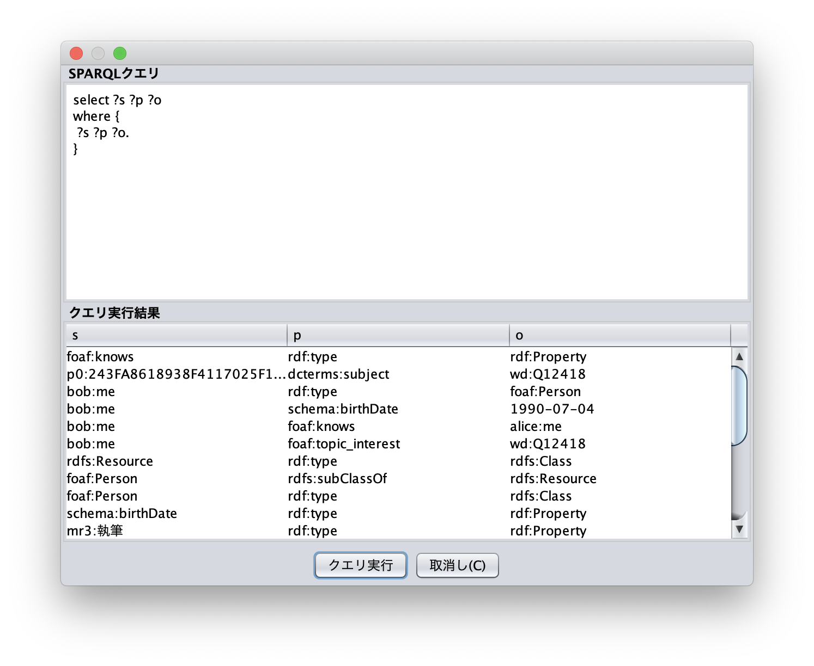

   SPARQLクエリダイアログ

整合性検証
-----------
「ツール」メニューの「整合性検証」を選択すると，:numref:`validator-dialog` に示すダイアログが表示される．
「整合性検証」では，Jenaの `org.apache.jena.reasoner.ValidityReport <https://jena.apache.org/documentation/javadoc/jena/org/apache/jena/reasoner/ValidityReport.html>`_ を利用し，リテラルのデータ型がプロパティの値域の定義に基いて定義されているかどうかなどを検証することができる．

.. _validator-dialog:
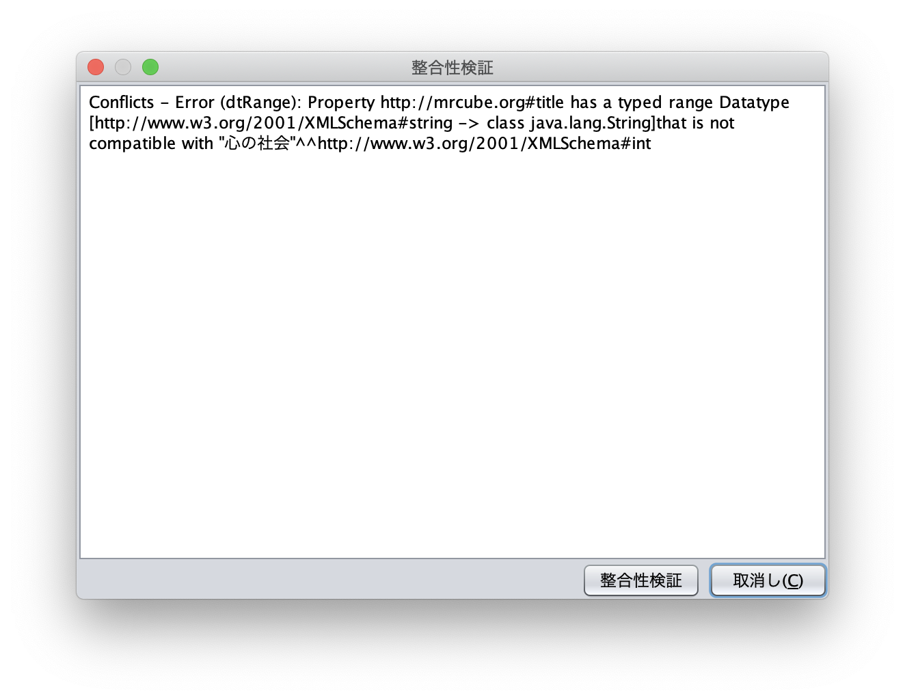

   整合性検証

プロジェクト情報
------------------
「ツール」メニューの「プロジェクト情報」を選択すると，:numref:`project-info-dialog` に示すダイアログが表示される．
「プロジェクト情報」には，現在のプロジェクト名，インポート時間，モデルのリソース数，モデルのリテラル数，モデルのステートメント数，
クラス数，プロパティ数，すべてのリソース数，すべてのリテラル数，すべてのステートメント数が表示される．

.. _project-info-dialog:
.. figure:: figures/project_info_dialog.png
   :scale: 50 %
   :alt: プロジェクト情報
   :align: center

   プロジェクト情報

履歴管理
-----------------
「ツール」メニューの「履歴管理」を選択すると，:numref:`history-management-dialog` に示すダイアログが表示される．
「履歴管理」では，各エディタ上で行った操作履歴が表示され，復元したい履歴を選択し，「履歴を開く」ボタンを押すと，選択した時点の状態に各エディタの状態を復元することができる．

.. _history-management-dialog:
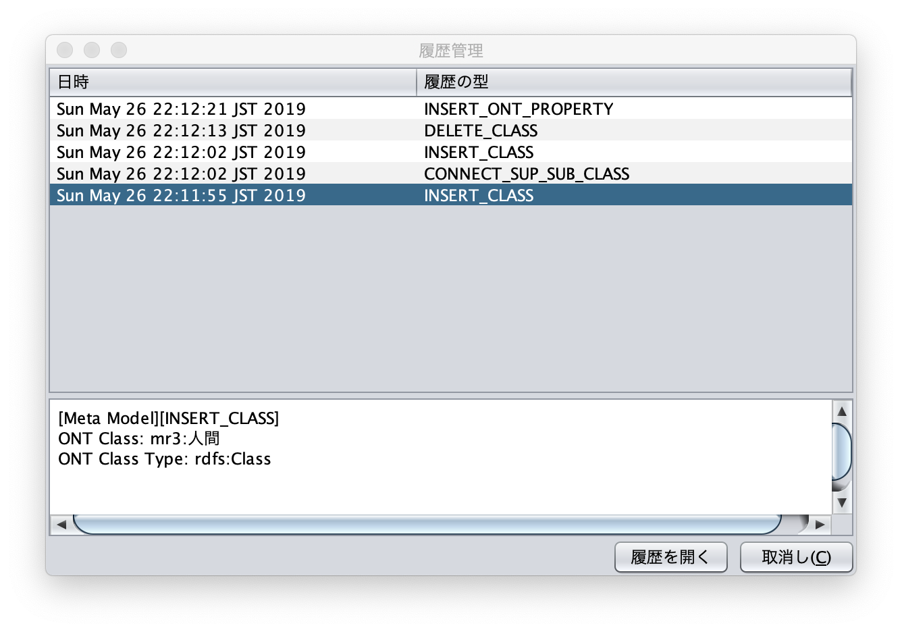

   履歴管理

ログ・コンソール
-----------------
「ツール」メニューの「ログ・コンソールを表示」を選択すると，:numref:`log-console` に示すダイアログが表示される．
ログ・コンソールには，標準出力と標準エラー出力への出力結果が確認できる．

.. _log-console:
.. figure:: figures/log_console.png
   :scale: 50 %
   :alt: ログ・コンソール
   :align: center

   ログ・コンソール

MR^3について
---------------
「ヘルプ」メニューの「MR^3について」を選択すると，:numref:`about-mr3` に示すダイアログが表示される．

.. _about-mr3:
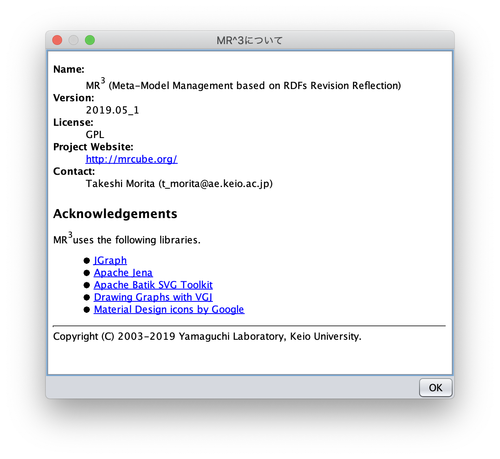

   MR^3について

メニュー
------------- 

ファイルメニュー
~~~~~~~~~~~~~~~~~~~~~~~~

新規
    MR\ :sup:`3` \のプロジェクトを新規に作成する．現在の作成中のプロジェクトは，保存するか破棄するかを選択する．
開く
    RDFファイル(Turtle, XML, JSONLD, N-Triples形式)またはMR\ :sup:`3` \のプロジェクトファイルを開く．
保存
    RDFファイル(Turtle, XML, JSONLD, N-Triples形式)またはMR\ :sup:`3` \のプロジェクトファイルを保存する．
名前をつけて保存
    RDFファイル(Turtle, XML, JSONLD, N-Triples形式)またはMR\ :sup:`3` \のプロジェクトファイルを別名で保存する．
グラフを画像として保存 -> RDFグラフを画像として保存
    RDFグラフをSVG, JPEG, PNGのいずれかの形式で画像ファイルとして保存する．
グラフを画像として保存 -> クラスグラフを画像として保存
    クラスグラフをSVG, JPEG, PNGのいずれかの形式で画像ファイルとして保存する．
グラフを画像として保存 -> プロパティグラフを画像として保存
    プロパティグラフをSVG, JPEG, PNGのいずれかの形式で画像ファイルとして保存する．
終了
    プログラムを終了する．

表示メニュー
~~~~~~~~~~~~~~~~~~~~~~
URI
    各エディタのノード内に表示されるラベルを，URI形式で表示する．名前空間テーブルで接頭辞の表示を有効にしている場合，名前空間を接頭辞に置き換えて表示する．
ID
    各エディタのノード内に表示されるラベルを，ID形式で表示する．
ラベル
    各エディタのノード内に表示されるラベルを，rdfs:labelで定義されたラベルで表示する．rdfs:labelが定義されていない場合には，URI形式で表示する．
リソースタイプ
    RDFリソースのタイプの表示・非表示を行う．
RDFプロパティ
    RDFプロパティの表示・非表示を行う．
ツールチップ
    ツールチップの表示・非表示を行う．
RDFグラフレイアウト（左から右）
    RDFエディタの自動レイアウト（左から右）を実行する
クラスグラフレイアウト（左から右）
    クラスエディタの自動レイアウト（左から右）を実行する
クラスグラフレイアウト（上から下）
    クラスエディタの自動レイアウト（上から下）を実行する
プロパティグラフレイアウト（左から右）
    プロパティエディタの自動レイアウト（左から右）を実行する
プロパティグラフレイアウト（上から下）
    プロパティエディタの自動レイアウト（上から下）を実行する

ウィンドウメニュー
~~~~~~~~~~~~~~~~~~~~~~~~~~~~~~

RDFエディタのオーバービュー
    RDFエディタの全体を表示する．表示されるウィンドウ内の赤色の四角をドラッグすることで，RDFエディタ内の移動を行うことができる．また，四角の右下部分をドラッグして，四角の大きさを変更することにより，拡大・縮小を行うことができる．大きくすると拡大し，小さくすると縮小する．
クラスエディタのオーバービュー
    クラスエディタの全体を表示する．機能は，RDFエディタと同様．
プロパティエディタのオーバービュー
    プロパティエディタの全体を表示する．機能は，RDFエディタと同様．
属性ダイアログ
    属性ダイアログを表示する．
名前空間テーブル
    名前空間テーブルを表示する．
ウィンドウ再配置(C,P,R)
    クラスエディタ，プロパティエディタ，RDFエディタを表示
ウィンドウ再配置(C,R)
    クラスエディタとRDFエディタのみを表示
ウィンドウ再配置(P,R)
    プロパティエディタとRDFエディタのみを表示

ツールメニュー
~~~~~~~~~~~~~~~~~~~~~
RDFソースコードビューア
    RDFソースコードを表示するダイアログが表示される
検索
    リソース検索ダイアログが表示される
SPARQLクエリダイアログ
    SPARQLのSELECTクエリにより検索を行うためのダイアログが表示される
整合性検証
    整合性検証ダイアログを表示する
プロジェクト情報
    プロジェクト情報ダイアログを表示する
履歴管理
    履歴管理ダイアログを表示する
ログ・コンソール
    MR\ :sup:`3` \の標準出力・標準エラー出力を表示するウィンドウを表示する．主にデバッグ用．
オプション
    オプションダイアログを表示する

ヘルプメニュー
~~~~~~~~~~~~~~~~~~
MR^3 について
    MR\ :sup:`3` \のバージョン，HPのURL等を表示する
MR^3 マニュアル 
    MR\ :sup:`3` \のマニュアルのページをウェブブラウザに表示する
 
ツールバー
------------- 

.. csv-table::
   :header: アイコン, 機能
   :align: center
   :widths: 3, 10 

   .. figure:: figures/toolbar/new.png, MR\ :sup:`3` \のプロジェクトを新規に開く                             
   .. figure:: figures/toolbar/open.png, MR\ :sup:`3` \のプロジェクトファイルを開く．                          
   .. figure:: figures/toolbar/save.png, MR\ :sup:`3` \のプロジェクトファイルを保存する．                       
   .. figure:: figures/toolbar/saveas.png, MR\ :sup:`3` \のプロジェクトファイルを別名で保存する．                  
   .. figure:: figures/toolbar/find.png, リソース検索ダイアログを表示する                                  
   .. figure:: figures/toolbar/rdf_editor.png, RDFエディタオーバービューを前面に表示する                                   
   .. figure:: figures/toolbar/class_editor.png, クラスエディタオーバービューを前面に表示する                                   
   .. figure:: figures/toolbar/property_editor.png, プロパティエディタオーバービューを前面に表示する                                 
   .. figure:: figures/toolbar/attribute_dialog.png, 属性ダイアログを前面に表示する                              
   .. figure:: figures/toolbar/namespace_table.png, 名前空間テーブルを前面に表示する                                  
   .. figure:: figures/toolbar/cpr.png, クラス，プロパティ，RDFエディタを表示する
   .. figure:: figures/toolbar/cr.png, クラス，RDFエディタを表示する
   .. figure:: figures/toolbar/pr.png, プロパティ，RDFエディタを表示する
   .. figure:: figures/toolbar/code.png, RDFソースコードビューアを表示する
   .. figure:: figures/toolbar/history_management.png, 履歴管理ダイアログを表示する
   .. figure:: figures/toolbar/accept.png, 整合性を検証する 
   .. figure:: figures/toolbar/information.png, プロジェクトの情報を表示する 
   .. figure:: figures/toolbar/log_console.png, ログコンソールを表示する
   .. figure:: figures/toolbar/cog.png, 設定ダイアログを表示する
   .. figure:: figures/toolbar/help.png, MR\ :sup:`3` \について表示する

ショートカットキー
----------------------- 

Windowsの場合には「Ctrl」を，macosの場合には「Command」をショートカットキーに用いる．

全体で使えるショートカットキー
~~~~~~~~~~~~~~~~~~~~~~~~~~~~~~~~~~~~~~~~~~~~~

.. csv-table::
   :header: ショートカットキー, 説明
   :align: center
   :widths: 5, 10 

    Ctrl + N | Command + N, MR\ :sup:`3` \のプロジェクトを新規に開く．現在の作成中のプロジェクトは，保存するか破棄するかを選択する．
    Ctrl + O | Command + O, MR\ :sup:`3` \のプロジェクトファイルを開く．
    Ctrl + S | Command + S, MR\ :sup:`3` \のプロジェクトファイルを保存する．
    Ctrl + Shift + S | Command + Shift + S, MR\ :sup:`3` \のプロジェクトファイルを別名で保存する．
    Ctrl + Q | Command + Q, MR\ :sup:`3` \を終了する．
    Ctrl + Shift + A | Command + Shift + A, 属性ダイアログを前面に表示する．
    Ctrl + Shift + N | Command + Shift + N, 名前空間テーブルを前面に表示する．
    Ctrl + 1 | Command + 1, ウィンドウ再配置(クラスエディタ，プロパティエディタ，RDFエディタ）を実行
    Ctrl + 2 | Command + 2, ウィンドウ再配置(クラスエディタとRDFエディタ）を実行
    Ctrl + 3 | Command + 3, ウィンドウ再配置(プロパティエディタとRDFエディタ）を実行
    Ctrl + R | Command + R, RDFソースコードビューアを表示する．
    Ctrl + F | Command + F, リソース検索ダイアログを表示する．
    Ctrl + Shift + F | Command + Shift + F, SPARQLクエリダイアログを表示する．
    Ctrl + Shift + V | Command + Shift + V, 整合性検証ダイアログを表示する．
    Ctrl + Shift + M | Command + Shift + M, プロジェクト情報を表示する．
    Ctrl + Shift + H | Command + Shift + H, 履歴管理ダイアログを表示する．
    Ctrl + Shift + L | Command + Shift + L, ログ・コンソールを表示する．
    Ctrl + Shift + O | Command + Shift + O, オプションダイアログを表示する．
    F1, MR\ :sup:`3` \についてを表示する．

エディタ内で使えるショートカットキー
~~~~~~~~~~~~~~~~~~~~~~~~~~~~~~~~~~~~~~~~~~~~~

.. csv-table::
   :header: ショートカットキー, 説明
   :align: center
   :widths: 5, 10 

   Ctrl + I | Command + I, リソースを挿入する．
   Ctrl + L | Command + L, RDFエディタ内でリテラルを挿入する．
   Ctrl + A | Command + A, エディタ内のノードをすべて選択する．
   Delete, エディタ内の選択されたノードを削除する．
   Ctrl + C | Command + C, エディタ内の選択されたノードをコピーする．
   Ctrl + X | Command + X, エディタ内の選択されたノードをカットする．
   Ctrl + V | Command + V, コピーまたは，カットされたノードをエディタにペーストする．
